# 系统架构设计

<cite>
**本文档引用的文件**
- [main.cpp](file://project/agent/src/main.cpp)
- [agent_app.cpp](file://project/agent/src/runtime/app/agent_app.cpp)
- [module.hpp](file://project/agent/src/foundation/include/foundation/module.hpp)
- [types.hpp](file://project/agent/src/foundation/include/foundation/types.hpp)
- [thread_safe_queue.hpp](file://project/agent/src/foundation/include/foundation/thread_safe_queue.hpp)
- [video_capture_module.hpp](file://project/agent/src/modules/capture/video/include/capture_video/video_capture_module.hpp)
- [audio_capture_module.hpp](file://project/agent/src/modules/capture/audio/include/capture_audio/audio_capture_module.hpp)
- [motion_detect.hpp](file://project/agent/src/modules/processing/motion_detect/include/processing_motion_detect/motion_detect.hpp)
- [encoder_module.hpp](file://project/agent/src/modules/processing/encoder/include/processing_encoder/encoder_module.hpp)
- [event_bus.hpp](file://project/agent/src/modules/infra/event_bus/include/infra_event/event_bus.hpp)
- [config_manager.hpp](file://project/agent/src/modules/infra/config/include/infra_config/config_manager.hpp)
- [logger.hpp](file://project/agent/src/modules/infra/log/include/infra_log/logger.hpp)
- [app.ts](file://project/server/src/app.ts)
- [App.tsx](file://project/web/src/App.tsx)
- [CMakeLists.txt](file://project/agent/CMakeLists.txt)
- [version.hpp](file://project/agent/include/piguard/version.hpp)
</cite>

## 目录
1. [引言](#引言)
2. [项目结构](#项目结构)
3. [核心组件](#核心组件)
4. [架构概览](#架构概览)
5. [详细组件分析](#详细组件分析)
6. [依赖关系分析](#依赖关系分析)
7. [性能考虑](#性能考虑)
8. [故障排除指南](#故障排除指南)
9. [结论](#结论)
10. [附录](#附录)

## 引言

Pi-Guard 是一个基于边缘计算的智能安防系统，采用模块化设计和事件驱动架构。该系统通过摄像头和麦克风采集音视频数据，利用运动检测算法识别异常事件，并通过多种输出通道进行实时处理和存储。

系统采用分层架构设计，包含代理端（Agent）和服务器端（Server）两个主要组件，以及Web前端界面。代理端负责本地数据采集、处理和存储，服务器端提供管理接口和状态同步，Web前端用于用户交互和配置管理。

## 项目结构

项目采用多语言混合架构，主要分为三个子项目：

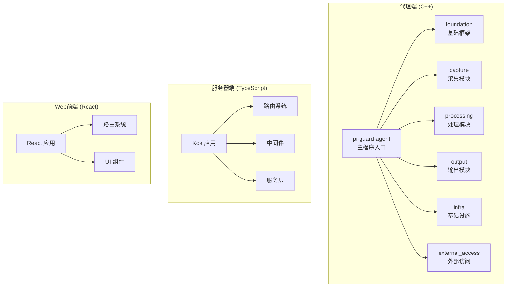

**图表来源**
- [CMakeLists.txt:1-51](file://project/agent/CMakeLists.txt#L1-L51)
- [main.cpp:1-19](file://project/agent/src/main.cpp#L1-L19)
- [app.ts:1-14](file://project/server/src/app.ts#L1-L14)
- [App.tsx:1-38](file://project/web/src/App.tsx#L1-L38)

**章节来源**
- [CMakeLists.txt:1-51](file://project/agent/CMakeLists.txt#L1-L51)
- [main.cpp:1-19](file://project/agent/src/main.cpp#L1-L19)

## 核心组件

### 基础框架模块

系统的基础框架提供了统一的模块化架构和基础设施支持：

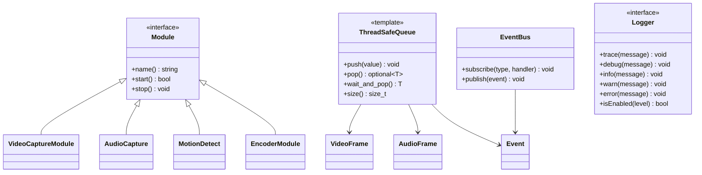

**图表来源**
- [module.hpp:1-17](file://project/agent/src/foundation/include/foundation/module.hpp#L1-L17)
- [thread_safe_queue.hpp:1-51](file://project/agent/src/foundation/include/foundation/thread_safe_queue.hpp#L1-L51)
- [event_bus.hpp:1-25](file://project/agent/src/modules/infra/event_bus/include/infra_event/event_bus.hpp#L1-L25)
- [logger.hpp:1-25](file://project/agent/src/modules/infra/log/include/infra_log/logger.hpp#L1-L25)

### 数据模型定义

系统定义了统一的数据模型来表示音视频帧和事件：

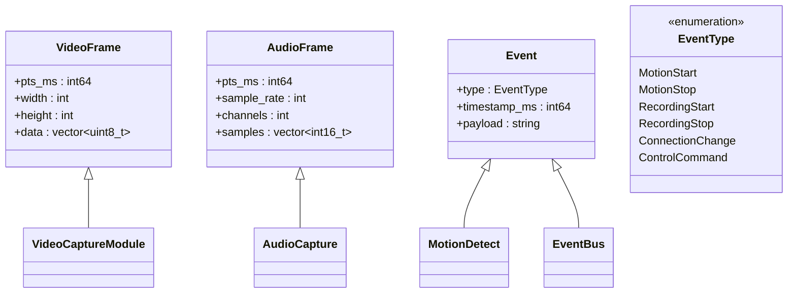

**图表来源**
- [types.hpp:1-39](file://project/agent/src/foundation/include/foundation/types.hpp#L1-L39)

**章节来源**
- [module.hpp:1-17](file://project/agent/src/foundation/include/foundation/module.hpp#L1-L17)
- [types.hpp:1-39](file://project/agent/src/foundation/include/foundation/types.hpp#L1-L39)
- [thread_safe_queue.hpp:1-51](file://project/agent/src/foundation/include/foundation/thread_safe_queue.hpp#L1-L51)

## 架构概览

### 系统上下文图

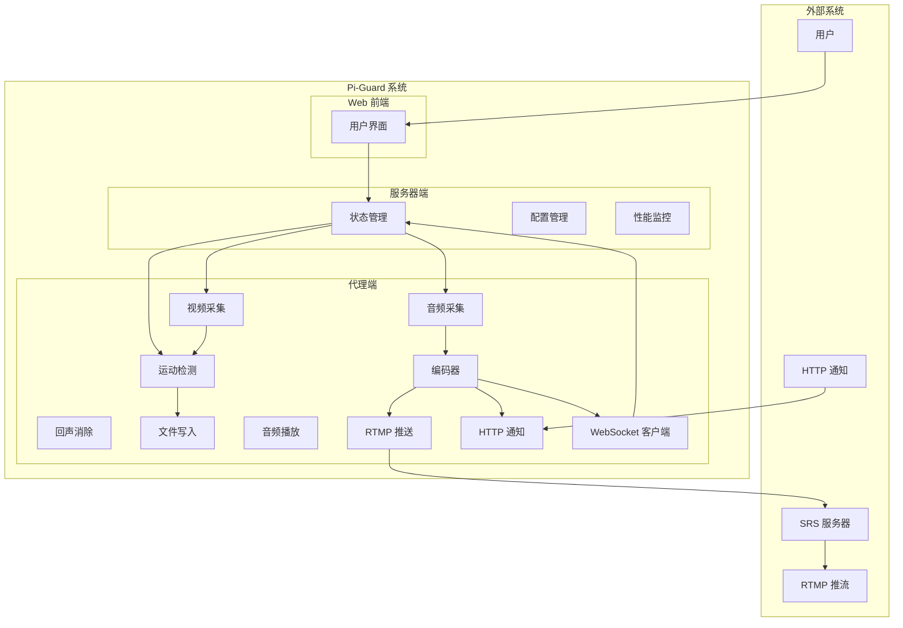

**图表来源**
- [agent_app.cpp:16-63](file://project/agent/src/runtime/app/agent_app.cpp#L16-L63)
- [video_capture_module.hpp:1-22](file://project/agent/src/modules/capture/video/include/capture_video/video_capture_module.hpp#L1-L22)
- [audio_capture_module.hpp:1-24](file://project/agent/src/modules/capture/audio/include/capture_audio/audio_capture_module.hpp#L1-L24)
- [motion_detect.hpp:1-28](file://project/agent/src/modules/processing/motion_detect/include/processing_motion_detect/motion_detect.hpp#L1-L28)
- [encoder_module.hpp:1-21](file://project/agent/src/modules/processing/encoder/include/processing_encoder/encoder_module.hpp#L1-L21)

### 数据流架构

系统采用生产者-消费者模式，通过线程安全队列实现模块间解耦：

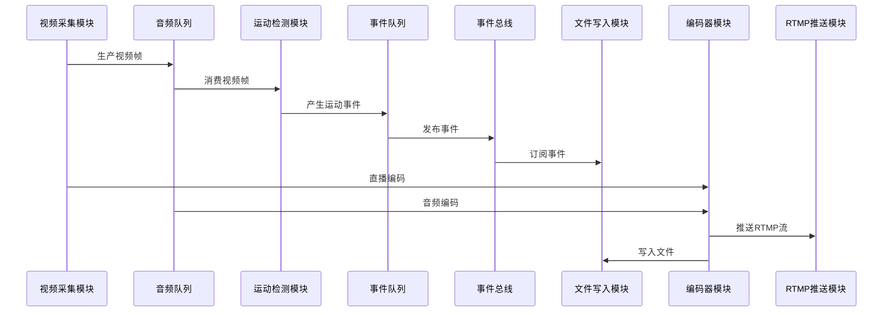

**图表来源**
- [agent_app.cpp:78-126](file://project/agent/src/runtime/app/agent_app.cpp#L78-L126)
- [motion_detect.hpp:19](file://project/agent/src/modules/processing/motion_detect/include/processing_motion_detect/motion_detect.hpp#L19)
- [event_bus.hpp:16](file://project/agent/src/modules/infra/event_bus/include/infra_event/event_bus.hpp#L16)

## 详细组件分析

### Agent 应用程序

Agent 应用程序是整个系统的协调中心，负责启动和管理所有模块：

```mermaid
classDiagram
class AgentApp {
-config_manager_ : ConfigManager
-video_capture_ : VideoCaptureModule
-audio_capture_ : AudioCapture
-motion_detect_ : MotionDetect
-encoder_ : EncoderModule
-file_writer_ : FileWriter
-audio_playback_ : AudioPlayback
-rtmp_pusher_ : RtmpPusher
-http_notify_ : HttpNotify
-ws_client_ : WebSocketClient
-event_bus_ : EventBus
-event_queue_ : ThreadSafeQueue~Event~
-video_queue_ : ThreadSafeQueue~VideoFrame~
-audio_queue_ : ThreadSafeQueue~AudioFrame~
+start() bool
+stop() void
+run_for_demo() void
-start_threads() void
-stop_threads() void
}
AgentApp --> ConfigManager : 使用
AgentApp --> VideoCaptureModule : 管理
AgentApp --> AudioCapture : 管理
AgentApp --> MotionDetect : 管理
AgentApp --> EncoderModule : 管理
AgentApp --> EventBus : 配置
```

**图表来源**
- [agent_app.cpp:7-42](file://project/agent/src/runtime/app/agent_app.cpp#L7-L42)

#### 启动流程时序图

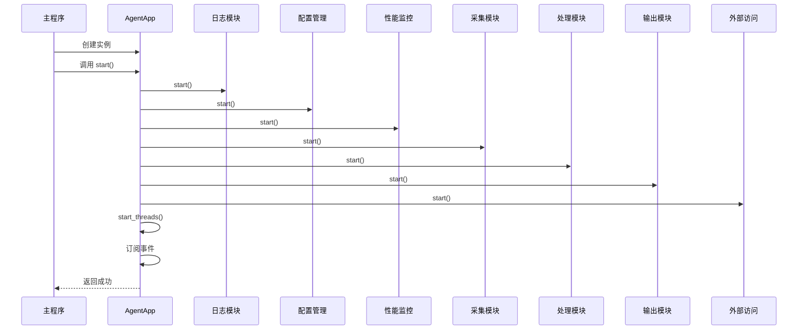

**图表来源**
- [agent_app.cpp:16-42](file://project/agent/src/runtime/app/agent_app.cpp#L16-L42)
- [main.cpp:6-16](file://project/agent/src/main.cpp#L6-L16)

**章节来源**
- [agent_app.cpp:1-138](file://project/agent/src/runtime/app/agent_app.cpp#L1-L138)
- [main.cpp:1-19](file://project/agent/src/main.cpp#L1-L19)

### 采集模块

系统包含独立的音视频采集模块，采用模块化设计：

#### 视频采集模块

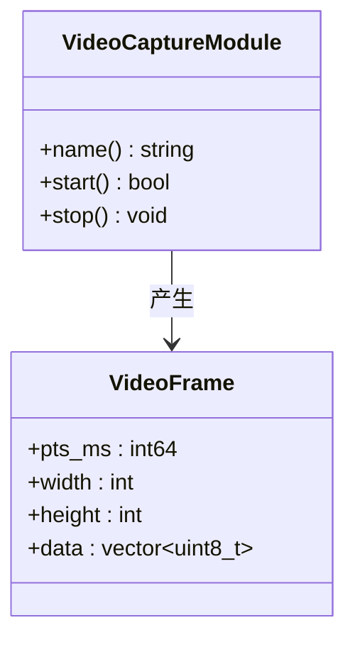

**图表来源**
- [video_capture_module.hpp:9-19](file://project/agent/src/modules/capture/video/include/capture_video/video_capture_module.hpp#L9-L19)

#### 音频采集模块

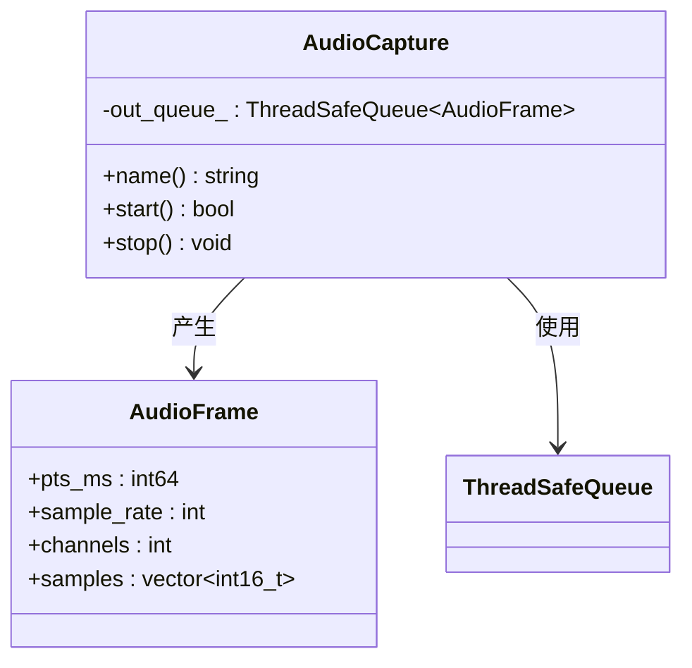

**图表来源**
- [audio_capture_module.hpp:11-21](file://project/agent/src/modules/capture/audio/include/capture_audio/audio_capture_module.hpp#L11-L21)

**章节来源**
- [video_capture_module.hpp:1-22](file://project/agent/src/modules/capture/video/include/capture_video/video_capture_module.hpp#L1-L22)
- [audio_capture_module.hpp:1-24](file://project/agent/src/modules/capture/audio/include/capture_audio/audio_capture_module.hpp#L1-L24)

### 处理模块

#### 运动检测模块

运动检测模块实现了基于视频帧的异常检测功能：

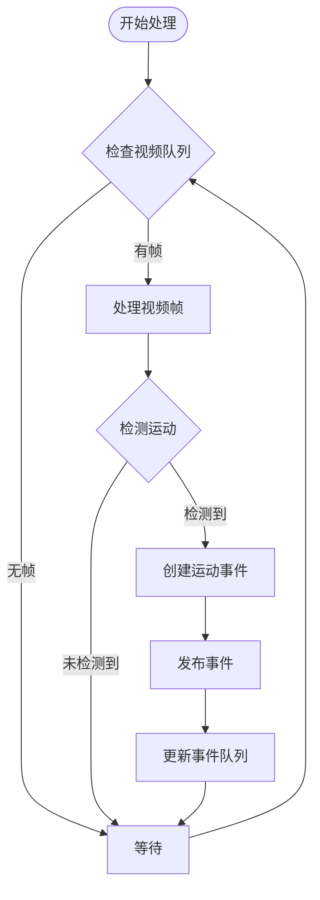

**图表来源**
- [motion_detect.hpp:19](file://project/agent/src/modules/processing/motion_detect/include/processing_motion_detect/motion_detect.hpp#L19)

#### 编码器模块

编码器模块负责将原始音视频数据转换为压缩格式：

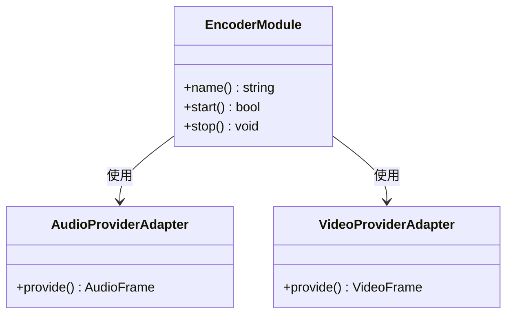

**图表来源**
- [encoder_module.hpp:9-18](file://project/agent/src/modules/processing/encoder/include/processing_encoder/encoder_module.hpp#L9-L18)

**章节来源**
- [motion_detect.hpp:1-28](file://project/agent/src/modules/processing/motion_detect/include/processing_motion_detect/motion_detect.hpp#L1-L28)
- [encoder_module.hpp:1-21](file://project/agent/src/modules/processing/encoder/include/processing_encoder/encoder_module.hpp#L1-L21)

### 基础设施模块

#### 事件总线

事件总线实现了发布-订阅模式，支持多线程安全：

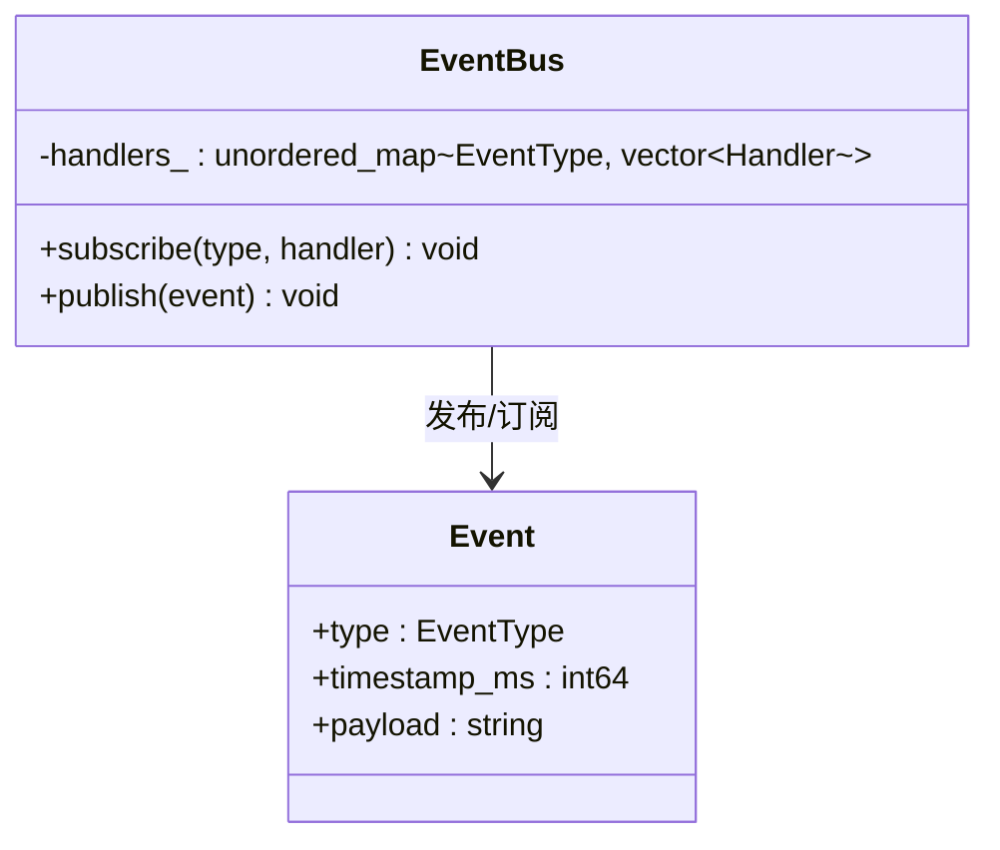

**图表来源**
- [event_bus.hpp:12-22](file://project/agent/src/modules/infra/event_bus/include/infra_event/event_bus.hpp#L12-L22)

#### 配置管理

配置管理系统提供运行时配置管理功能：

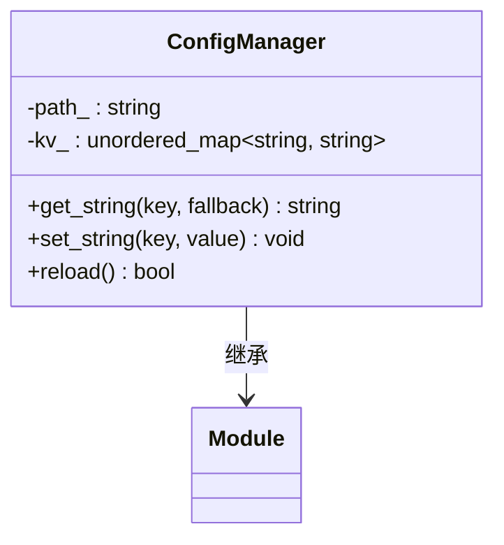

**图表来源**
- [config_manager.hpp:11-27](file://project/agent/src/modules/infra/config/include/infra_config/config_manager.hpp#L11-L27)

**章节来源**
- [event_bus.hpp:1-25](file://project/agent/src/modules/infra/event_bus/include/infra_event/event_bus.hpp#L1-L25)
- [config_manager.hpp:1-30](file://project/agent/src/modules/infra/config/include/infra_config/config_manager.hpp#L1-L30)

## 依赖关系分析

### 构建系统依赖

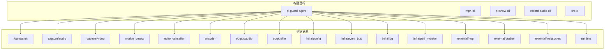

**图表来源**
- [CMakeLists.txt:11-27](file://project/agent/CMakeLists.txt#L11-L27)

### 运行时依赖

系统在运行时需要以下依赖关系：

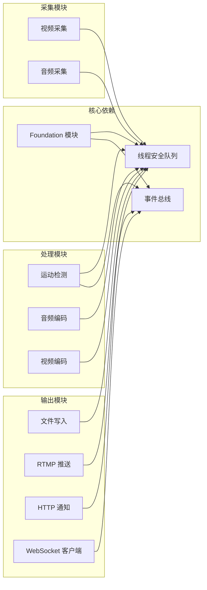

**图表来源**
- [agent_app.cpp:7-34](file://project/agent/src/runtime/app/agent_app.cpp#L7-L34)

**章节来源**
- [CMakeLists.txt:1-51](file://project/agent/CMakeLists.txt#L1-L51)
- [agent_app.cpp:1-138](file://project/agent/src/runtime/app/agent_app.cpp#L1-L138)

## 性能考虑

### 线程模型

系统采用多线程架构，每个模块运行在独立线程中：

| 线程 | 职责 | 轮询间隔 |
|------|------|----------|
| 视频采集线程 | 采集视频帧 | ~33ms |
| 音频采集线程 | 采集音频帧 | ~20ms |
| 运动检测线程 | 处理视频帧 | ~66ms |
| 文件写入线程 | 写入文件 | ~50ms |
| 其他线程 | RTMP推送、HTTP通知等 | ~30ms |

### 内存管理

系统使用智能指针和RAII原则管理内存资源，避免内存泄漏：

- 所有动态分配的对象都使用智能指针管理
- 线程安全队列自动管理队列元素生命周期
- 模块对象在停止时自动清理资源

### 性能监控

系统内置性能监控机制，可以实时监控CPU使用率、内存使用率和温度：

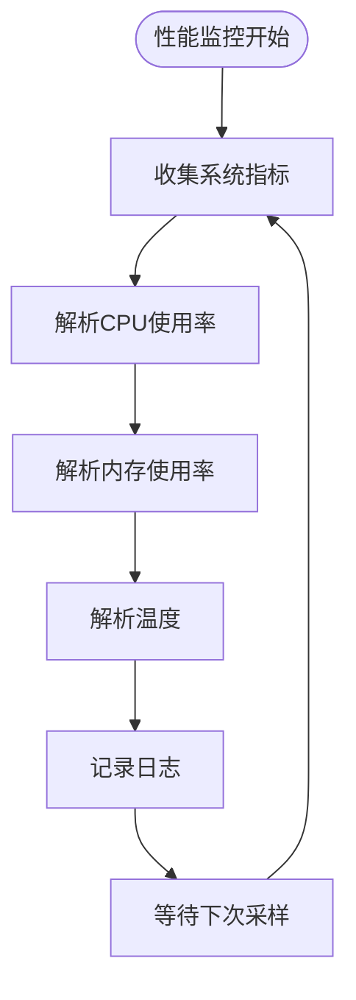

**图表来源**
- [agent_app.cpp:65-76](file://project/agent/src/runtime/app/agent_app.cpp#L65-L76)

## 故障排除指南

### 常见问题诊断

#### 模块启动失败

当某个模块无法启动时，检查以下方面：

1. **依赖检查**：确认相关依赖模块已正确初始化
2. **权限检查**：验证设备访问权限（摄像头、麦克风）
3. **资源检查**：确认系统资源充足（内存、磁盘空间）

#### 数据流中断

当数据流中断时，按以下顺序排查：

1. **队列状态**：检查线程安全队列是否正常工作
2. **事件订阅**：确认事件总线订阅关系正确
3. **模块状态**：验证各模块运行状态

#### 性能问题

性能问题的诊断步骤：

1. **监控指标**：查看CPU、内存使用情况
2. **线程分析**：检查各线程执行时间
3. **资源瓶颈**：识别系统瓶颈环节

**章节来源**
- [agent_app.cpp:44-63](file://project/agent/src/runtime/app/agent_app.cpp#L44-L63)

## 结论

Pi-Guard 系统采用了先进的模块化设计和事件驱动架构，具有以下特点：

1. **模块化设计**：清晰的模块边界和职责分离
2. **事件驱动**：基于事件总线的松耦合通信
3. **生产者-消费者**：通过线程安全队列实现异步处理
4. **多线程架构**：充分利用系统资源提高处理效率
5. **可扩展性**：易于添加新模块和功能

系统架构为未来的功能扩展和性能优化奠定了良好的基础，能够满足智能安防场景的各种需求。

## 附录

### 技术栈详情

**后端 (C++)**
- C++17 标准
- CMake 构建系统
- C++ 标准库
- 线程安全容器

**服务器端 (TypeScript)**
- Node.js 运行时
- Koa Web 框架
- TypeScript 类型系统

**前端 (React)**
- React 18
- Ant Design Mobile
- Vite 构建工具

**基础设施**
- SRS RTMP 服务器
- JSON 配置文件
- SPDLOG 日志系统

### 版本兼容性

- **C++17**：编译器需支持 C++17 标准
- **Node.js**：建议使用 LTS 版本
- **React**：兼容 17.x 和 18.x
- **SRS**：兼容 4.x 版本

### 部署拓扑

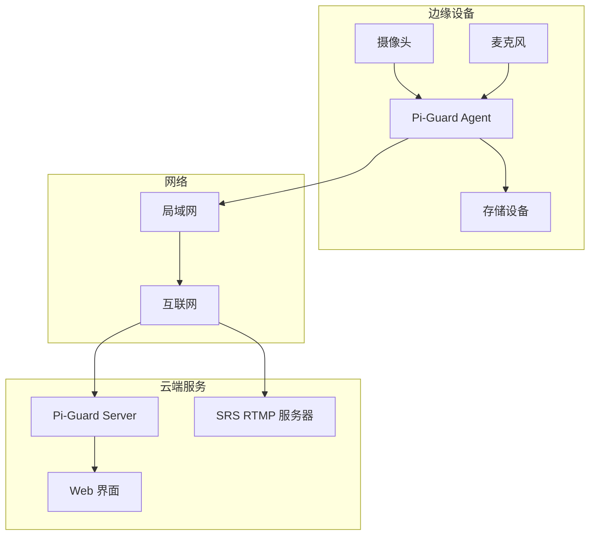

[本节为概念性内容，不涉及具体文件分析]