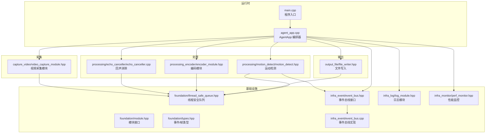
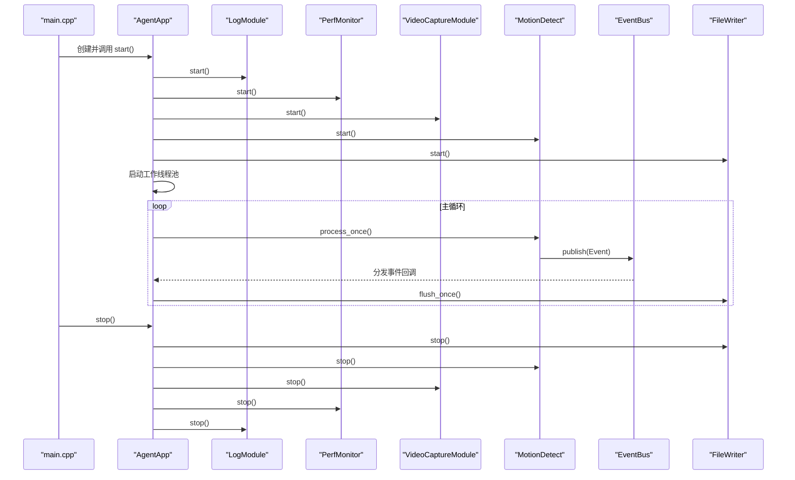
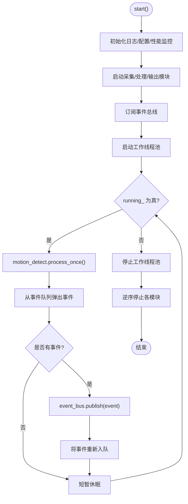
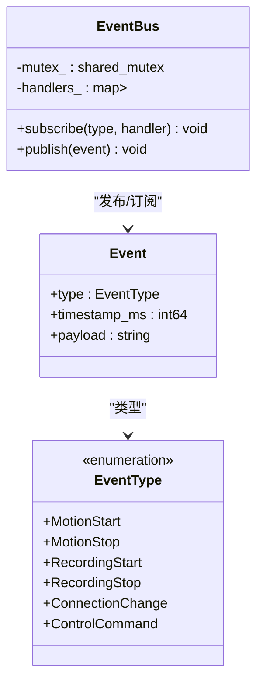
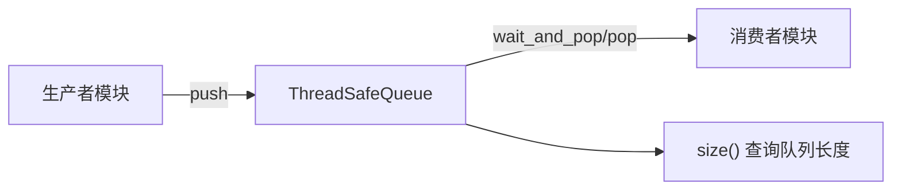
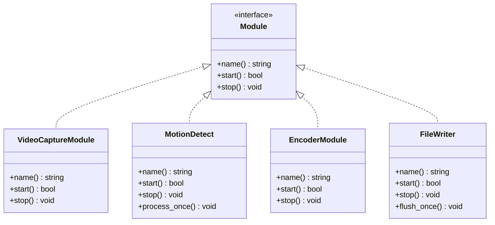
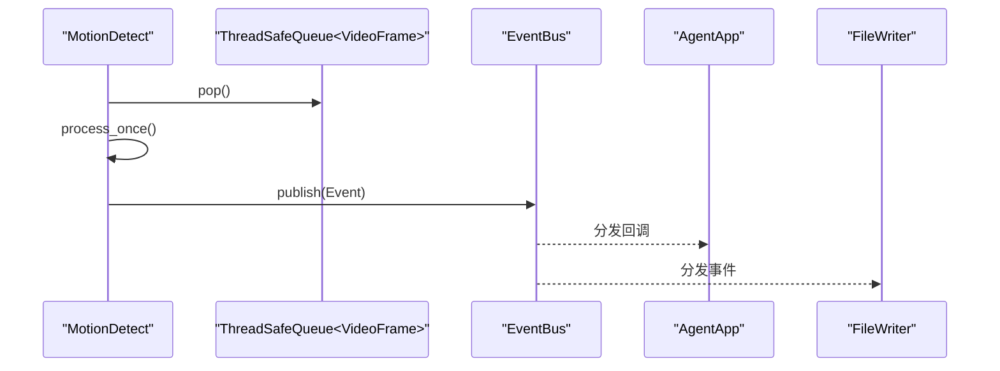
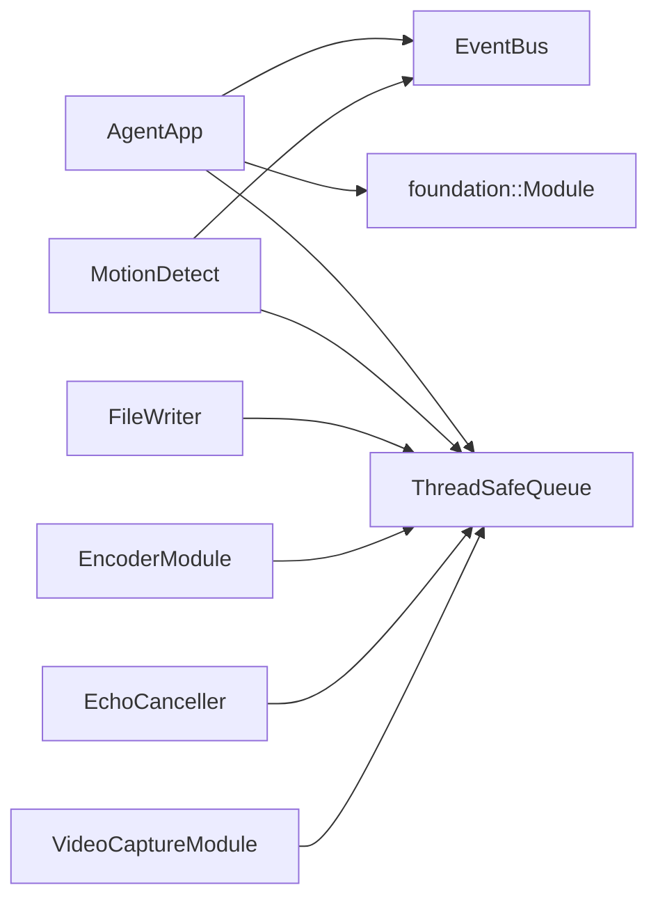

# 组件交互模式

<cite>
**本文引用的文件**
- [main.cpp](file://project/agent/src/main.cpp)
- [agent_app.cpp](file://project/agent/src/runtime/app/agent_app.cpp)
- [module.hpp](file://project/agent/src/foundation/include/foundation/module.hpp)
- [types.hpp](file://project/agent/src/foundation/include/foundation/types.hpp)
- [thread_safe_queue.hpp](file://project/agent/src/foundation/include/foundation/thread_safe_queue.hpp)
- [event_bus.hpp](file://project/agent/src/modules/infra/event_bus/include/infra_event/event_bus.hpp)
- [event_bus.cpp](file://project/agent/src/modules/infra/event_bus/event_bus.cpp)
- [video_capture_module.hpp](file://project/agent/src/modules/capture/video/include/capture_video/video_capture_module.hpp)
- [motion_detect.hpp](file://project/agent/src/modules/processing/motion_detect/include/processing_motion_detect/motion_detect.hpp)
- [encoder_module.hpp](file://project/agent/src/modules/processing/encoder/include/processing_encoder/encoder_module.hpp)
- [file_writer.hpp](file://project/agent/src/modules/output/file/include/output_file/file_writer.hpp)
- [log_module.hpp](file://project/agent/src/modules/infra/log/include/infra_log/log_module.hpp)
- [perf_monitor.hpp](file://project/agent/src/modules/infra/perf_monitor/include/infra_monitor/perf_monitor.hpp)
- [echo_canceller.cpp](file://project/agent/src/modules/processing/echo_canceller/echo_canceller.cpp)
</cite>

## 目录
1. [引言](#引言)
2. [项目结构](#项目结构)
3. [核心组件](#核心组件)
4. [架构总览](#架构总览)
5. [详细组件分析](#详细组件分析)
6. [依赖关系分析](#依赖关系分析)
7. [性能考量](#性能考量)
8. [故障排查指南](#故障排查指南)
9. [结论](#结论)
10. [附录](#附录)

## 引言
本文件聚焦于 Pi-Guard Agent 的组件交互模式与事件驱动架构，系统通过统一的模块接口与事件总线实现松耦合的组件协作，辅以线程安全队列进行跨模块数据传递。AgentApp 负责协调各模块的启动、运行与关闭，并在内部线程池中调度处理流程。本文将从架构、数据流、错误传播与生命周期管理等维度，给出可视化图示与可操作的实践建议。

## 项目结构
Pi-Guard Agent 采用分层与功能域结合的组织方式：
- 基础设施层（foundation）：模块接口、通用类型、线程安全队列等
- 事件总线（infra/event_bus）：事件发布/订阅基础设施
- 模块层（modules）：采集、处理、输出、外部接入、基础设施服务等
- 运行时（runtime/app）：应用入口与编排器（AgentApp）

图表来源
- [main.cpp:1-19](file://project/agent/src/main.cpp#L1-L19)
- [agent_app.cpp:1-138](file://project/agent/src/runtime/app/agent_app.cpp#L1-L138)
- [module.hpp:1-17](file://project/agent/src/foundation/include/foundation/module.hpp#L1-L17)
- [types.hpp:1-39](file://project/agent/src/foundation/include/foundation/types.hpp#L1-L39)
- [thread_safe_queue.hpp:1-51](file://project/agent/src/foundation/include/foundation/thread_safe_queue.hpp#L1-L51)
- [event_bus.hpp:1-25](file://project/agent/src/modules/infra/event_bus/include/infra_event/event_bus.hpp#L1-L25)
- [event_bus.cpp:1-25](file://project/agent/src/modules/infra/event_bus/event_bus.cpp#L1-L25)
- [video_capture_module.hpp:1-22](file://project/agent/src/modules/capture/video/include/capture_video/video_capture_module.hpp#L1-L22)
- [motion_detect.hpp:1-28](file://project/agent/src/modules/processing/motion_detect/include/processing_motion_detect/motion_detect.hpp#L1-L28)
- [encoder_module.hpp:1-21](file://project/agent/src/modules/processing/encoder/include/processing_encoder/encoder_module.hpp#L1-L21)
- [file_writer.hpp:1-27](file://project/agent/src/modules/output/file/include/output_file/file_writer.hpp#L1-L27)
- [log_module.hpp:1-17](file://project/agent/src/modules/infra/log/include/infra_log/log_module.hpp#L1-L17)
- [perf_monitor.hpp:1-28](file://project/agent/src/modules/infra/perf_monitor/include/infra_monitor/perf_monitor.hpp#L1-L28)
- [echo_canceller.cpp:1-21](file://project/agent/src/modules/processing/echo_canceller/echo_canceller.cpp#L1-L21)

章节来源
- [main.cpp:1-19](file://project/agent/src/main.cpp#L1-L19)
- [agent_app.cpp:1-138](file://project/agent/src/runtime/app/agent_app.cpp#L1-L138)

## 核心组件
- 模块接口（foundation::Module）
  - 规范所有模块的统一行为：name/start/stop
  - 为松耦合提供了稳定的契约
- 事件与数据类型（foundation::types）
  - 定义事件枚举（如 MotionStart/MotionStop）、视频/音频帧结构
  - 作为跨模块通信的数据载体
- 线程安全队列（foundation::ThreadSafeQueue）
  - 提供 push/wait_and_pop/pop/size 等方法，支持多生产者-多消费者场景
  - 是模块间解耦的核心通道
- 事件总线（infra::EventBus）
  - 支持按事件类型订阅与发布
  - 内部使用互斥保护订阅表，保证并发安全
- 典型模块
  - 视频采集模块：提供视频帧输入
  - 运动检测模块：消费视频帧，产出事件并可发布到事件总线
  - 编码模块：对音视频进行编码（接口定义）
  - 回声消除模块：对音频进行处理（轻量实现）
  - 文件写入模块：消费事件并触发落盘
  - 日志与性能监控模块：基础设施服务

章节来源
- [module.hpp:1-17](file://project/agent/src/foundation/include/foundation/module.hpp#L1-L17)
- [types.hpp:1-39](file://project/agent/src/foundation/include/foundation/types.hpp#L1-L39)
- [thread_safe_queue.hpp:1-51](file://project/agent/src/foundation/include/foundation/thread_safe_queue.hpp#L1-L51)
- [event_bus.hpp:1-25](file://project/agent/src/modules/infra/event_bus/include/infra_event/event_bus.hpp#L1-L25)
- [event_bus.cpp:1-25](file://project/agent/src/modules/infra/event_bus/event_bus.cpp#L1-L25)
- [video_capture_module.hpp:1-22](file://project/agent/src/modules/capture/video/include/capture_video/video_capture_module.hpp#L1-L22)
- [motion_detect.hpp:1-28](file://project/agent/src/modules/processing/motion_detect/include/processing_motion_detect/motion_detect.hpp#L1-L28)
- [encoder_module.hpp:1-21](file://project/agent/src/modules/processing/encoder/include/processing_encoder/encoder_module.hpp#L1-L21)
- [file_writer.hpp:1-27](file://project/agent/src/modules/output/file/include/output_file/file_writer.hpp#L1-L27)
- [log_module.hpp:1-17](file://project/agent/src/modules/infra/log/include/infra_log/log_module.hpp#L1-L17)
- [perf_monitor.hpp:1-28](file://project/agent/src/modules/infra/perf_monitor/include/infra_monitor/perf_monitor.hpp#L1-L28)
- [echo_canceller.cpp:1-21](file://project/agent/src/modules/processing/echo_canceller/echo_canceller.cpp#L1-L21)

## 架构总览
Pi-Guard Agent 采用“模块 + 事件总线 + 线程安全队列”的事件驱动架构：
- 模块通过统一接口注册与编排，由 AgentApp 在主线程中依次启动
- 模块内部通过线程安全队列进行异步数据交换，避免直接耦合
- 运动检测模块将事件发布到事件总线，其他模块可订阅感兴趣事件
- AgentApp 在独立工作线程中周期性调度各模块的处理逻辑

图表来源
- [main.cpp:1-19](file://project/agent/src/main.cpp#L1-L19)
- [agent_app.cpp:16-63](file://project/agent/src/runtime/app/agent_app.cpp#L16-L63)
- [log_module.hpp:1-17](file://project/agent/src/modules/infra/log/include/infra_log/log_module.hpp#L1-L17)
- [perf_monitor.hpp:1-28](file://project/agent/src/modules/infra/perf_monitor/include/infra_monitor/perf_monitor.hpp#L1-L28)
- [video_capture_module.hpp:1-22](file://project/agent/src/modules/capture/video/include/capture_video/video_capture_module.hpp#L1-L22)
- [motion_detect.hpp:1-28](file://project/agent/src/modules/processing/motion_detect/include/processing_motion_detect/motion_detect.hpp#L1-L28)
- [event_bus.hpp:1-25](file://project/agent/src/modules/infra/event_bus/include/infra_event/event_bus.hpp#L1-L25)
- [file_writer.hpp:1-27](file://project/agent/src/modules/output/file/include/output_file/file_writer.hpp#L1-L27)

## 详细组件分析

### AgentApp：模块编排与线程调度
- 职责
  - 统一启动/停止所有模块
  - 订阅事件总线，响应运动检测等事件
  - 启动并管理一组工作线程，周期性调用各模块的处理函数
- 关键点
  - 使用原子变量 running_ 控制线程生命周期
  - stop 时按相反顺序停止模块，确保资源有序释放
  - 事件总线订阅在 start 中完成，便于模块间解耦

图表来源
- [agent_app.cpp:16-63](file://project/agent/src/runtime/app/agent_app.cpp#L16-L63)
- [agent_app.cpp:78-126](file://project/agent/src/runtime/app/agent_app.cpp#L78-L126)

章节来源
- [agent_app.cpp:1-138](file://project/agent/src/runtime/app/agent_app.cpp#L1-L138)

### 事件总线：发布/订阅与并发安全
- 设计要点
  - 每个事件类型维护一个处理器列表
  - 订阅使用独占锁，发布使用共享锁，提升并发吞吐
  - 发布时若无订阅者则直接返回，避免无效开销
- 典型用法
  - 运动检测模块产生事件后发布
  - AgentApp 订阅感兴趣事件并记录日志

图表来源
- [event_bus.hpp:1-25](file://project/agent/src/modules/infra/event_bus/include/infra_event/event_bus.hpp#L1-L25)
- [event_bus.cpp:1-25](file://project/agent/src/modules/infra/event_bus/event_bus.cpp#L1-L25)
- [types.hpp:9-16](file://project/agent/src/foundation/include/foundation/types.hpp#L9-L16)

章节来源
- [event_bus.hpp:1-25](file://project/agent/src/modules/infra/event_bus/include/infra_event/event_bus.hpp#L1-L25)
- [event_bus.cpp:1-25](file://project/agent/src/modules/infra/event_bus/event_bus.cpp#L1-L25)

### 线程安全队列：跨模块数据通路
- 特性
  - push 后通知单个等待者
  - wait_and_pop 提供阻塞式等待
  - size 返回当前队列长度
- 应用
  - 视频/音频采集模块将帧放入队列
  - 处理模块从队列取出帧进行处理
  - 输出模块从事件队列取事件并触发落盘

图表来源
- [thread_safe_queue.hpp:10-48](file://project/agent/src/foundation/include/foundation/thread_safe_queue.hpp#L10-L48)

章节来源
- [thread_safe_queue.hpp:1-51](file://project/agent/src/foundation/include/foundation/thread_safe_queue.hpp#L1-L51)

### 模块接口与松耦合设计
- 接口抽象
  - 所有模块继承自 foundation::Module，统一暴露 name/start/stop
  - 通过构造函数注入依赖（如队列、事件总线），实现依赖注入
- 依赖注入
  - AgentApp 在构造时将共享队列与事件总线传入相关模块
  - 模块之间不直接依赖彼此，仅依赖抽象接口与共享通道
- 模块化通信
  - 通过线程安全队列与事件总线实现“发布-订阅”与“生产-消费”
  - 降低模块间耦合度，提升可测试性与可扩展性

图表来源
- [module.hpp:7-14](file://project/agent/src/foundation/include/foundation/module.hpp#L7-L14)
- [video_capture_module.hpp:9-19](file://project/agent/src/modules/capture/video/include/capture_video/video_capture_module.hpp#L9-L19)
- [motion_detect.hpp:12-25](file://project/agent/src/modules/processing/motion_detect/include/processing_motion_detect/motion_detect.hpp#L12-L25)
- [encoder_module.hpp:9-18](file://project/agent/src/modules/processing/encoder/include/processing_encoder/encoder_module.hpp#L9-L18)
- [file_writer.hpp:12-24](file://project/agent/src/modules/output/file/include/output_file/file_writer.hpp#L12-L24)

章节来源
- [module.hpp:1-17](file://project/agent/src/foundation/include/foundation/module.hpp#L1-L17)
- [video_capture_module.hpp:1-22](file://project/agent/src/modules/capture/video/include/capture_video/video_capture_module.hpp#L1-L22)
- [motion_detect.hpp:1-28](file://project/agent/src/modules/processing/motion_detect/include/processing_motion_detect/motion_detect.hpp#L1-L28)
- [encoder_module.hpp:1-21](file://project/agent/src/modules/processing/encoder/include/processing_encoder/encoder_module.hpp#L1-L21)
- [file_writer.hpp:1-27](file://project/agent/src/modules/output/file/include/output_file/file_writer.hpp#L1-L27)

### 典型模块交互序列

#### 运动检测与事件总线
- 流程
  - 运动检测模块周期性从输入队列取出视频帧进行处理
  - 产生事件后发布到事件总线
  - AgentApp 订阅事件并记录日志
  - 事件可能被其他模块（如文件写入）消费

图表来源
- [motion_detect.hpp:14-24](file://project/agent/src/modules/processing/motion_detect/include/processing_motion_detect/motion_detect.hpp#L14-L24)
- [event_bus.cpp:13-22](file://project/agent/src/modules/infra/event_bus/event_bus.cpp#L13-L22)
- [agent_app.cpp:36-41](file://project/agent/src/runtime/app/agent_app.cpp#L36-L41)
- [file_writer.hpp:14-23](file://project/agent/src/modules/output/file/include/output_file/file_writer.hpp#L14-L23)

章节来源
- [motion_detect.hpp:1-28](file://project/agent/src/modules/processing/motion_detect/include/processing_motion_detect/motion_detect.hpp#L1-L28)
- [event_bus.cpp:1-25](file://project/agent/src/modules/infra/event_bus/event_bus.cpp#L1-L25)
- [agent_app.cpp:1-138](file://project/agent/src/runtime/app/agent_app.cpp#L1-L138)
- [file_writer.hpp:1-27](file://project/agent/src/modules/output/file/include/output_file/file_writer.hpp#L1-L27)

### 错误传播与异常处理机制
- 当前实现特征
  - 模块 start/stop 返回布尔值用于表示启动/停止是否成功
  - 事件总线发布未显式抛出异常；订阅者异常需在各自模块内捕获
  - 线程安全队列提供非抛出式 pop（返回空值），避免异常传播
- 建议改进
  - 在模块 start/stop 中引入统一的异常包装与日志上报
  - 对事件总线的订阅回调增加异常捕获，防止影响其他订阅者
  - 对队列出队失败或超时场景，提供可配置的重试/降级策略

章节来源
- [module.hpp:11-13](file://project/agent/src/foundation/include/foundation/module.hpp#L11-L13)
- [thread_safe_queue.hpp:21-37](file://project/agent/src/foundation/include/foundation/thread_safe_queue.hpp#L21-L37)
- [event_bus.cpp:13-22](file://project/agent/src/modules/infra/event_bus/event_bus.cpp#L13-L22)

### 组件生命周期管理与资源清理
- 生命周期阶段
  - 构造：注入依赖（队列/事件总线/配置等）
  - start：打开设备/线程/网络连接，准备就绪
  - 运行：在 AgentApp 的工作线程中定期执行 process_once/flush_once
  - stop：关闭设备/线程/网络连接，释放资源
- 清理策略
  - AgentApp 按相反顺序停止模块，确保上游先于下游关闭
  - 工作线程 join 可中断的等待，避免资源泄漏
  - 队列中的残留数据可在 stop 前后进行清空或丢弃策略

章节来源
- [agent_app.cpp:16-63](file://project/agent/src/runtime/app/agent_app.cpp#L16-L63)
- [agent_app.cpp:128-135](file://project/agent/src/runtime/app/agent_app.cpp#L128-L135)
- [module.hpp:9-14](file://project/agent/src/foundation/include/foundation/module.hpp#L9-L14)

### 组件扩展与插件化
- 扩展路径
  - 新增模块：实现 foundation::Module 接口，按需声明输入/输出队列
  - 新增事件类型：在 foundation::EventType 中添加枚举值
  - 新增订阅者：在 AgentApp 或目标模块中订阅事件总线
- 插件化建议
  - 将模块工厂化，通过配置或反射加载模块
  - 将事件总线的订阅者注册集中化，便于动态启用/禁用
  - 将线程调度策略参数化，支持不同模块的优先级与节拍

章节来源
- [module.hpp:7-14](file://project/agent/src/foundation/include/foundation/module.hpp#L7-L14)
- [types.hpp:9-16](file://project/agent/src/foundation/include/foundation/types.hpp#L9-L16)
- [event_bus.hpp:16-22](file://project/agent/src/modules/infra/event_bus/include/infra_event/event_bus.hpp#L16-L22)

## 依赖关系分析
- 组件耦合
  - 模块间通过抽象接口与共享通道耦合，降低直接依赖
  - 事件总线提供跨模块的弱耦合通信
- 外部依赖
  - 线程安全队列依赖标准互斥与条件变量
  - 事件总线依赖共享互斥锁与哈希表存储订阅者
- 循环依赖
  - 通过接口与队列解耦，未见直接循环依赖迹象

图表来源
- [agent_app.cpp:7-12](file://project/agent/src/runtime/app/agent_app.cpp#L7-L12)
- [motion_detect.hpp:22-23](file://project/agent/src/modules/processing/motion_detect/include/processing_motion_detect/motion_detect.hpp#L22-L23)
- [file_writer.hpp:22-23](file://project/agent/src/modules/output/file/include/output_file/file_writer.hpp#L22-L23)
- [encoder_module.hpp:1-21](file://project/agent/src/modules/processing/encoder/include/processing_encoder/encoder_module.hpp#L1-L21)
- [echo_canceller.cpp:1-21](file://project/agent/src/modules/processing/echo_canceller/echo_canceller.cpp#L1-L21)
- [video_capture_module.hpp:1-22](file://project/agent/src/modules/capture/video/include/capture_video/video_capture_module.hpp#L1-L22)

章节来源
- [agent_app.cpp:1-138](file://project/agent/src/runtime/app/agent_app.cpp#L1-L138)
- [motion_detect.hpp:1-28](file://project/agent/src/modules/processing/motion_detect/include/processing_motion_detect/motion_detect.hpp#L1-L28)
- [file_writer.hpp:1-27](file://project/agent/src/modules/output/file/include/output_file/file_writer.hpp#L1-L27)
- [encoder_module.hpp:1-21](file://project/agent/src/modules/processing/encoder/include/processing_encoder/encoder_module.hpp#L1-L21)
- [echo_canceller.cpp:1-21](file://project/agent/src/modules/processing/echo_canceller/echo_canceller.cpp#L1-L21)
- [video_capture_module.hpp:1-22](file://project/agent/src/modules/capture/video/include/capture_video/video_capture_module.hpp#L1-L22)

## 性能考量
- 线程调度
  - AgentApp 的工作线程采用固定休眠间隔，简单可靠但缺乏自适应
  - 建议根据模块处理耗时动态调整休眠时间，或基于事件驱动的回调
- 队列长度
  - 通过 ThreadSafeQueue::size 可观测积压，结合配置阈值进行限流或降级
- 事件总线
  - 订阅者数量较多时，发布成本上升；可考虑批处理或去抖策略
- 日志与监控
  - 日志模块与性能监控模块在 start 中初始化，运行时可周期性收集指标

章节来源
- [agent_app.cpp:78-126](file://project/agent/src/runtime/app/agent_app.cpp#L78-L126)
- [thread_safe_queue.hpp:39-42](file://project/agent/src/foundation/include/foundation/thread_safe_queue.hpp#L39-L42)
- [perf_monitor.hpp:18-25](file://project/agent/src/modules/infra/perf_monitor/include/infra_monitor/perf_monitor.hpp#L18-L25)

## 故障排查指南
- 启动失败
  - 检查模块 start 返回值与日志模块输出
  - 确认配置管理器已正确加载配置
- 无事件或无输出
  - 检查运动检测模块是否正常 process_once
  - 确认事件总线订阅是否生效
  - 检查文件写入模块 flush_once 是否被调度
- 资源未释放
  - 确认 stop 顺序与线程 join 成功
  - 检查工作线程是否在 running_ 为假时退出

章节来源
- [agent_app.cpp:16-63](file://project/agent/src/runtime/app/agent_app.cpp#L16-L63)
- [log_module.hpp:1-17](file://project/agent/src/modules/infra/log/include/infra_log/log_module.hpp#L1-L17)
- [file_writer.hpp:17-19](file://project/agent/src/modules/output/file/include/output_file/file_writer.hpp#L17-L19)

## 结论
Pi-Guard Agent 通过模块接口、事件总线与线程安全队列实现了清晰的事件驱动架构。AgentApp 作为编排器负责模块生命周期与线程调度，模块间通过抽象契约与共享通道实现松耦合协作。建议在异常处理、自适应调度与插件化方面进一步增强，以提升系统的健壮性与可扩展性。

## 附录
- 术语
  - 模块：实现 foundation::Module 的功能单元
  - 事件：foundation::Event，承载事件类型、时间戳与载荷
  - 队列：foundation::ThreadSafeQueue，提供线程安全的数据通道
  - 事件总线：infra::EventBus，提供发布/订阅能力