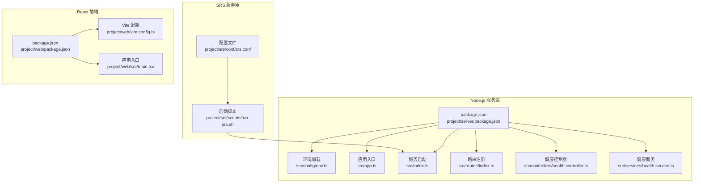
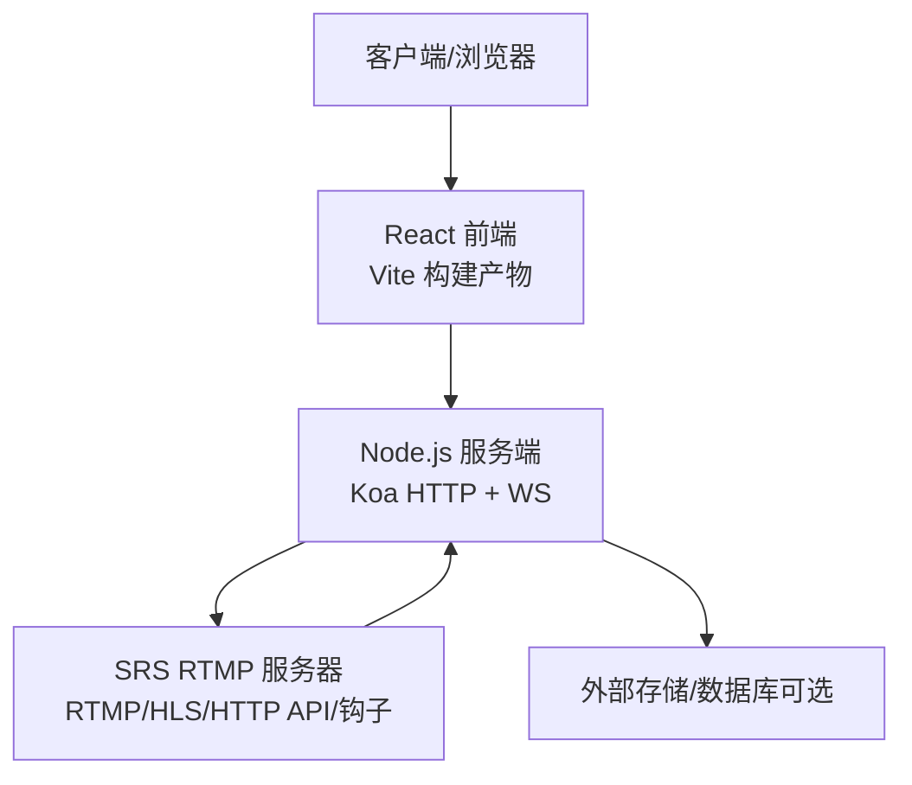
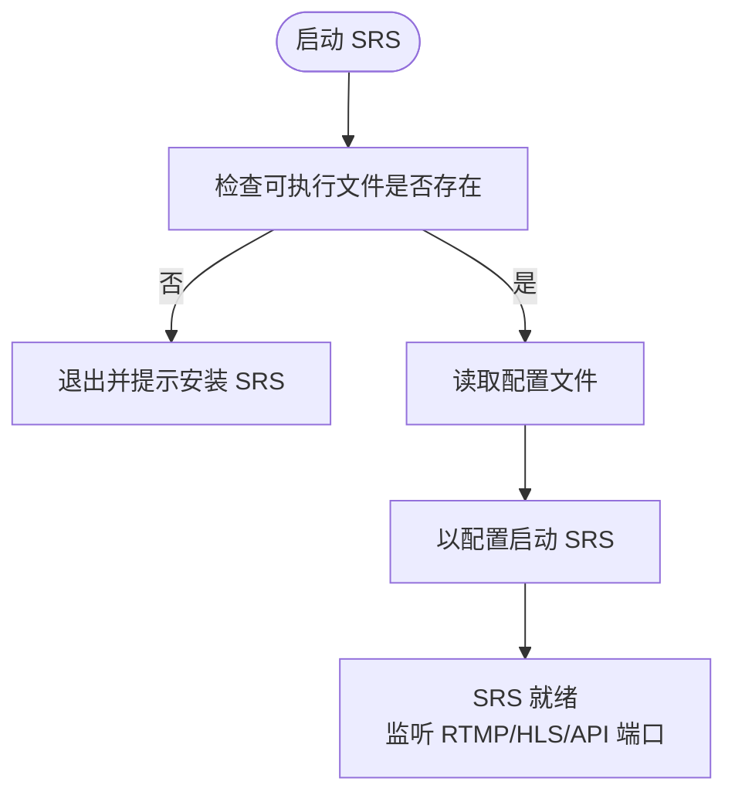
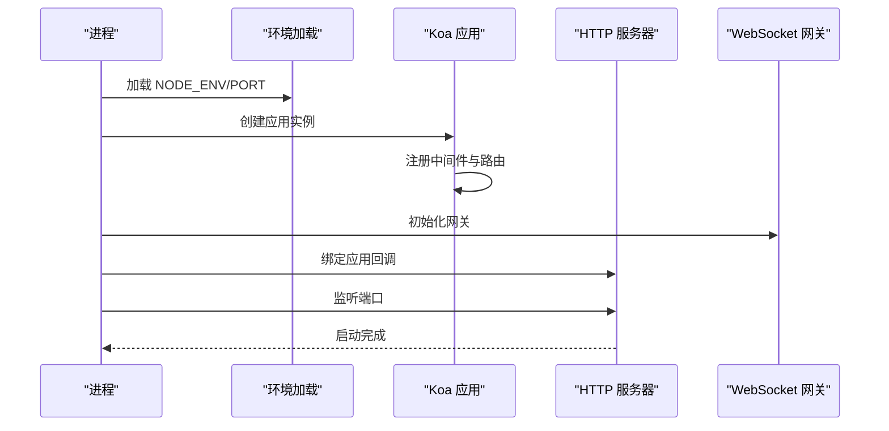
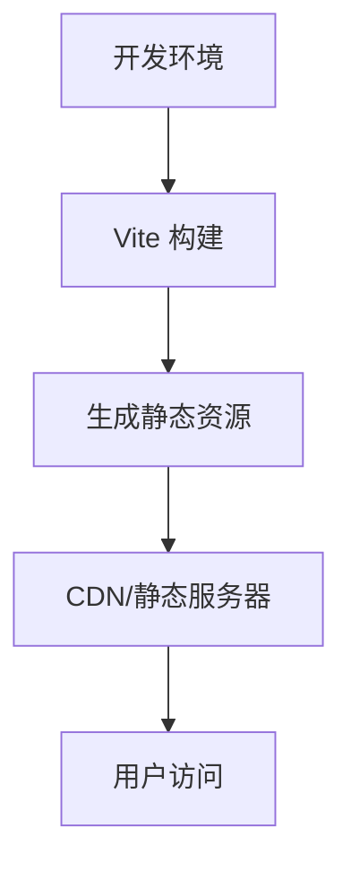
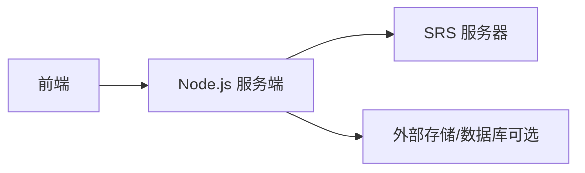

# 服务部署

<cite>
**本文引用的文件**
- [srs.conf](file://project/srs/conf/srs.conf)
- [run-srs.sh](file://project/srs/scripts/run-srs.sh)
- [package.json（服务端）](file://project/server/package.json)
- [env.ts](file://project/server/src/config/env.ts)
- [app.ts](file://project/server/src/app.ts)
- [index.ts](file://project/server/src/index.ts)
- [routes/index.ts](file://project/server/src/routes/index.ts)
- [controllers/health.controller.ts](file://project/server/src/controllers/health.controller.ts)
- [services/health.service.ts](file://project/server/src/services/health.service.ts)
- [package.json（前端）](file://project/web/package.json)
- [vite.config.ts](file://project/web/vite.config.ts)
- [main.tsx](file://project/web/src/main.tsx)
</cite>

## 目录
1. [简介](#简介)
2. [项目结构](#项目结构)
3. [核心组件](#核心组件)
4. [架构总览](#架构总览)
5. [详细组件分析](#详细组件分析)
6. [依赖关系分析](#依赖关系分析)
7. [性能考虑](#性能考虑)
8. [故障排查指南](#故障排查指南)
9. [结论](#结论)
10. [附录](#附录)

## 简介
本指南面向 Pi-Guard 系统的服务部署，覆盖以下目标：
- SRS RTMP 服务器的部署配置与启动管理
- Node.js 后端服务的部署流程、进程管理、端口配置与健康检查
- React 前端静态资源构建与部署策略
- systemd 服务配置、Docker 容器化部署与 Kubernetes 集群部署方案
- 服务发现、健康检查与自动重启配置建议

## 项目结构
Pi-Guard 由三部分组成：
- SRS RTMP 服务器：负责推拉流、HTTP 回调、HLS 输出等
- Node.js 服务端：基于 Koa 的 HTTP/WebSocket 服务，提供健康检查等接口
- React 前端：基于 Vite 构建的单页应用，用于管理与展示

图表来源
- [srs.conf:1-61](file://project/srs/conf/srs.conf#L1-L61)
- [run-srs.sh:1-14](file://project/srs/scripts/run-srs.sh#L1-L14)
- [package.json（服务端）:1-28](file://project/server/package.json#L1-L28)
- [env.ts:1-12](file://project/server/src/config/env.ts#L1-L12)
- [app.ts:1-14](file://project/server/src/app.ts#L1-L14)
- [index.ts:1-15](file://project/server/src/index.ts#L1-L15)
- [routes/index.ts:1-9](file://project/server/src/routes/index.ts#L1-L9)
- [controllers/health.controller.ts:1-7](file://project/server/src/controllers/health.controller.ts#L1-L7)
- [services/health.service.ts:1-14](file://project/server/src/services/health.service.ts#L1-L14)
- [package.json（前端）:1-34](file://project/web/package.json#L1-L34)
- [vite.config.ts:1-8](file://project/web/vite.config.ts#L1-L8)
- [main.tsx:1-15](file://project/web/src/main.tsx#L1-L15)

章节来源
- [srs.conf:1-61](file://project/srs/conf/srs.conf#L1-L61)
- [run-srs.sh:1-14](file://project/srs/scripts/run-srs.sh#L1-L14)
- [package.json（服务端）:1-28](file://project/server/package.json#L1-L28)
- [env.ts:1-12](file://project/server/src/config/env.ts#L1-L12)
- [app.ts:1-14](file://project/server/src/app.ts#L1-L14)
- [index.ts:1-15](file://project/server/src/index.ts#L1-L15)
- [routes/index.ts:1-9](file://project/server/src/routes/index.ts#L1-L9)
- [controllers/health.controller.ts:1-7](file://project/server/src/controllers/health.controller.ts#L1-L7)
- [services/health.service.ts:1-14](file://project/server/src/services/health.service.ts#L1-L14)
- [package.json（前端）:1-34](file://project/web/package.json#L1-L34)
- [vite.config.ts:1-8](file://project/web/vite.config.ts#L1-L8)
- [main.tsx:1-15](file://project/web/src/main.tsx#L1-L15)

## 核心组件
- SRS RTMP 服务器
  - 默认监听端口与功能：RTMP 1935、HTTP 管理 8080、API 1985、HLS 输出、HTTP 钩子回调
  - 推流发布与播放队列参数、GOP 缓存等
- Node.js 服务端
  - 端口通过环境变量加载，默认 3000；提供健康检查接口
  - 使用 Koa 路由与中间件，支持 WebSocket 网关初始化
- React 前端
  - Vite 构建产物，入口挂载于浏览器路由

章节来源
- [srs.conf:1-61](file://project/srs/conf/srs.conf#L1-L61)
- [env.ts:1-12](file://project/server/src/config/env.ts#L1-L12)
- [index.ts:1-15](file://project/server/src/index.ts#L1-L15)
- [routes/index.ts:1-9](file://project/server/src/routes/index.ts#L1-L9)
- [controllers/health.controller.ts:1-7](file://project/server/src/controllers/health.controller.ts#L1-L7)
- [services/health.service.ts:1-14](file://project/server/src/services/health.service.ts#L1-L14)
- [package.json（前端）:1-34](file://project/web/package.json#L1-L34)
- [vite.config.ts:1-8](file://project/web/vite.config.ts#L1-L8)
- [main.tsx:1-15](file://project/web/src/main.tsx#L1-L15)

## 架构总览
下图展示了系统组件间的交互关系与数据流向。

图表来源
- [index.ts:1-15](file://project/server/src/index.ts#L1-L15)
- [routes/index.ts:1-9](file://project/server/src/routes/index.ts#L1-L9)
- [srs.conf:1-61](file://project/srs/conf/srs.conf#L1-L61)

## 详细组件分析

### SRS RTMP 服务器部署与启动
- 配置要点
  - RTMP 监听端口、最大连接数、日志输出方式
  - HTTP 管理页面端口与静态目录
  - HTTP API 端口
  - 统计网络指标开关
  - vhost 级别优化：最小延迟、TCP_NODELAY
  - 发布与播放行为：关闭 MR、开启 GOP 缓存、设置播放队列长度
  - HTTP 重 mux 与 HLS 参数：路径、片段时长、窗口、清理策略、m3u8/ts 文件命名模板
  - HTTP 钩子：on_publish、on_unpublish、on_hls 回调至本地 Node.js 服务
- 启动方式
  - 提供启动脚本，校验可执行文件存在后以指定配置文件启动
- 建议
  - 将 HTTP 静态目录映射到可公开访问的路径，便于 HLS 播放
  - 在生产环境启用守护进程模式与日志轮转
  - 如需公网访问，结合反向代理与安全策略

图表来源
- [run-srs.sh:1-14](file://project/srs/scripts/run-srs.sh#L1-L14)
- [srs.conf:1-61](file://project/srs/conf/srs.conf#L1-L61)

章节来源
- [srs.conf:1-61](file://project/srs/conf/srs.conf#L1-L61)
- [run-srs.sh:1-14](file://project/srs/scripts/run-srs.sh#L1-L14)

### Node.js 服务端部署与健康检查
- 端口与环境
  - 端口从环境变量加载，默认 3000；NODE_ENV 控制运行模式
- 应用启动
  - 创建 HTTP 服务器，挂载 Koa 应用与路由
  - 初始化 WebSocket 网关
  - 监听端口并记录日志
- 路由与健康检查
  - 注册健康检查路由，返回服务状态与时间戳
- 建议
  - 结合 SRS HTTP 钩子回调，实现推流事件通知
  - 在容器或集群中暴露健康检查端点，配合探针使用

图表来源
- [env.ts:1-12](file://project/server/src/config/env.ts#L1-L12)
- [app.ts:1-14](file://project/server/src/app.ts#L1-L14)
- [index.ts:1-15](file://project/server/src/index.ts#L1-L15)
- [routes/index.ts:1-9](file://project/server/src/routes/index.ts#L1-L9)
- [controllers/health.controller.ts:1-7](file://project/server/src/controllers/health.controller.ts#L1-L7)
- [services/health.service.ts:1-14](file://project/server/src/services/health.service.ts#L1-L14)

章节来源
- [env.ts:1-12](file://project/server/src/config/env.ts#L1-L12)
- [app.ts:1-14](file://project/server/src/app.ts#L1-L14)
- [index.ts:1-15](file://project/server/src/index.ts#L1-L15)
- [routes/index.ts:1-9](file://project/server/src/routes/index.ts#L1-L9)
- [controllers/health.controller.ts:1-7](file://project/server/src/controllers/health.controller.ts#L1-L7)
- [services/health.service.ts:1-14](file://project/server/src/services/health.service.ts#L1-L14)

### React 前端静态资源部署
- 构建与预览
  - 使用 Vite 构建生产包，入口挂载于浏览器路由
- 部署建议
  - 将构建产物部署至 Nginx/Apache 或对象存储 CDN
  - 配置缓存头与压缩，确保静态资源高效分发
  - 若采用反向代理，注意处理 SPA 路由回退

图表来源
- [package.json（前端）:1-34](file://project/web/package.json#L1-L34)
- [vite.config.ts:1-8](file://project/web/vite.config.ts#L1-L8)
- [main.tsx:1-15](file://project/web/src/main.tsx#L1-L15)

章节来源
- [package.json（前端）:1-34](file://project/web/package.json#L1-L34)
- [vite.config.ts:1-8](file://project/web/vite.config.ts#L1-L8)
- [main.tsx:1-15](file://project/web/src/main.tsx#L1-L15)

## 依赖关系分析
- 组件耦合
  - Node.js 服务端依赖 SRS 的 HTTP 钩子回调地址
  - 前端通过 HTTP 与 WebSocket 与服务端交互
- 外部依赖
  - SRS 作为独立二进制运行
  - Node.js 服务端依赖 Koa 与路由
  - 前端依赖 React 生态与 Vite

图表来源
- [index.ts:1-15](file://project/server/src/index.ts#L1-L15)
- [routes/index.ts:1-9](file://project/server/src/routes/index.ts#L1-L9)
- [srs.conf:1-61](file://project/srs/conf/srs.conf#L1-L61)

章节来源
- [index.ts:1-15](file://project/server/src/index.ts#L1-L15)
- [routes/index.ts:1-9](file://project/server/src/routes/index.ts#L1-L9)
- [srs.conf:1-61](file://project/srs/conf/srs.conf#L1-L61)

## 性能考虑
- SRS
  - 合理设置播放队列长度与 GOP 缓存，平衡延迟与稳定性
  - HLS 片段时长与窗口应根据业务场景调整
  - 在高并发场景下评估最大连接数与网络统计开关
- Node.js
  - 使用进程管理器（如 PM2）进行多实例与自动重启
  - 合理设置端口与负载均衡，避免单点瓶颈
- 前端
  - 利用 CDN 缓存与压缩，减少首屏加载时间
  - 对路由进行懒加载与代码分割（如适用）

## 故障排查指南
- SRS
  - 启动失败：确认可执行文件存在与配置文件路径正确
  - 端口占用：检查 1935/8080/1985 是否被占用
  - HLS 不可用：确认静态目录可写且路径配置正确
- Node.js
  - 端口无法绑定：检查 PORT 环境变量与权限
  - 健康检查异常：确认路由注册与服务状态返回
- 前端
  - 构建失败：检查依赖与 Vite 配置
  - 路由 404：确认反向代理对 SPA 的回退配置

章节来源
- [run-srs.sh:1-14](file://project/srs/scripts/run-srs.sh#L1-L14)
- [srs.conf:1-61](file://project/srs/conf/srs.conf#L1-L61)
- [env.ts:1-12](file://project/server/src/config/env.ts#L1-L12)
- [index.ts:1-15](file://project/server/src/index.ts#L1-L15)
- [routes/index.ts:1-9](file://project/server/src/routes/index.ts#L1-L9)
- [controllers/health.controller.ts:1-7](file://project/server/src/controllers/health.controller.ts#L1-L7)
- [services/health.service.ts:1-14](file://project/server/src/services/health.service.ts#L1-L14)
- [package.json（前端）:1-34](file://project/web/package.json#L1-L34)
- [vite.config.ts:1-8](file://project/web/vite.config.ts#L1-L8)

## 结论
本指南提供了 Pi-Guard 系统在 SRS、Node.js 与 React 前端三个层面的部署要点与最佳实践。结合健康检查与进程管理，可在生产环境中实现稳定、可扩展的服务交付。

## 附录

### systemd 服务配置（示例思路）
- 目标：将 SRS 与 Node.js 服务托管为 systemd 单元，实现开机自启、自动重启与日志聚合
- 步骤概要
  - 为 SRS 创建单元：指向启动脚本，设置工作目录与用户
  - 为 Node.js 服务创建单元：设置环境变量（如 PORT）、工作目录、重启策略
  - 为前端静态资源准备 Nginx 配置并托管
- 关键点
  - 使用 Restart=always 与 RestartSec=10 实现自动重启
  - 使用 StandardOutput=journal 和 StandardError=journal 记录日志
  - 使用 ExecStartPre/ExecStartPost 进行前置检查与后置处理

章节来源
- [run-srs.sh:1-14](file://project/srs/scripts/run-srs.sh#L1-L14)
- [env.ts:1-12](file://project/server/src/config/env.ts#L1-L12)
- [index.ts:1-15](file://project/server/src/index.ts#L1-L15)

### Docker 容器化部署（示例思路）
- 目标：将 SRS、Node.js 与前端打包为容器镜像，统一版本与依赖
- 步骤概要
  - SRS：使用官方或社区镜像，挂载配置文件与静态目录
  - Node.js：构建多阶段镜像，复制构建产物，设置环境变量与非 root 用户
  - 前端：使用 Nginx 镜像承载静态资源，或直接将构建产物挂载到 Nginx
- 关键点
  - 暴露必要端口（1935/8080/1985/3000+）
  - 使用 docker-compose 编排，定义网络与卷
  - 设置健康检查与重启策略

章节来源
- [srs.conf:1-61](file://project/srs/conf/srs.conf#L1-L61)
- [package.json（服务端）:1-28](file://project/server/package.json#L1-L28)
- [package.json（前端）:1-34](file://project/web/package.json#L1-L34)

### Kubernetes 集群部署（示例思路）
- 目标：在集群内部署 SRS、Node.js 与前端，实现服务发现、滚动更新与弹性伸缩
- 步骤概要
  - SRS：使用 Deployment + Service，暴露 RTMP/HLS/API 端口
  - Node.js：使用 Deployment + Service，暴露 HTTP/WS 端口，配置健康检查
  - 前端：使用 Deployment + Ingress，或使用静态站点托管
- 关键点
  - 使用 ConfigMap 管理 SRS 配置与 Node.js 环境变量
  - 使用 Service 的 headless 或 ClusterIP 实现服务发现
  - 使用 readiness/liveness 探针保障健康检查
  - 使用 HPA 根据 CPU/内存或自定义指标进行扩缩容

章节来源
- [srs.conf:1-61](file://project/srs/conf/srs.conf#L1-L61)
- [routes/index.ts:1-9](file://project/server/src/routes/index.ts#L1-L9)
- [controllers/health.controller.ts:1-7](file://project/server/src/controllers/health.controller.ts#L1-L7)
- [services/health.service.ts:1-14](file://project/server/src/services/health.service.ts#L1-L14)