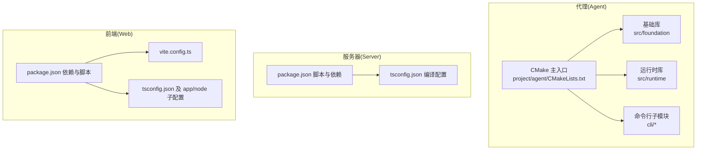
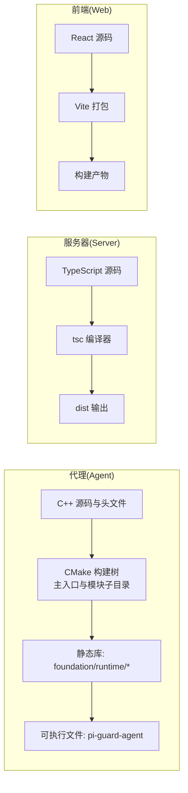
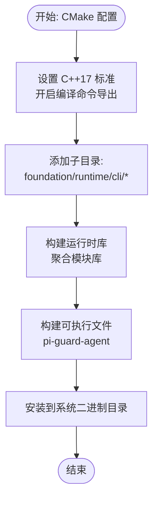
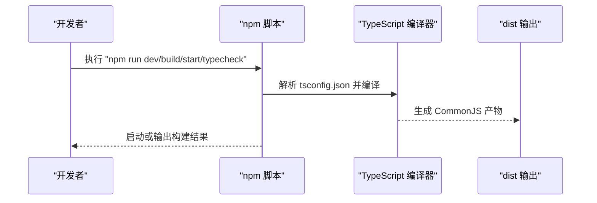
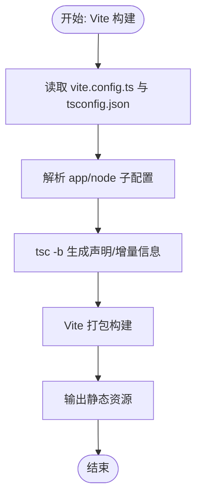
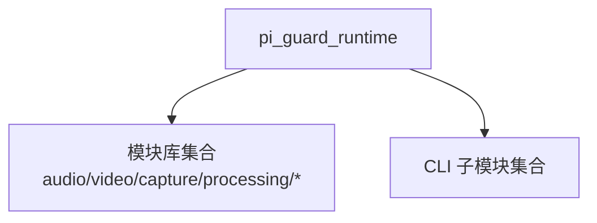

# 构建与打包

<cite>
**本文引用的文件**
- [project/agent/CMakeLists.txt](file://project/agent/CMakeLists.txt)
- [project/agent/src/foundation/CMakeLists.txt](file://project/agent/src/foundation/CMakeLists.txt)
- [project/agent/src/runtime/CMakeLists.txt](file://project/agent/src/runtime/CMakeLists.txt)
- [project/agent/cli/CMakeLists.txt](file://project/agent/cli/CMakeLists.txt)
- [project/agent/include/piguard/version.hpp](file://project/agent/include/piguard/version.hpp)
- [project/server/package.json](file://project/server/package.json)
- [project/server/tsconfig.json](file://project/server/tsconfig.json)
- [project/web/vite.config.ts](file://project/web/vite.config.ts)
- [project/web/package.json](file://project/web/package.json)
- [project/web/tsconfig.json](file://project/web/tsconfig.json)
- [project/web/tsconfig.app.json](file://project/web/tsconfig.app.json)
- [project/web/tsconfig.node.json](file://project/web/tsconfig.node.json)
</cite>

## 目录
1. [简介](#简介)
2. [项目结构](#项目结构)
3. [核心组件](#核心组件)
4. [架构总览](#架构总览)
5. [详细组件分析](#详细组件分析)
6. [依赖关系分析](#依赖关系分析)
7. [性能考虑](#性能考虑)
8. [故障排查指南](#故障排查指南)
9. [结论](#结论)
10. [附录](#附录)

## 简介
本指南面向 Pi-Guard 系统的构建与打包，覆盖以下方面：
- C++ 代理程序（Agent）的 CMake 构建：编译标准、目标组织、链接库、安装规则与测试开关。
- Node.js 服务（Server）的 npm 构建：脚本、类型检查、运行与打包流程。
- React 前端（Web）的 Vite 构建：配置、TypeScript 多配置文件策略与开发/预览/生产构建。
- 版本管理与发布：基于 C++ 头文件中的版本常量与 npm 包版本协同。
- 自动化与最佳实践：建议的 CI/CD 流程与镜像构建要点。

## 项目结构
Pi-Guard 采用多模块分层布局：
- 代理（Agent）：C++ 源码与子模块，通过 CMake 组织为静态库与可执行文件。
- 服务器（Server）：Koa + TypeScript，使用 TypeScript 编译器进行构建。
- 前端（Web）：React + Vite，采用多 tsconfig 的组合模式以区分应用与工具链类型。

图表来源
- [project/agent/CMakeLists.txt:1-51](file://project/agent/CMakeLists.txt#L1-L51)
- [project/agent/src/foundation/CMakeLists.txt:1-9](file://project/agent/src/foundation/CMakeLists.txt#L1-L9)
- [project/agent/src/runtime/CMakeLists.txt:1-28](file://project/agent/src/runtime/CMakeLists.txt#L1-L28)
- [project/server/package.json:1-28](file://project/server/package.json#L1-L28)
- [project/server/tsconfig.json:1-18](file://project/server/tsconfig.json#L1-L18)
- [project/web/vite.config.ts:1-8](file://project/web/vite.config.ts#L1-L8)
- [project/web/package.json:1-34](file://project/web/package.json#L1-L34)
- [project/web/tsconfig.json:1-8](file://project/web/tsconfig.json#L1-L8)
- [project/web/tsconfig.app.json:1-26](file://project/web/tsconfig.app.json#L1-L26)
- [project/web/tsconfig.node.json:1-25](file://project/web/tsconfig.node.json#L1-L25)

章节来源
- [project/agent/CMakeLists.txt:1-51](file://project/agent/CMakeLists.txt#L1-L51)
- [project/server/package.json:1-28](file://project/server/package.json#L1-L28)
- [project/web/package.json:1-34](file://project/web/package.json#L1-L34)

## 核心组件
- 代理（Agent）
  - 使用 C++17 标准，导出 compile_commands.json 便于编辑器与工具链集成。
  - 主可执行文件名称为 pi-guard-agent，安装到系统二进制目录。
  - 通过子目录组织模块，包含采集、处理、输出、基础设施与外部接入等模块。
- 服务器（Server）
  - 使用 Koa 与 TypeScript，提供开发、构建、启动与类型检查脚本。
  - CommonJS 输出目录为 dist，严格类型检查。
- 前端（Web）
  - Vite 配置启用 React 插件；多 tsconfig 分离应用与工具链类型定义。
  - 提供开发、构建、预览与 ESLint 检查脚本。

章节来源
- [project/agent/CMakeLists.txt:1-51](file://project/agent/CMakeLists.txt#L1-L51)
- [project/agent/src/foundation/CMakeLists.txt:1-9](file://project/agent/src/foundation/CMakeLists.txt#L1-L9)
- [project/agent/src/runtime/CMakeLists.txt:1-28](file://project/agent/src/runtime/CMakeLists.txt#L1-L28)
- [project/server/package.json:1-28](file://project/server/package.json#L1-L28)
- [project/server/tsconfig.json:1-18](file://project/server/tsconfig.json#L1-L18)
- [project/web/vite.config.ts:1-8](file://project/web/vite.config.ts#L1-L8)
- [project/web/package.json:1-34](file://project/web/package.json#L1-L34)
- [project/web/tsconfig.json:1-8](file://project/web/tsconfig.json#L1-L8)
- [project/web/tsconfig.app.json:1-26](file://project/web/tsconfig.app.json#L1-L26)
- [project/web/tsconfig.node.json:1-25](file://project/web/tsconfig.node.json#L1-L25)

## 架构总览
下图展示从源码到产物的关键构建路径与依赖关系：

图表来源
- [project/agent/CMakeLists.txt:1-51](file://project/agent/CMakeLists.txt#L1-L51)
- [project/agent/src/foundation/CMakeLists.txt:1-9](file://project/agent/src/foundation/CMakeLists.txt#L1-L9)
- [project/agent/src/runtime/CMakeLists.txt:1-28](file://project/agent/src/runtime/CMakeLists.txt#L1-L28)
- [project/server/tsconfig.json:1-18](file://project/server/tsconfig.json#L1-L18)
- [project/web/vite.config.ts:1-8](file://project/web/vite.config.ts#L1-L8)

## 详细组件分析

### C++ 代理程序（Agent）构建
- 编译标准与工具链
  - C++17 标准，开启编译命令导出以便 IDE/工具链使用。
- 目标与安装
  - 主可执行文件名为 pi-guard-agent，安装到系统二进制目录。
- 库与模块
  - 基础库：foundation（静态库）。
  - 运行时库：runtime（静态库），聚合多个模块库。
  - CLI 子模块：preview-video、record-audio、mp4、srs。
- 测试
  - 可选测试子目录，受 BUILD_TESTING 控制。

图表来源
- [project/agent/CMakeLists.txt:1-51](file://project/agent/CMakeLists.txt#L1-L51)
- [project/agent/src/foundation/CMakeLists.txt:1-9](file://project/agent/src/foundation/CMakeLists.txt#L1-L9)
- [project/agent/src/runtime/CMakeLists.txt:1-28](file://project/agent/src/runtime/CMakeLists.txt#L1-L28)
- [project/agent/cli/CMakeLists.txt:1-5](file://project/agent/cli/CMakeLists.txt#L1-L5)

章节来源
- [project/agent/CMakeLists.txt:1-51](file://project/agent/CMakeLists.txt#L1-L51)
- [project/agent/src/foundation/CMakeLists.txt:1-9](file://project/agent/src/foundation/CMakeLists.txt#L1-L9)
- [project/agent/src/runtime/CMakeLists.txt:1-28](file://project/agent/src/runtime/CMakeLists.txt#L1-L28)
- [project/agent/cli/CMakeLists.txt:1-5](file://project/agent/cli/CMakeLists.txt#L1-L5)

### Node.js 服务（Server）构建
- 脚本
  - 开发：使用 ts-node-dev 启动热重载。
  - 构建：tsc 按 tsconfig.json 编译。
  - 启动：运行 dist/index.js。
  - 类型检查：tsc --noEmit。
- 编译配置
  - CommonJS 模块，输出目录 dist，严格类型检查，跳过库校验，允许 JSON 模块。

图表来源
- [project/server/package.json:1-28](file://project/server/package.json#L1-L28)
- [project/server/tsconfig.json:1-18](file://project/server/tsconfig.json#L1-L18)

章节来源
- [project/server/package.json:1-28](file://project/server/package.json#L1-L28)
- [project/server/tsconfig.json:1-18](file://project/server/tsconfig.json#L1-L18)

### React 前端（Web）构建
- Vite 配置
  - 默认启用 @vitejs/plugin-react，简化 React 开发体验。
- TypeScript 配置
  - 顶层 tsconfig.json 通过 references 引入 app 与 node 子配置。
  - app 配置：bundler 模式、ES2023 目标、DOM 库、JSX 设置。
  - node 配置：bundler 模式、ES2023 目标、Node 类型。
- 脚本
  - 开发：vite。
  - 构建：先 tsc -b，再 vite build。
  - 预览：vite preview。
  - Lint：eslint .

图表来源
- [project/web/vite.config.ts:1-8](file://project/web/vite.config.ts#L1-L8)
- [project/web/package.json:1-34](file://project/web/package.json#L1-L34)
- [project/web/tsconfig.json:1-8](file://project/web/tsconfig.json#L1-L8)
- [project/web/tsconfig.app.json:1-26](file://project/web/tsconfig.app.json#L1-L26)
- [project/web/tsconfig.node.json:1-25](file://project/web/tsconfig.node.json#L1-L25)

章节来源
- [project/web/vite.config.ts:1-8](file://project/web/vite.config.ts#L1-L8)
- [project/web/package.json:1-34](file://project/web/package.json#L1-L34)
- [project/web/tsconfig.json:1-8](file://project/web/tsconfig.json#L1-L8)
- [project/web/tsconfig.app.json:1-26](file://project/web/tsconfig.app.json#L1-L26)
- [project/web/tsconfig.node.json:1-25](file://project/web/tsconfig.node.json#L1-L25)

### 版本管理与发布
- 代理版本
  - 在 piguard/version.hpp 中定义内联字符串版本号，可用于运行时查询与日志打印。
- 服务器与前端版本
  - 服务器与前端各自维护 package.json 中的 version 字段，用于包管理与发布。
- 发布建议
  - 统一版本标签：在合并前更新各处版本号，确保三端一致。
  - 语义化版本：遵循 MAJOR.MINOR.PATCH 规则，变更记录与变更集提交。

章节来源
- [project/agent/include/piguard/version.hpp:1-8](file://project/agent/include/piguard/version.hpp#L1-L8)
- [project/server/package.json:1-28](file://project/server/package.json#L1-L28)
- [project/web/package.json:1-34](file://project/web/package.json#L1-L34)

### 自动化构建脚本（建议）
- 通用步骤
  - 清理旧构建产物。
  - 代理：CMake 配置、编译、安装（可选测试）。
  - 服务器：安装依赖、类型检查、构建。
  - 前端：安装依赖、类型检查、构建。
- CI/CD 建议
  - 并行任务：分别构建三端产物。
  - 缓存：缓存 npm 与 CMake 编译缓存。
  - 归档：将构建产物与版本信息归档。

## 依赖关系分析
- 代理（Agent）
  - 运行时库链接多个模块库，形成清晰的模块边界与依赖聚合。
- 服务器（Server）
  - 运行时依赖 Koa 与 Router，开发期依赖 ts-node-dev 与 TypeScript。
- 前端（Web）
  - 运行时依赖 React 生态与 antd-mobile，开发期依赖 Vite、React 插件与 ESLint。

图表来源
- [project/agent/src/runtime/CMakeLists.txt:10-27](file://project/agent/src/runtime/CMakeLists.txt#L10-L27)

章节来源
- [project/agent/src/runtime/CMakeLists.txt:1-28](file://project/agent/src/runtime/CMakeLists.txt#L1-L28)

## 性能考虑
- CMake
  - 启用编译命令导出，提升索引与补全效率。
  - 将公共头文件路径设为 PUBLIC，减少重复包含开销。
- TypeScript
  - 使用 bundler 模式与 noEmit，避免重复编译。
  - 合理拆分 app 与 node 配置，缩短增量编译时间。
- Vite
  - 使用 React 插件与 ES2023 目标，获得更好的 Tree-shaking 与现代语法支持。
  - 预览与生产构建分离，便于定位性能问题。

## 故障排查指南
- 代理（Agent）
  - CMake 版本过低：确保 CMake ≥ 3.16。
  - C++ 标准不匹配：确认 C++17 标准已启用。
  - 链接失败：检查模块库是否正确添加与命名一致。
- 服务器（Server）
  - 类型错误：执行 typecheck 脚本定位问题。
  - 运行时异常：检查 dist 输出与环境变量。
- 前端（Web）
  - 构建失败：先执行 tsc -b 再 vite build。
  - 预览异常：确认本地端口未被占用。

章节来源
- [project/agent/CMakeLists.txt:1-51](file://project/agent/CMakeLists.txt#L1-L51)
- [project/server/package.json:1-28](file://project/server/package.json#L1-L28)
- [project/web/package.json:1-34](file://project/web/package.json#L1-L34)

## 结论
本指南提供了 Pi-Guard 三端（代理、服务器、前端）的构建与打包要点。通过统一的版本管理与脚本化流程，可实现稳定高效的持续集成与交付。建议在团队内约定统一的构建规范与发布节奏，确保跨平台与跨语言的一致性。

## 附录
- 快速命令参考（示例）
  - 代理：CMake 配置 → 编译 → 安装 → 可选测试。
  - 服务器：安装依赖 → 类型检查 → 构建 → 启动。
  - 前端：安装依赖 → 类型检查 → 构建 → 预览。
- 最佳实践
  - 使用独立的构建目录与缓存策略。
  - 在 CI 中并行构建三端，缩短流水线时间。
  - 对产物进行签名与完整性校验（建议）。