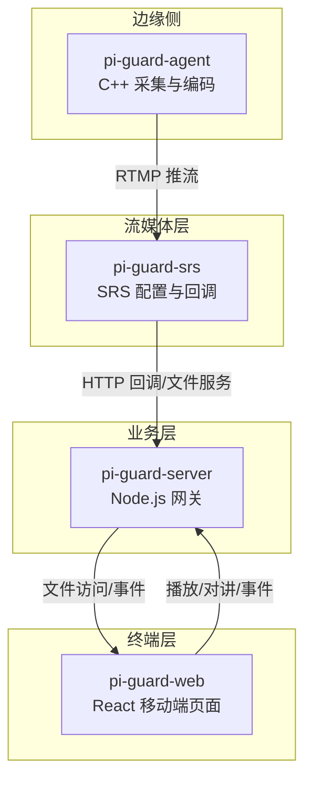
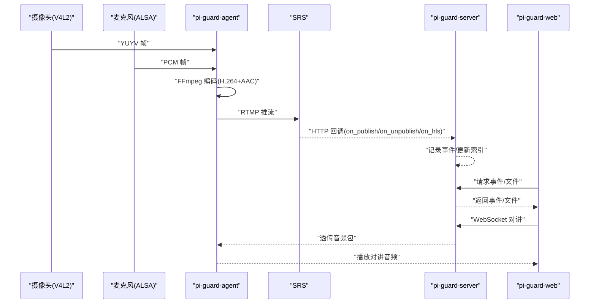
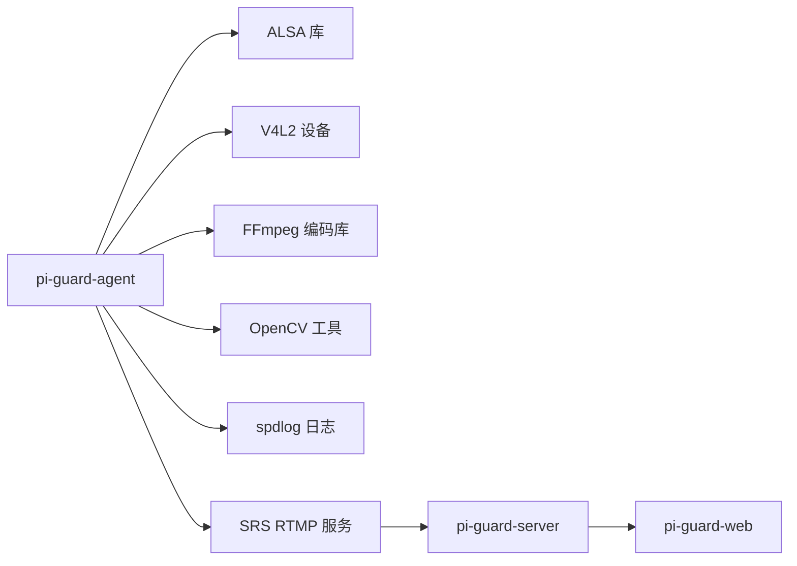
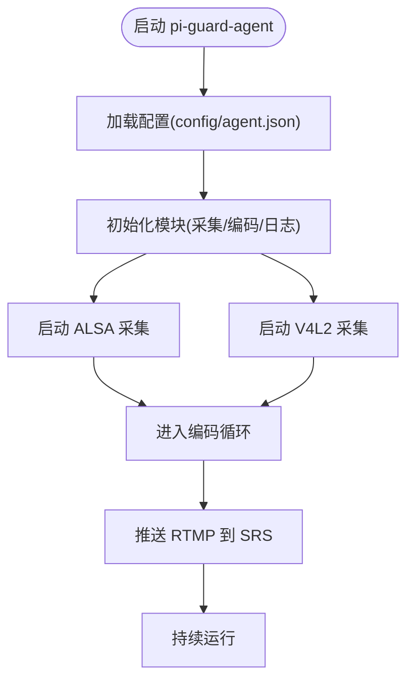

# 环境准备

<cite>
**本文引用的文件**
- [README.md](file://README.md)
- [构建.md](file://docs/agent/构建.md)
- [package.json（服务端）](file://project/server/package.json)
- [env.ts（服务端配置）](file://project/server/src/config/env.ts)
- [package.json（前端）](file://project/web/package.json)
- [CMakeLists.txt（代理工程）](file://project/agent/CMakeLists.txt)
- [main.cpp（代理入口）](file://project/agent/src/main.cpp)
- [srs.conf（SRS配置）](file://project/srs/conf/srs.conf)
- [run-srs.sh（SRS启动脚本）](file://project/srs/scripts/run-srs.sh)
- [audio_capture_provider.cpp（音频采集实现）](file://project/agent/src/modules/capture/audio/audio_capture_provider.cpp)
- [video_capture_provider.cpp（视频采集实现）](file://project/agent/src/modules/capture/video/video_capture_provider.cpp)
- [encoder.cpp（音视频编码实现）](file://project/agent/src/modules/processing/encoder/encoder.cpp)
</cite>

## 目录
1. [简介](#简介)
2. [项目结构](#项目结构)
3. [核心组件](#核心组件)
4. [架构总览](#架构总览)
5. [详细组件分析](#详细组件分析)
6. [依赖分析](#依赖分析)
7. [性能考虑](#性能考虑)
8. [故障排查指南](#故障排查指南)
9. [结论](#结论)
10. [附录](#附录)

## 简介
本指南面向 Pi-Guard 系统的环境准备与部署，覆盖系统要求、依赖包、跨平台安装步骤、开发工具链、权限与网络配置、环境变量与系统服务配置等。Pi-Guard 采用分层架构：边缘侧 C++ 采集代理（pi-guard-agent）、SRS 流媒体服务（pi-guard-srs）、Node.js 业务网关（pi-guard-server）、移动端 Web 前端（pi-guard-web）。系统在 Ubuntu 环境运行，支持 ARM（树莓派）与 x86-64 架构。

章节来源
- [README.md:1-68](file://README.md#L1-L68)

## 项目结构
Pi-Guard 工程位于 project/ 目录，包含四个核心子工程：
- agent：边缘采集代理（C++，CMake 构建）
- server：Node.js 业务网关
- web：移动端 Web 前端（React + Vite）
- srs：SRS 流媒体服务配置与启动脚本

图表来源
- [README.md:50-68](file://README.md#L50-L68)
- [srs.conf:1-61](file://project/srs/conf/srs.conf#L1-L61)
- [env.ts:1-12](file://project/server/src/config/env.ts#L1-L12)

章节来源
- [README.md:50-68](file://README.md#L50-L68)

## 核心组件
- 边缘采集代理（pi-guard-agent）
  - 通过 V4L2 采集摄像头视频，ALSA 采集麦克风音频
  - 使用 OpenCV 做移动侦测
  - 本地异步录制 MP4（H.264 + AAC）
  - 基于 FFmpeg API 推送 RTMP 到 SRS（视频使用 h264_v4l2m2m 硬件编码）
  - 通过 WebSocket 与后端保持连接，支持双向语音对讲
- 流媒体服务（pi-guard-srs）
  - 接收并转发 RTMP 音视频流
  - 支持 DVR/HLS 录制（.m3u8 + .ts）
  - 通过 HTTP Hooks 向 Node.js 通知推流状态与录制事件
- 业务网关（pi-guard-server）
  - 接收与存储移动侦测事件
  - 提供录像文件的 HTTP 访问与分发
  - 作为 WebSocket 语音网关，协调对讲会话
- 终端交互（pi-guard-web）
  - 播放实时流（RTMP/HTTP-FLV/HLS）
  - 采集手机麦克风音频并通过 WebSocket 发送给后端

章节来源
- [README.md:1-68](file://README.md#L1-L68)

## 架构总览
Pi-Guard 的端到端流程如下：
- 边缘侧采集与编码：V4L2 + ALSA -> FFmpeg 编码 -> RTMP 推流
- 流媒体层：SRS 接收 -> 转发/录制 -> HTTP 回调
- 业务层：Node.js 接收回调，管理事件与文件服务
- 终端层：Web 端播放实时流、回放历史、双向语音

图表来源
- [README.md:1-68](file://README.md#L1-L68)
- [srs.conf:54-59](file://project/srs/conf/srs.conf#L54-L59)
- [env.ts:6-11](file://project/server/src/config/env.ts#L6-L11)

## 详细组件分析

### 系统要求与平台支持
- 操作系统
  - Ubuntu（推荐）
  - 支持 ARM（树莓派）与 x86-64 架构
- 硬件要求
  - 摄像头：支持 V4L2 的 USB/CSI 设备
  - 麦克风：支持 ALSA 的 USB/板载音频设备
  - 存储：至少满足实时录制与 HLS/DVR 录制的空间需求
- 内存与存储
  - 建议至少 1GB RAM（实际取决于分辨率与并发）
  - 存储空间应预留至少 100GB（根据录制策略与保留周期）

章节来源
- [README.md:5-6](file://README.md#L5-L6)

### 依赖包清单与安装指引
- 代理工程（C++，CMake）
  - 必需工具：CMake ≥ 3.16、C++17 支持编译器（g++/clang++）
  - 外部依赖：ALSA（音频采集）、OpenCV（工具）、spdlog（日志）
  - Ubuntu 安装命令示例（摘自构建文档）
    - 开发工具链与基础库：build-essential cmake pkg-config
    - 音频：libasound2-dev
    - 日志：libspdlog-dev
    - OpenCV：libopencv-dev
- 服务端（Node.js）
  - 运行时：Node.js（与 package.json 中的脚本与依赖匹配）
  - 依赖：Koa、@koa/router（生产），ts-node-dev、typescript（开发）
- 前端（React + Vite）
  - 运行时：Node.js（用于构建与预览）
  - 依赖：React、react-dom、antd-mobile、vite、typescript、eslint 等
- 流媒体（SRS）
  - 二进制：SRS（通过 run-srs.sh 检查并启动）

章节来源
- [构建.md:5-39](file://docs/agent/构建.md#L5-L39)
- [构建.md:46-86](file://docs/agent/构建.md#L46-L86)
- [package.json（服务端）:16-26](file://project/server/package.json#L16-L26)
- [package.json（前端）:12-32](file://project/web/package.json#L12-L32)
- [run-srs.sh:4-7](file://project/srs/scripts/run-srs.sh#L4-L7)

### 开发工具链配置
- C++ 代理
  - CMake ≥ 3.16，C++17 标准，启用 CMAKE_EXPORT_COMPILE_COMMANDS 便于 IDE/clangd
  - 常用选项：BUILD_TESTING、CMAKE_BUILD_TYPE（Release/Debug）、PI_GUARD_LOG_BACKEND
  - 构建与安装：out-of-source 构建至 build/，安装前缀默认 /usr/local
- Node.js 服务端
  - 开发：ts-node-dev、typescript
  - 构建：tsc
  - 启动：npm run dev 或 npm run start
- React 前端
  - 开发：vite
  - 构建：tsc -b && vite build
  - 预览：vite preview

章节来源
- [构建.md:66-86](file://docs/agent/构建.md#L66-L86)
- [package.json（服务端）:6-11](file://project/server/package.json#L6-L11)
- [package.json（前端）:6-11](file://project/web/package.json#L6-L11)

### 权限设置
- ALSA 音频采集
  - 需要访问声卡设备节点与动态库
  - 开发环境建议安装 libasound2-dev；运行时通常 libasound2 已存在
- V4L2 视频采集
  - 需要访问 /dev/video* 设备
  - 建议将运行用户加入 video 组，或授予相应 udev 规则
- 文件系统
  - 本地录制与 SRS HLS/DVR 输出目录需具备读写权限
  - 建议为录制目录设置合适的权限与磁盘配额

章节来源
- [构建.md:31-45](file://docs/agent/构建.md#L31-L45)
- [audio_capture_provider.cpp:6](file://project/agent/src/modules/capture/audio/audio_capture_provider.cpp#L6)
- [video_capture_provider.cpp:8](file://project/agent/src/modules/capture/video/video_capture_provider.cpp#L8)

### 网络配置
- SRS
  - 默认监听 1935（RTMP）、8080（HTTP 服务）、1985（HTTP API）
  - HTTP Hooks 回调地址指向后端服务（默认 127.0.0.1:3000）
- 业务网关（Node.js）
  - 默认端口 3000（可通过环境变量 PORT 覆盖）
  - 提供健康检查、事件与文件服务
- 前端
  - 通过 RTMP/HTTP-FLV/HLS 播放实时流
  - 通过 WebSocket 与后端进行双向语音对讲

章节来源
- [srs.conf:1-61](file://project/srs/conf/srs.conf#L1-L61)
- [env.ts:6-11](file://project/server/src/config/env.ts#L6-L11)

### 环境变量与系统服务配置
- 环境变量（Node.js）
  - NODE_ENV：运行环境（默认 development）
  - PORT：服务端口（默认 3000）
- 系统服务（systemd）
  - 文档中提及 systemd 服务定义文件（piguard.service）
  - 建议将代理、SRS、服务端分别配置为独立服务，按需自启动
- 启动顺序
  - 先启动 SRS，再启动服务端，最后启动代理

章节来源
- [env.ts:1-12](file://project/server/src/config/env.ts#L1-L12)
- [README.md:40-49](file://README.md#L40-L49)

## 依赖分析
Pi-Guard 的关键依赖关系如下：
- 代理工程依赖 ALSA、V4L2、FFmpeg（通过 FFmpeg API 编码）、OpenCV（工具）、spdlog（日志）
- 服务端依赖 Koa、@koa/router，前端依赖 React 生态与 Vite
- SRS 通过 HTTP Hooks 与服务端通信

图表来源
- [构建.md:15-39](file://docs/agent/构建.md#L15-L39)
- [audio_capture_provider.cpp:6](file://project/agent/src/modules/capture/audio/audio_capture_provider.cpp#L6)
- [video_capture_provider.cpp:8](file://project/agent/src/modules/capture/video/video_capture_provider.cpp#L8)
- [encoder.cpp:14-21](file://project/agent/src/modules/processing/encoder/encoder.cpp#L14-L21)
- [srs.conf:54-59](file://project/srs/conf/srs.conf#L54-L59)

章节来源
- [构建.md:15-39](file://docs/agent/构建.md#L15-L39)
- [encoder.cpp:14-21](file://project/agent/src/modules/processing/encoder/encoder.cpp#L14-L21)

## 性能考虑
- 编码参数
  - 视频：H.264，硬件编码（h264_v4l2m2m），预设与调优参数已在编码器中配置
  - 音频：AAC，采样率与声道布局按通道数调整
- 队列与缓冲
  - 采集与编码线程间通过无界队列缓冲，容量受最大容量限制，避免内存膨胀
- 线程模型
  - 采集线程负责设备 IO，编码线程负责 CPU 密集型处理，分离设计降低耦合
- I/O 与存储
  - 本地录制与 SRS HLS/DVR 录制需关注磁盘吞吐，建议使用 SSD 或优化挂载参数

章节来源
- [README.md:10-14](file://README.md#L10-L14)
- [encoder.cpp:56-138](file://project/agent/src/modules/processing/encoder/encoder.cpp#L56-L138)
- [video_capture_provider.cpp:310-401](file://project/agent/src/modules/capture/video/video_capture_provider.cpp#L310-L401)

## 故障排查指南
- 无法启动 SRS
  - 确认已安装 SRS，并通过 run-srs.sh 启动
  - 检查端口占用与配置文件路径
- 代理启动失败
  - 检查 ALSA 设备是否可用（设备名、权限）
  - 检查 V4L2 设备是否可用（/dev/video*、权限）
  - 查看日志输出（spdlog）
- 编码异常
  - 确认 FFmpeg 库版本与编码器可用性
  - 检查分辨率、帧率与比特率参数是否合理
- 回调未到达
  - 检查 SRS HTTP Hooks 配置与后端服务可达性
  - 确认后端服务已启动并监听正确端口

章节来源
- [run-srs.sh:4-13](file://project/srs/scripts/run-srs.sh#L4-L13)
- [audio_capture_provider.cpp:170-210](file://project/agent/src/modules/capture/audio/audio_capture_provider.cpp#L170-L210)
- [video_capture_provider.cpp:104-124](file://project/agent/src/modules/capture/video/video_capture_provider.cpp#L104-L124)
- [encoder.cpp:56-138](file://project/agent/src/modules/processing/encoder/encoder.cpp#L56-L138)
- [srs.conf:54-59](file://project/srs/conf/srs.conf#L54-L59)
- [env.ts:6-11](file://project/server/src/config/env.ts#L6-L11)

## 结论
Pi-Guard 的环境准备围绕“采集-编码-转码/存储-业务-终端”的链路展开。完成系统与依赖安装、权限与网络配置、环境变量与服务配置后，即可按顺序启动 SRS、服务端与代理，实现完整的实时安防闭环。建议在生产环境中结合硬件规格与业务负载，进一步优化编码参数、存储与网络策略。

## 附录

### 平台安装步骤（Ubuntu）
- 安装代理依赖
  - 开发工具：build-essential cmake pkg-config
  - 音频：libasound2-dev
  - 日志：libspdlog-dev
  - OpenCV：libopencv-dev
- 安装 Node.js 与前端依赖
  - 安装 Node.js（服务端与前端均需）
  - 在服务端与前端目录执行依赖安装与构建
- 安装 SRS
  - 安装 SRS 二进制
  - 使用 run-srs.sh 启动并验证配置

章节来源
- [构建.md:24-45](file://docs/agent/构建.md#L24-L45)
- [package.json（服务端）:16-26](file://project/server/package.json#L16-L26)
- [package.json（前端）:12-32](file://project/web/package.json#L12-L32)
- [run-srs.sh:4-13](file://project/srs/scripts/run-srs.sh#L4-L13)

### 关键流程图：代理启动与采集

图表来源
- [main.cpp:6-18](file://project/agent/src/main.cpp#L6-L18)
- [audio_capture_provider.cpp:39-73](file://project/agent/src/modules/capture/audio/audio_capture_provider.cpp#L39-L73)
- [video_capture_provider.cpp:48-82](file://project/agent/src/modules/capture/video/video_capture_provider.cpp#L48-L82)
- [encoder.cpp:267-297](file://project/agent/src/modules/processing/encoder/encoder.cpp#L267-L297)