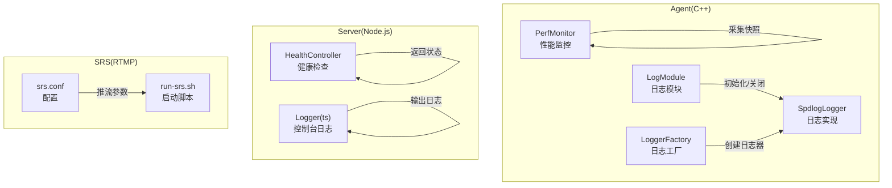
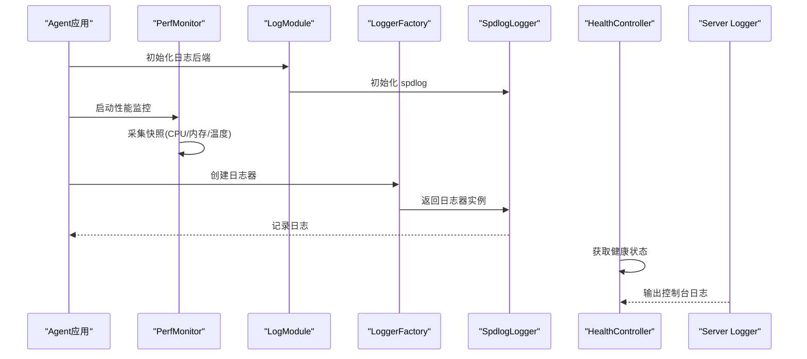
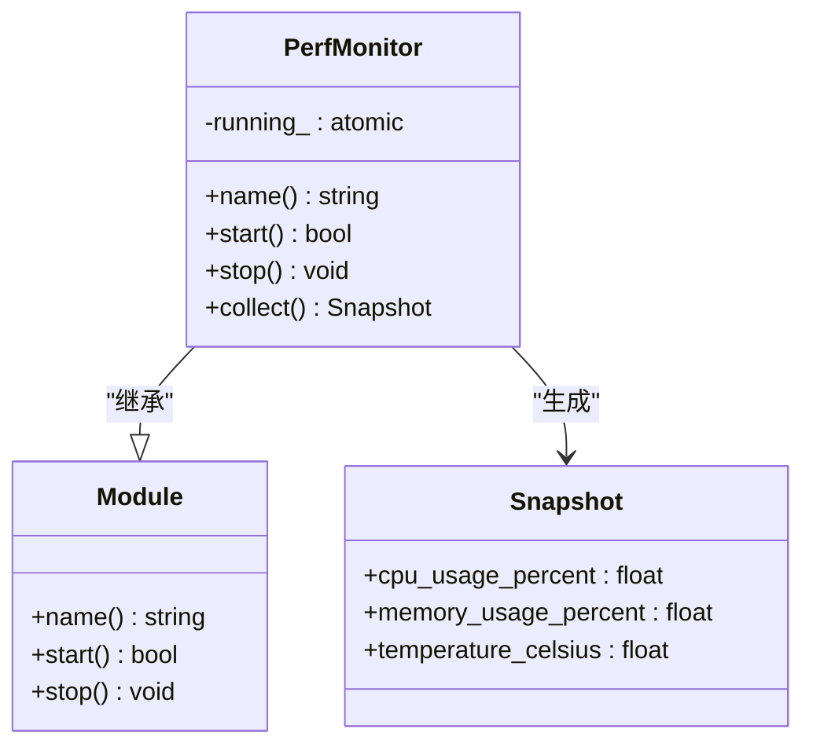
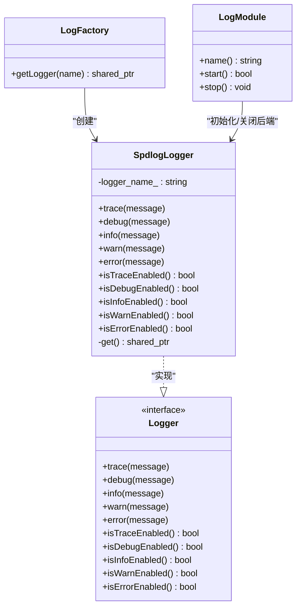
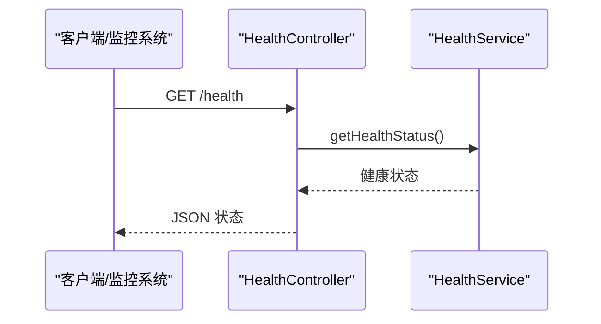
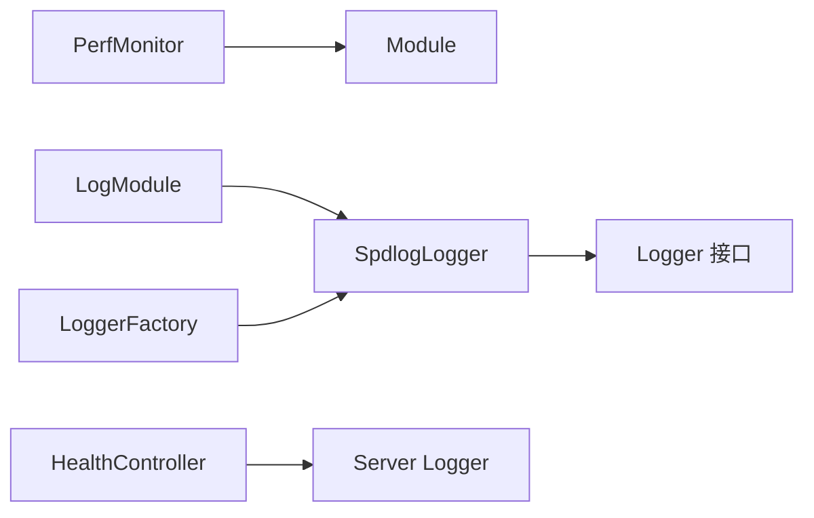

# 监控与维护

<cite>
**本文引用的文件**
- [perf_monitor.hpp](file://project/agent/src/modules/infra/perf_monitor/include/infra_monitor/perf_monitor.hpp)
- [perf_monitor.cpp](file://project/agent/src/modules/infra/perf_monitor/perf_monitor.cpp)
- [module.hpp](file://project/agent/src/foundation/include/foundation/module.hpp)
- [log_module.cpp](file://project/agent/src/modules/infra/log/log_module.cpp)
- [logger.hpp](file://project/agent/src/modules/infra/log/include/infra_log/logger.hpp)
- [logger_factory.cpp](file://project/agent/src/modules/infra/log/logger_factory.cpp)
- [spd_logger.hpp](file://project/agent/src/modules/infra/log/spd_logger.hpp)
- [spd_logger.cpp](file://project/agent/src/modules/infra/log/spd_logger.cpp)
- [logger.ts](file://project/server/src/config/logger.ts)
- [health.controller.ts](file://project/server/src/controllers/health.controller.ts)
- [srs.conf](file://project/srs/conf/srs.conf)
- [run-srs.sh](file://project/srs/scripts/run-srs.sh)
</cite>

## 目录
1. [简介](#简介)
2. [项目结构](#项目结构)
3. [核心组件](#核心组件)
4. [架构总览](#架构总览)
5. [详细组件分析](#详细组件分析)
6. [依赖关系分析](#依赖关系分析)
7. [性能考量](#性能考量)
8. [故障排查指南](#故障排查指南)
9. [结论](#结论)
10. [附录](#附录)

## 简介
本指南面向 Pi-Guard 系统的运维与开发人员，聚焦于系统监控与维护实践。当前代码库中已包含基础的性能监控模块与日志基础设施，以及服务端健康检查接口。本文基于现有实现，给出可操作的监控指标采集与展示建议、日志配置与管理策略、性能监控与告警设置思路、故障诊断方法、定期维护与备份建议，以及升级与回滚流程。

## 项目结构
Pi-Guard 由三部分组成：Agent（C++ 模块化采集与处理）、Server（Node.js 健康检查与网关）、SRS（RTMP 推流）。监控与维护相关的关键位置如下：
- Agent 性能监控：perf_monitor 模块提供 CPU、内存、温度快照能力，并通过 Module 生命周期管理启动/停止。
- Agent 日志：基于 spdlog 的日志后端初始化与工厂创建日志器；LogModule 负责后端生命周期。
- Server 日志：控制台格式化输出；健康检查控制器返回运行状态。
- SRS：RTMP 推流服务配置与脚本。

**图表来源**
- [perf_monitor.hpp:1-28](file://project/agent/src/modules/infra/perf_monitor/include/infra_monitor/perf_monitor.hpp#L1-L28)
- [perf_monitor.cpp:1-26](file://project/agent/src/modules/infra/perf_monitor/perf_monitor.cpp#L1-L26)
- [log_module.cpp:1-30](file://project/agent/src/modules/infra/log/log_module.cpp#L1-L30)
- [logger_factory.cpp:1-11](file://project/agent/src/modules/infra/log/logger_factory.cpp#L1-L11)
- [spd_logger.hpp:1-38](file://project/agent/src/modules/infra/log/spd_logger.hpp#L1-L38)
- [spd_logger.cpp:1-68](file://project/agent/src/modules/infra/log/spd_logger.cpp#L1-L68)
- [health.controller.ts:1-7](file://project/server/src/controllers/health.controller.ts#L1-L7)
- [logger.ts:1-18](file://project/server/src/config/logger.ts#L1-L18)
- [srs.conf](file://project/srs/conf/srs.conf)
- [run-srs.sh](file://project/srs/scripts/run-srs.sh)

**章节来源**
- [perf_monitor.hpp:1-28](file://project/agent/src/modules/infra/perf_monitor/include/infra_monitor/perf_monitor.hpp#L1-L28)
- [perf_monitor.cpp:1-26](file://project/agent/src/modules/infra/perf_monitor/perf_monitor.cpp#L1-L26)
- [log_module.cpp:1-30](file://project/agent/src/modules/infra/log/log_module.cpp#L1-L30)
- [logger.hpp:1-25](file://project/agent/src/modules/infra/log/include/infra_log/logger.hpp#L1-L25)
- [logger_factory.cpp:1-11](file://project/agent/src/modules/infra/log/logger_factory.cpp#L1-L11)
- [spd_logger.hpp:1-38](file://project/agent/src/modules/infra/log/spd_logger.hpp#L1-L38)
- [spd_logger.cpp:1-68](file://project/agent/src/modules/infra/log/spd_logger.cpp#L1-L68)
- [health.controller.ts:1-7](file://project/server/src/controllers/health.controller.ts#L1-L7)
- [logger.ts:1-18](file://project/server/src/config/logger.ts#L1-L18)
- [srs.conf](file://project/srs/conf/srs.conf)
- [run-srs.sh](file://project/srs/scripts/run-srs.sh)

## 核心组件
- 性能监控模块（PerfMonitor）
  - 提供快照结构体，包含 CPU 使用率、内存使用率、温度等字段。
  - 实现 Module 接口，支持启动/停止与快照采集。
  - 当前实现返回固定值，实际部署时应替换为真实系统指标采集逻辑。
- 日志系统（Agent）
  - LogModule：负责初始化/关闭 spdlog 后端。
  - Logger 接口与 SpdlogLogger 实现：统一日志抽象与具体实现。
  - LoggerFactory：按名称创建日志器实例。
  - 支持多线程安全的后端初始化与关闭。
- 服务端日志与健康检查（Server）
  - 控制台格式化日志输出。
  - 健康检查控制器返回服务状态，便于外部监控系统拉取。

**章节来源**
- [perf_monitor.hpp:1-28](file://project/agent/src/modules/infra/perf_monitor/include/infra_monitor/perf_monitor.hpp#L1-L28)
- [perf_monitor.cpp:1-26](file://project/agent/src/modules/infra/perf_monitor/perf_monitor.cpp#L1-L26)
- [module.hpp:1-17](file://project/agent/src/foundation/include/foundation/module.hpp#L1-L17)
- [log_module.cpp:1-30](file://project/agent/src/modules/infra/log/log_module.cpp#L1-L30)
- [logger.hpp:1-25](file://project/agent/src/modules/infra/log/include/infra_log/logger.hpp#L1-L25)
- [logger_factory.cpp:1-11](file://project/agent/src/modules/infra/log/logger_factory.cpp#L1-L11)
- [spd_logger.hpp:1-38](file://project/agent/src/modules/infra/log/spd_logger.hpp#L1-L38)
- [spd_logger.cpp:1-68](file://project/agent/src/modules/infra/log/spd_logger.cpp#L1-L68)
- [health.controller.ts:1-7](file://project/server/src/controllers/health.controller.ts#L1-L7)
- [logger.ts:1-18](file://project/server/src/config/logger.ts#L1-L18)

## 架构总览
下图展示了监控与维护相关组件在系统中的交互关系，以及数据流向。

**图表来源**
- [log_module.cpp:1-30](file://project/agent/src/modules/infra/log/log_module.cpp#L1-L30)
- [logger_factory.cpp:1-11](file://project/agent/src/modules/infra/log/logger_factory.cpp#L1-L11)
- [spd_logger.cpp:1-68](file://project/agent/src/modules/infra/log/spd_logger.cpp#L1-L68)
- [perf_monitor.cpp:1-26](file://project/agent/src/modules/infra/perf_monitor/perf_monitor.cpp#L1-L26)
- [health.controller.ts:1-7](file://project/server/src/controllers/health.controller.ts#L1-L7)
- [logger.ts:1-18](file://project/server/src/config/logger.ts#L1-L18)

## 详细组件分析

### 性能监控模块（PerfMonitor）
- 角色与职责
  - 提供性能快照采集能力，包含 CPU、内存、温度等关键指标。
  - 通过 Module 接口纳入 Agent 生命周期管理。
- 关键点
  - 当前实现返回固定数值，需替换为真实系统指标采集（如 /proc 或平台 API）。
  - 运行状态以原子布尔变量控制，避免竞态。
- 可视化与集成
  - 建议将快照写入本地或远程监控系统（如 Prometheus Pushgateway），并结合 Grafana 展示。
  - 健康检查控制器可扩展为聚合性能指标并返回。

**图表来源**
- [module.hpp:1-17](file://project/agent/src/foundation/include/foundation/module.hpp#L1-L17)
- [perf_monitor.hpp:1-28](file://project/agent/src/modules/infra/perf_monitor/include/infra_monitor/perf_monitor.hpp#L1-L28)

**章节来源**
- [perf_monitor.hpp:1-28](file://project/agent/src/modules/infra/perf_monitor/include/infra_monitor/perf_monitor.hpp#L1-L28)
- [perf_monitor.cpp:1-26](file://project/agent/src/modules/infra/perf_monitor/perf_monitor.cpp#L1-L26)
- [module.hpp:1-17](file://project/agent/src/foundation/include/foundation/module.hpp#L1-L17)

### 日志系统（Agent）
- 组件关系
  - LogModule：负责初始化/关闭 spdlog 后端，确保单次初始化与线程安全。
  - Logger 接口：定义日志级别与可用性查询。
  - SpdlogLogger：基于 spdlog 的具体实现，提供彩色控制台输出。
  - LoggerFactory：按名称创建日志器，内部委托 spdlog 后端。
- 配置与管理
  - 默认输出到控制台，支持统一时间戳与级别格式。
  - 建议在生产环境增加文件输出与轮转策略（例如基于大小或时间的轮转）。
- 可视化与分析
  - 将日志导出至集中式日志系统（如 ELK/Fluentd），进行检索与分析。

**图表来源**
- [logger.hpp:1-25](file://project/agent/src/modules/infra/log/include/infra_log/logger.hpp#L1-L25)
- [spd_logger.hpp:1-38](file://project/agent/src/modules/infra/log/spd_logger.hpp#L1-L38)
- [spd_logger.cpp:1-68](file://project/agent/src/modules/infra/log/spd_logger.cpp#L1-L68)
- [log_module.cpp:1-30](file://project/agent/src/modules/infra/log/log_module.cpp#L1-L30)
- [logger_factory.cpp:1-11](file://project/agent/src/modules/infra/log/logger_factory.cpp#L1-L11)

**章节来源**
- [log_module.cpp:1-30](file://project/agent/src/modules/infra/log/log_module.cpp#L1-L30)
- [logger.hpp:1-25](file://project/agent/src/modules/infra/log/include/infra_log/logger.hpp#L1-L25)
- [logger_factory.cpp:1-11](file://project/agent/src/modules/infra/log/logger_factory.cpp#L1-L11)
- [spd_logger.hpp:1-38](file://project/agent/src/modules/infra/log/spd_logger.hpp#L1-L38)
- [spd_logger.cpp:1-68](file://project/agent/src/modules/infra/log/spd_logger.cpp#L1-L68)

### 服务端日志与健康检查（Server）
- 日志
  - 控制台格式化输出，包含时间戳与级别。
  - 建议接入文件输出与轮转，便于长期留存与审计。
- 健康检查
  - 健康检查控制器返回服务状态，可用于容器编排与负载均衡探活。
  - 可扩展为包含数据库连接、外部服务连通性等更全面的健康项。

**图表来源**
- [health.controller.ts:1-7](file://project/server/src/controllers/health.controller.ts#L1-L7)

**章节来源**
- [logger.ts:1-18](file://project/server/src/config/logger.ts#L1-L18)
- [health.controller.ts:1-7](file://project/server/src/controllers/health.controller.ts#L1-L7)

### SRS 推流监控
- 配置与启动
  - srs.conf 提供 RTMP 推流配置入口。
  - run-srs.sh 提供启动脚本，便于集成到系统服务或容器。
- 监控建议
  - 结合 SRS 自带统计接口或外部监控系统采集连接数、上行/下行码率、丢包率等指标。
  - 将 SRS 日志与 Agent/Server 日志统一收集与分析。

**章节来源**
- [srs.conf](file://project/srs/conf/srs.conf)
- [run-srs.sh](file://project/srs/scripts/run-srs.sh)

## 依赖关系分析
- 组件耦合
  - PerfMonitor 与 Module 解耦，便于在应用生命周期内统一管理。
  - 日志子系统通过 Logger 接口与具体实现解耦，利于替换后端。
- 外部依赖
  - Agent 日志依赖 spdlog；Server 日志依赖控制台输出。
  - SRS 作为独立进程，通过 RTMP 协议与 Agent/Server 协作。

**图表来源**
- [module.hpp:1-17](file://project/agent/src/foundation/include/foundation/module.hpp#L1-L17)
- [perf_monitor.hpp:1-28](file://project/agent/src/modules/infra/perf_monitor/include/infra_monitor/perf_monitor.hpp#L1-L28)
- [log_module.cpp:1-30](file://project/agent/src/modules/infra/log/log_module.cpp#L1-L30)
- [logger_factory.cpp:1-11](file://project/agent/src/modules/infra/log/logger_factory.cpp#L1-L11)
- [spd_logger.hpp:1-38](file://project/agent/src/modules/infra/log/spd_logger.hpp#L1-L38)
- [health.controller.ts:1-7](file://project/server/src/controllers/health.controller.ts#L1-L7)
- [logger.ts:1-18](file://project/server/src/config/logger.ts#L1-L18)

**章节来源**
- [module.hpp:1-17](file://project/agent/src/foundation/include/foundation/module.hpp#L1-L17)
- [perf_monitor.hpp:1-28](file://project/agent/src/modules/infra/perf_monitor/include/infra_monitor/perf_monitor.hpp#L1-L28)
- [log_module.cpp:1-30](file://project/agent/src/modules/infra/log/log_module.cpp#L1-L30)
- [logger_factory.cpp:1-11](file://project/agent/src/modules/infra/log/logger_factory.cpp#L1-L11)
- [spd_logger.hpp:1-38](file://project/agent/src/modules/infra/log/spd_logger.hpp#L1-L38)
- [health.controller.ts:1-7](file://project/server/src/controllers/health.controller.ts#L1-L7)
- [logger.ts:1-18](file://project/server/src/config/logger.ts#L1-L18)

## 性能考量
- 性能监控
  - 当前快照采集返回固定值，需替换为真实系统指标（CPU/内存/温度）采集。
  - 建议将快照周期性上报至监控系统，避免频繁采集带来的开销。
- 日志性能
  - 控制台输出适合开发调试；生产环境建议启用文件输出与异步写入，降低阻塞。
  - 合理设置日志级别，避免过多细粒度日志影响性能。
- SRS 推流
  - 根据硬件能力调整编码参数与并发连接数，避免过载导致丢帧与延迟上升。

[本节为通用指导，不直接分析具体文件]

## 故障排查指南
- 日志定位
  - Agent：确认 LogModule 是否成功初始化 spdlog 后端；检查日志器创建是否抛出异常。
  - Server：检查控制台日志输出是否正常，确认健康检查接口可访问。
- 性能问题
  - 若发现 CPU/内存占用异常升高，优先检查采集模块与编码模块的工作负载。
  - 对比历史快照趋势，定位异常波动的时间点与事件。
- 推流异常
  - 检查 SRS 配置与启动脚本，确认端口与协议参数正确。
  - 结合 SRS 日志与 Agent/Server 日志交叉分析，定位丢包、延迟等问题根因。

**章节来源**
- [log_module.cpp:1-30](file://project/agent/src/modules/infra/log/log_module.cpp#L1-L30)
- [logger_factory.cpp:1-11](file://project/agent/src/modules/infra/log/logger_factory.cpp#L1-L11)
- [spd_logger.cpp:1-68](file://project/agent/src/modules/infra/log/spd_logger.cpp#L1-L68)
- [health.controller.ts:1-7](file://project/server/src/controllers/health.controller.ts#L1-L7)
- [logger.ts:1-18](file://project/server/src/config/logger.ts#L1-L18)

## 结论
Pi-Guard 的监控与维护体系已在 Agent 中提供了性能监控与日志基础设施，并在 Server 中提供了健康检查接口。建议在生产环境中完善以下方面：
- 性能监控：替换为真实系统指标采集，接入集中式监控与可视化。
- 日志管理：启用文件输出与轮转，统一收集与分析。
- 健康检查：扩展更全面的健康项，配合告警策略。
- SRS：完善推流监控与日志归档。
- 运维：制定定期维护、备份与灾难恢复计划，明确升级与回滚流程。

[本节为总结，不直接分析具体文件]

## 附录

### 监控指标采集与展示建议
- 指标类型
  - CPU 使用率、内存使用率、温度、磁盘使用率、网络收发字节数。
- 采集方式
  - Agent：在 PerfMonitor 中替换为真实系统指标采集。
  - Server：可扩展健康检查服务，返回数据库/外部服务状态。
- 展示与告警
  - 使用 Prometheus/Grafana 展示；结合 Alertmanager 设置阈值告警。

[本节为通用指导，不直接分析具体文件]

### 日志系统配置与管理
- 配置要点
  - 控制台输出：适合开发与调试。
  - 文件输出与轮转：生产环境建议启用，按大小或时间轮转。
  - 日志级别：根据场景设置 TRACE/DEBUG/INFO/WARN/ERROR。
- 分析工具
  - 导出至 ELK/Fluentd，进行检索与可视化。

**章节来源**
- [spd_logger.cpp:1-68](file://project/agent/src/modules/infra/log/spd_logger.cpp#L1-L68)
- [logger.ts:1-18](file://project/server/src/config/logger.ts#L1-L18)

### 性能监控与告警设置
- 快照采集
  - 在 PerfMonitor 中实现真实指标采集，并周期性上报。
- 告警规则
  - CPU/内存/温度超过阈值触发告警；网络异常、磁盘空间不足等触发告警。
- 可视化
  - Grafana 展示历史趋势，辅助容量规划与问题定位。

**章节来源**
- [perf_monitor.hpp:1-28](file://project/agent/src/modules/infra/perf_monitor/include/infra_monitor/perf_monitor.hpp#L1-L28)
- [perf_monitor.cpp:1-26](file://project/agent/src/modules/infra/perf_monitor/perf_monitor.cpp#L1-L26)

### 故障诊断与问题排查
- 步骤
  - 检查日志输出与级别，定位异常时间点。
  - 对比历史快照，识别异常波动。
  - 结合 SRS 日志与系统日志交叉分析。
- 工具
  - 使用系统自带工具（如 top/iotop/iostat/netstat）辅助定位。

**章节来源**
- [log_module.cpp:1-30](file://project/agent/src/modules/infra/log/log_module.cpp#L1-L30)
- [logger_factory.cpp:1-11](file://project/agent/src/modules/infra/log/logger_factory.cpp#L1-L11)
- [spd_logger.cpp:1-68](file://project/agent/src/modules/infra/log/spd_logger.cpp#L1-L68)
- [health.controller.ts:1-7](file://project/server/src/controllers/health.controller.ts#L1-L7)

### 定期维护任务、备份策略与灾难恢复
- 维护任务
  - 清理日志与临时文件，检查磁盘空间。
  - 更新第三方依赖与系统补丁。
- 备份策略
  - 备份配置文件、日志目录与关键数据。
- 灾难恢复
  - 制定恢复流程与演练计划，确保快速回退与数据一致性。

[本节为通用指导，不直接分析具体文件]

### 系统升级与回滚流程
- 升级步骤
  - 打包新版本，停用旧服务，部署新版本，启动并验证。
- 回滚策略
  - 保留上一版本二进制，失败时立即回滚。
  - 对配置与数据进行兼容性评估。

[本节为通用指导，不直接分析具体文件]