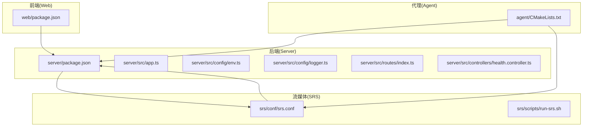
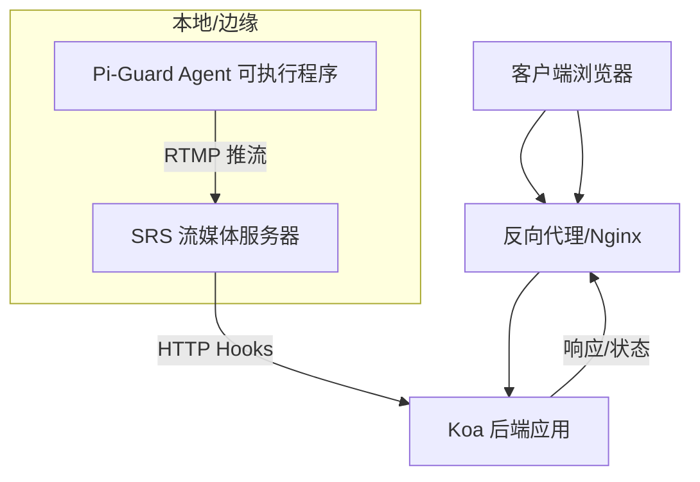
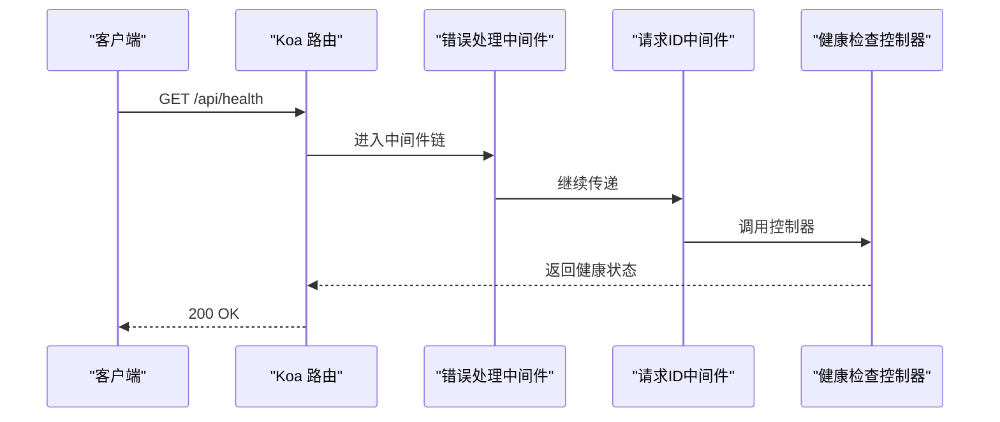
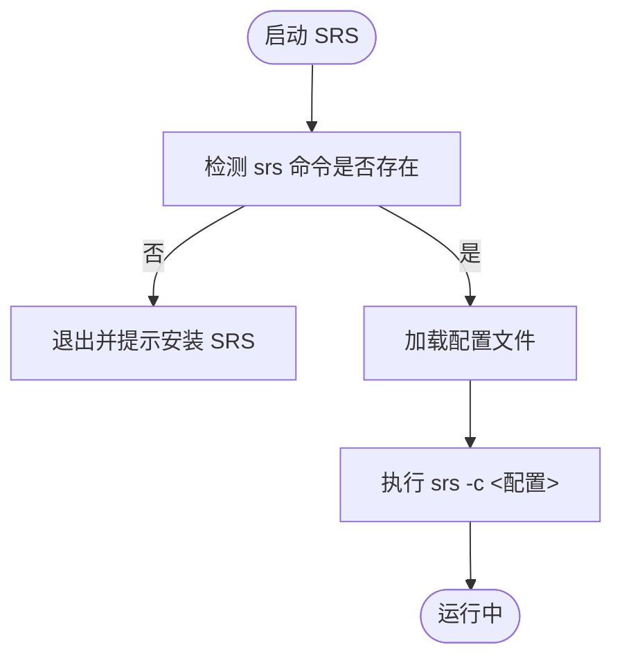
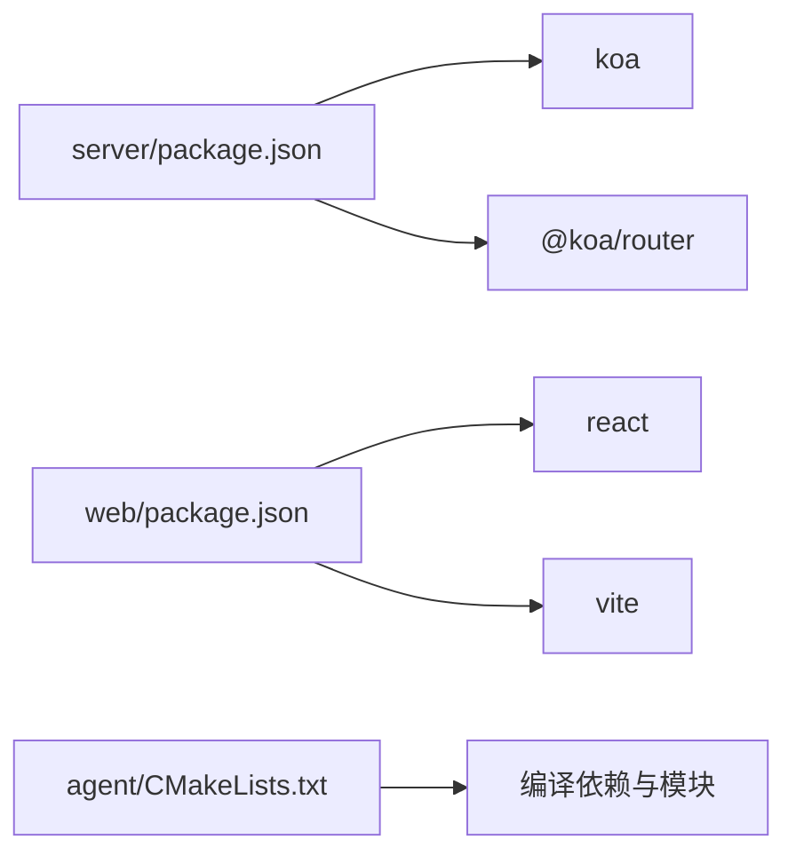

# 部署指南

<cite>
**本文引用的文件**
- [package.json](file://project/server/package.json)
- [app.ts](file://project/server/src/app.ts)
- [env.ts](file://project/server/src/config/env.ts)
- [logger.ts](file://project/server/src/config/logger.ts)
- [routes/index.ts](file://project/server/src/routes/index.ts)
- [controllers/health.controller.ts](file://project/server/src/controllers/health.controller.ts)
- [srs.conf](file://project/srs/conf/srs.conf)
- [run-srs.sh](file://project/srs/scripts/run-srs.sh)
- [CMakeLists.txt](file://project/agent/CMakeLists.txt)
- [package.json](file://project/web/package.json)
</cite>

## 目录
1. [简介](#简介)
2. [项目结构](#项目结构)
3. [核心组件](#核心组件)
4. [架构总览](#架构总览)
5. [详细组件分析](#详细组件分析)
6. [依赖分析](#依赖分析)
7. [性能考虑](#性能考虑)
8. [故障排查指南](#故障排查指南)
9. [结论](#结论)
10. [附录](#附录)

## 简介
本指南面向生产环境部署 Pi-Guard 系统，覆盖系统要求、依赖安装与环境配置、Docker 部署策略、系统服务配置、自动化部署脚本建议、负载均衡与高可用、容灾备份、监控与日志管理、性能调优以及安全加固与访问控制最佳实践。Pi-Guard 由三部分组成：Web 前端（React/Vite）、后端服务（Koa/TypeScript）与流媒体服务器（SRS），并通过 RTMP 推流与 HTTP/WebSocket 等外部接入模块进行集成。

## 项目结构
Pi-Guard 采用多模块分层组织方式：
- 代理端（Agent）：基于 CMake 构建，包含采集、处理、编码、输出、基础设施等模块，最终生成可执行程序。
- 服务端（Server）：基于 Koa 的 Node.js 后端，提供健康检查等接口。
- 流媒体服务器（SRS）：RTMP/HLS/HTTP-FLV 等协议支持，并通过 HTTP Hook 与服务端交互。
- Web 前端（Web）：React/Vite 应用，负责用户界面与交互。

图表来源
- [package.json:1-28](file://project/server/package.json#L1-L28)
- [app.ts:1-14](file://project/server/src/app.ts#L1-L14)
- [env.ts:1-12](file://project/server/src/config/env.ts#L1-L12)
- [logger.ts:1-18](file://project/server/src/config/logger.ts#L1-L18)
- [routes/index.ts:1-9](file://project/server/src/routes/index.ts#L1-L9)
- [controllers/health.controller.ts:1-7](file://project/server/src/controllers/health.controller.ts#L1-L7)
- [srs.conf:1-61](file://project/srs/conf/srs.conf#L1-L61)
- [run-srs.sh:1-14](file://project/srs/scripts/run-srs.sh#L1-L14)
- [CMakeLists.txt:1-51](file://project/agent/CMakeLists.txt#L1-L51)
- [package.json:1-34](file://project/web/package.json#L1-L34)

章节来源
- [package.json:1-28](file://project/server/package.json#L1-L28)
- [srs.conf:1-61](file://project/srs/conf/srs.conf#L1-L61)
- [CMakeLists.txt:1-51](file://project/agent/CMakeLists.txt#L1-L51)
- [package.json:1-34](file://project/web/package.json#L1-L34)

## 核心组件
- 后端服务（Koa/TypeScript）
  - 路由与中间件：统一错误处理与请求 ID 中间件，路由挂载健康检查。
  - 环境变量：NODE_ENV、PORT。
  - 日志：基础格式化日志器。
- 流媒体服务器（SRS）
  - RTMP 端口、HTTP API、HTTP-Server、HLS、HTTP Hooks 等配置。
  - 通过 HTTP Hook 将发布/停止/HLs 事件上报至服务端。
- 代理端（Agent）
  - CMake 多模块工程，编译生成可执行程序，链接运行时模块。
- Web 前端（React/Vite）
  - 构建产物用于静态托管或反向代理。

章节来源
- [app.ts:1-14](file://project/server/src/app.ts#L1-L14)
- [env.ts:1-12](file://project/server/src/config/env.ts#L1-L12)
- [logger.ts:1-18](file://project/server/src/config/logger.ts#L1-L18)
- [routes/index.ts:1-9](file://project/server/src/routes/index.ts#L1-L9)
- [controllers/health.controller.ts:1-7](file://project/server/src/controllers/health.controller.ts#L1-L7)
- [srs.conf:1-61](file://project/srs/conf/srs.conf#L1-L61)
- [CMakeLists.txt:1-51](file://project/agent/CMakeLists.txt#L1-L51)
- [package.json:1-34](file://project/web/package.json#L1-L34)

## 架构总览
Pi-Guard 生产部署建议采用“Web 前端 + 后端服务 + 代理端 + 流媒体服务器”的组合模式。SRS 作为边缘流媒体节点，接收来自代理端的 RTMP 推流，同时通过 HTTP Hooks 将状态事件上报给后端；后端提供健康检查与业务接口；Web 前端通过反向代理访问后端 API。

图表来源
- [srs.conf:54-59](file://project/srs/conf/srs.conf#L54-L59)
- [app.ts:1-14](file://project/server/src/app.ts#L1-L14)
- [routes/index.ts:1-9](file://project/server/src/routes/index.ts#L1-L9)
- [controllers/health.controller.ts:1-7](file://project/server/src/controllers/health.controller.ts#L1-L7)

## 详细组件分析

### 后端服务（Koa/TypeScript）部署要点
- 环境变量
  - NODE_ENV：决定运行环境（开发/生产）。
  - PORT：监听端口，默认 3000。
- 中间件
  - 错误处理中间件：统一捕获异常并返回。
  - 请求 ID 中间件：便于链路追踪。
- 路由与控制器
  - 健康检查接口：对外暴露服务可用性。
- 日志
  - 使用基础格式化日志器，生产中建议对接结构化日志与集中式日志系统。

图表来源
- [app.ts:1-14](file://project/server/src/app.ts#L1-L14)
- [routes/index.ts:1-9](file://project/server/src/routes/index.ts#L1-L9)
- [controllers/health.controller.ts:1-7](file://project/server/src/controllers/health.controller.ts#L1-L7)

章节来源
- [env.ts:1-12](file://project/server/src/config/env.ts#L1-L12)
- [app.ts:1-14](file://project/server/src/app.ts#L1-L14)
- [logger.ts:1-18](file://project/server/src/config/logger.ts#L1-L18)
- [routes/index.ts:1-9](file://project/server/src/routes/index.ts#L1-L9)
- [controllers/health.controller.ts:1-7](file://project/server/src/controllers/health.controller.ts#L1-L7)

### 流媒体服务器（SRS）部署要点
- 关键配置
  - RTMP 端口、HTTP API、HTTP-Server、HLS、HTTP Hooks。
  - HTTP Hooks 指向后端服务地址，用于发布/停止/HLs 事件上报。
- 启动脚本
  - run-srs.sh 校验 srs 命令存在后以指定配置启动。

图表来源
- [run-srs.sh:1-14](file://project/srs/scripts/run-srs.sh#L1-L14)
- [srs.conf:1-61](file://project/srs/conf/srs.conf#L1-L61)

章节来源
- [srs.conf:1-61](file://project/srs/conf/srs.conf#L1-L61)
- [run-srs.sh:1-14](file://project/srs/scripts/run-srs.sh#L1-L14)

### 代理端（Agent）构建与部署要点
- 构建系统
  - CMake 多模块工程，包含采集、处理、编码、输出、基础设施与外部接入模块。
  - 目标可执行程序名称与安装路径在顶层 CMake 中定义。
- 部署建议
  - 在目标设备上安装必要依赖后编译安装，确保运行时具备摄像头/麦克风权限与网络访问能力。
  - 结合系统服务（如 systemd）实现开机自启与崩溃重启。

章节来源
- [CMakeLists.txt:1-51](file://project/agent/CMakeLists.txt#L1-L51)

### Web 前端（React/Vite）部署要点
- 构建产物
  - 使用 Vite 构建静态资源，产物可直接托管于 Nginx/Apache 或通过反向代理提供服务。
- 配置建议
  - 生产环境启用压缩与缓存策略，确保 HTTPS 传输。

章节来源
- [package.json:1-34](file://project/web/package.json#L1-L34)

## 依赖分析
- 后端依赖
  - 运行时：Koa、@koa/router。
  - 开发工具：ts-node-dev、TypeScript。
- SRS
  - 作为独立二进制运行，需满足其运行时依赖与系统权限。
- 代理端
  - CMake 工程，需在目标平台安装编译工具链与相关库。
- Web
  - React、Vite、Less、ESLint 等。

图表来源
- [package.json:16-26](file://project/server/package.json#L16-L26)
- [package.json:12-32](file://project/web/package.json#L12-L32)
- [CMakeLists.txt:11-27](file://project/agent/CMakeLists.txt#L11-L27)

章节来源
- [package.json:1-28](file://project/server/package.json#L1-L28)
- [package.json:1-34](file://project/web/package.json#L1-L34)
- [CMakeLists.txt:1-51](file://project/agent/CMakeLists.txt#L1-L51)

## 性能考虑
- SRS
  - 合理设置最大连接数、播放队列长度与 GOP 缓存，平衡延迟与稳定性。
  - HLS 参数（片段时长、窗口大小、清理策略）按业务场景调整。
- 后端
  - 使用进程池/集群模式（如 PM2）提升并发处理能力；开启请求限流与超时控制。
- 代理端
  - 编码参数与线程模型根据硬件能力优化；避免阻塞 IO。
- 网络
  - 前端静态资源启用 Gzip/Brotli 压缩与 CDN 加速；后端接口启用缓存与异步处理。

## 故障排查指南
- 健康检查
  - 访问健康接口确认后端服务可用性。
- 日志
  - 后端使用基础格式化日志器，生产中建议接入结构化日志与集中式日志系统（如 ELK/Fluentd）。
- SRS
  - 检查 HTTP Hooks 回调地址可达性与后端服务是否正确处理事件。
- 代理端
  - 确认摄像头/麦克风权限、网络连通性与 SRS 地址配置。

章节来源
- [controllers/health.controller.ts:1-7](file://project/server/src/controllers/health.controller.ts#L1-L7)
- [logger.ts:1-18](file://project/server/src/config/logger.ts#L1-L18)
- [srs.conf:54-59](file://project/srs/conf/srs.conf#L54-L59)

## 结论
Pi-Guard 的生产部署需要将 Web 前端、后端服务、代理端与 SRS 协同配置。通过合理的系统服务与自动化脚本、负载均衡与高可用策略、完善的监控与日志体系、性能调优与安全加固，可实现稳定可靠的视频采集与流媒体分发系统。

## 附录

### 系统要求与依赖安装
- 后端
  - Node.js 运行时与包管理器；TypeScript 编译工具（开发）。
- SRS
  - 安装 SRS 并确保命令可用；准备配置文件与运行脚本。
- 代理端
  - CMake、C++17 编译工具链；按模块依赖安装第三方库。
- Web
  - Node.js 与包管理器；Vite 构建工具。

章节来源
- [package.json:16-26](file://project/server/package.json#L16-L26)
- [run-srs.sh:4-7](file://project/srs/scripts/run-srs.sh#L4-L7)
- [CMakeLists.txt:1-10](file://project/agent/CMakeLists.txt#L1-L10)
- [package.json:1-34](file://project/web/package.json#L1-L34)

### Docker 部署策略（建议）
- 分层镜像
  - Web：Nginx 托管静态资源。
  - Server：Node.js 运行时 + 构建产物。
  - Agent：目标平台基础镜像 + 编译产物 + 运行时依赖。
  - SRS：官方或社区镜像，挂载配置卷。
- 网络与存储
  - 使用 Docker Compose 编排；为 SRS 暴露 RTMP/HLS/HTTP 端口；持久化日志与配置卷。
- 健康检查
  - 为后端与 SRS 配置健康检查探针。

### 系统服务配置（建议）
- 后端
  - 使用 systemd 管理服务生命周期，设置 Restart=always、Environment=NODE_ENV/PORT。
- SRS
  - 使用 systemd 管理，确保配置文件路径正确。
- 代理端
  - 设置 ExecStart 指向编译产物；配置日志重定向与自动重启。

### 自动化部署脚本（建议）
- 构建与打包
  - Web：Vite 构建 → 产出静态资源。
  - Server：TypeScript 编译 → 产出 dist。
  - Agent：CMake 构建 → 产出可执行程序。
- 发布与回滚
  - 通过版本标签与配置文件切换；保留最近 N 个版本以便回滚。
- 配置注入
  - 使用环境变量注入 NODE_ENV、PORT、SRS 地址等。

### 负载均衡、高可用与容灾备份
- 负载均衡
  - Nginx/HAProxy 前置，后端多实例横向扩展；SRS 采用多节点部署。
- 高可用
  - 后端与 SRS 均配置健康检查与自动故障转移；数据库/对象存储采用主从或分布式。
- 容灾备份
  - 定期备份配置、日志与媒体数据；演练恢复流程。

### 监控配置、日志管理与性能调优
- 监控
  - 指标：CPU/内存/磁盘/网络、连接数、丢帧率、延迟。
  - 告警：阈值告警与异常检测。
- 日志
  - 结构化日志、日志轮转、集中收集与检索。
- 性能
  - 后端：连接池、限流、缓存；SRS：并发与缓冲区参数；代理端：编码参数与线程模型。

### 安全加固与访问控制
- 网络
  - 仅开放必要端口；SRS RTMP/HLS/HTTP 端口限制内网访问或使用防火墙。
- 认证与授权
  - 后端接口增加鉴权与权限校验；WebSocket/HTTP 推流增加签名或 Token 校验。
- 传输安全
  - 全站 HTTPS；RTMP 推流建议走内网或专用加密通道。
- 最小权限
  - 代理端仅授予摄像头/麦克风与网络权限；SRS 仅开放必需端口。