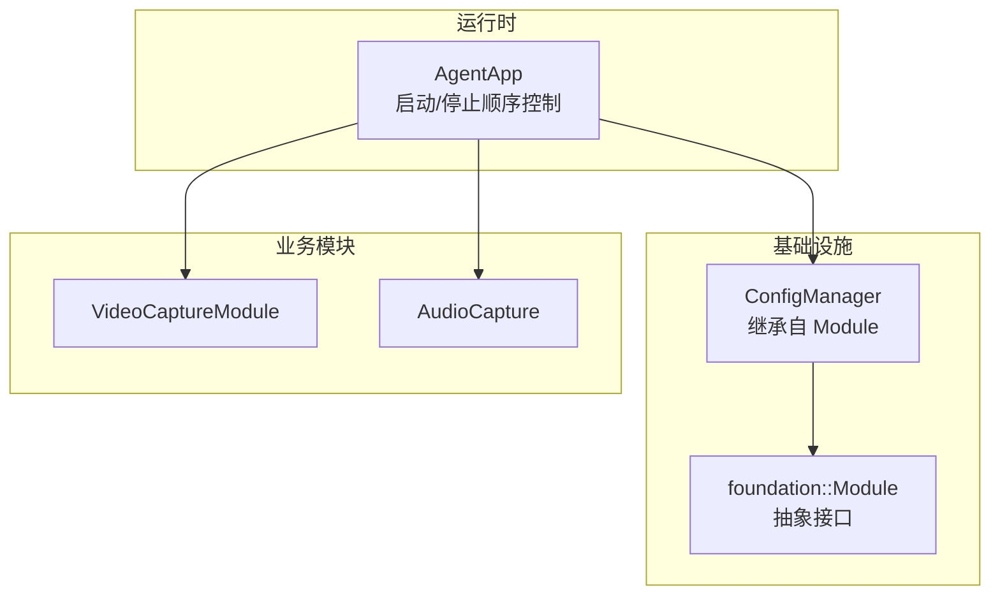
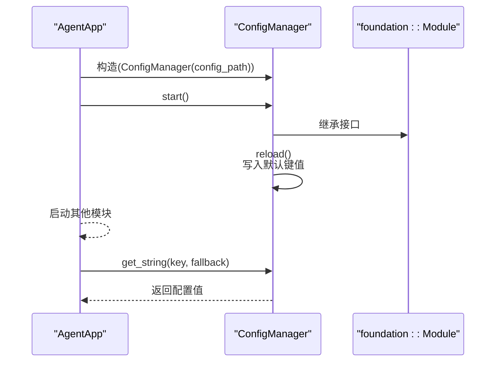
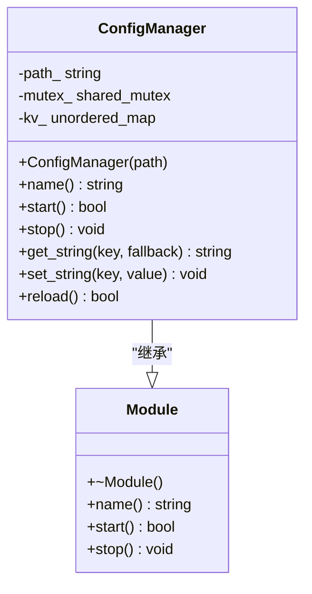
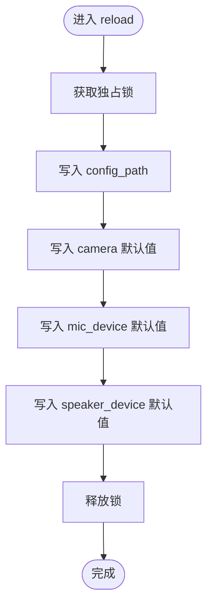
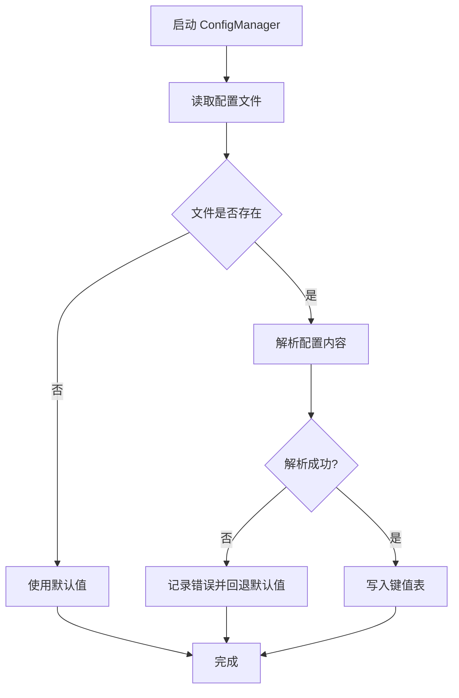
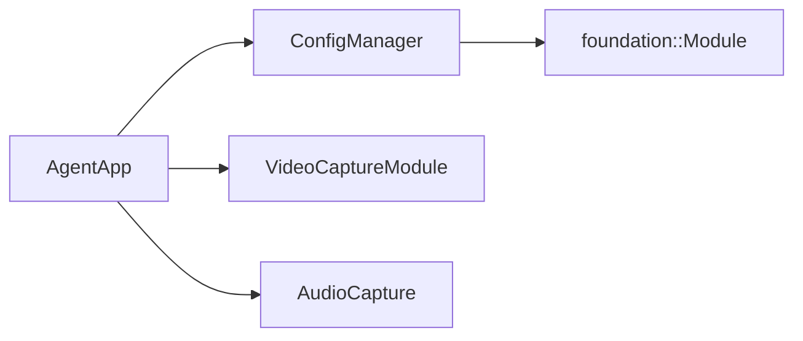

# C++ 代理程序配置

<cite>
**本文引用的文件**
- [config_manager.hpp](file://project/agent/src/modules/infra/config/include/infra_config/config_manager.hpp)
- [config_manager.cpp](file://project/agent/src/modules/infra/config/config_manager.cpp)
- [module.hpp](file://project/agent/src/foundation/include/foundation/module.hpp)
- [agent_app.hpp](file://project/agent/src/runtime/include/agent_app.hpp)
- [agent_app.cpp](file://project/agent/src/runtime/app/agent_app.cpp)
- [audio_capture_module.cpp](file://project/agent/src/modules/capture/audio/audio_capture_module.cpp)
- [video_capture_module.cpp](file://project/agent/src/modules/capture/video/video_capture_module.cpp)
</cite>

## 目录
1. [简介](#简介)
2. [项目结构](#项目结构)
3. [核心组件](#核心组件)
4. [架构总览](#架构总览)
5. [详细组件分析](#详细组件分析)
6. [依赖关系分析](#依赖关系分析)
7. [性能考虑](#性能考虑)
8. [故障排查指南](#故障排查指南)
9. [结论](#结论)
10. [附录](#附录)

## 简介
本文件面向 C++ 代理程序的配置管理，重点围绕 ConfigManager 类的实现与使用，系统性阐述其线程安全设计、配置项管理机制、加载与热更新能力，并结合实际模块（摄像头、麦克风、扬声器）的配置项说明，给出常见配置场景的最佳实践与排障建议。由于当前仓库中 ConfigManager 的实现为硬编码默认值，本文在“配置项说明”部分以“占位说明”的形式呈现，帮助读者理解未来扩展为从外部配置文件加载时的预期行为。

## 项目结构
配置管理位于基础设施层（infra），通过 Module 接口统一纳入运行时生命周期管理；Agent 应用在启动阶段初始化并启动 ConfigManager，随后各业务模块按需读取配置。

图表来源
- [agent_app.cpp:16-42](file://project/agent/src/runtime/app/agent_app.cpp#L16-L42)
- [config_manager.hpp:11-27](file://project/agent/src/modules/infra/config/include/infra_config/config_manager.hpp#L11-L27)
- [module.hpp:7-14](file://project/agent/src/foundation/include/foundation/module.hpp#L7-L14)
- [video_capture_module.cpp:13-19](file://project/agent/src/modules/capture/video/video_capture_module.cpp#L13-L19)
- [audio_capture_module.cpp:6-13](file://project/agent/src/modules/capture/audio/audio_capture_module.cpp#L6-L13)

章节来源
- [agent_app.hpp:29-68](file://project/agent/src/runtime/include/agent_app.hpp#L29-L68)
- [agent_app.cpp:16-42](file://project/agent/src/runtime/app/agent_app.cpp#L16-L42)
- [config_manager.hpp:11-27](file://project/agent/src/modules/infra/config/include/infra_config/config_manager.hpp#L11-L27)
- [module.hpp:7-14](file://project/agent/src/foundation/include/foundation/module.hpp#L7-L14)

## 核心组件
- ConfigManager：负责配置项的存储、读取、写入与重载，提供线程安全访问。
- Module 接口：定义 name/start/stop 生命周期方法，ConfigManager 继承该接口以便统一管理。
- AgentApp：在启动时调用 ConfigManager::start 完成初始加载，在停止时进行资源回收。

关键点
- 线程安全：使用共享互斥锁保护键值表，读多写少场景下采用共享锁提升并发读性能。
- 生命周期：遵循 Module 接口约定，启动即执行一次重载，停止为空操作。
- 配置项类型：当前实现仅支持字符串键值对，便于扩展为 JSON/YAML 等格式解析后注入。

章节来源
- [config_manager.hpp:11-27](file://project/agent/src/modules/infra/config/include/infra_config/config_manager.hpp#L11-L27)
- [config_manager.cpp:8-37](file://project/agent/src/modules/infra/config/config_manager.cpp#L8-L37)
- [module.hpp:7-14](file://project/agent/src/foundation/include/foundation/module.hpp#L7-L14)
- [agent_app.cpp:22-23](file://project/agent/src/runtime/app/agent_app.cpp#L22-L23)

## 架构总览
ConfigManager 作为独立模块被 AgentApp 管理，业务模块通过全局或局部上下文获取配置项。当前实现为硬编码默认值，后续可替换为从外部配置文件加载。

图表来源
- [agent_app.cpp:7-23](file://project/agent/src/runtime/app/agent_app.cpp#L7-L23)
- [config_manager.cpp:10-23](file://project/agent/src/modules/infra/config/config_manager.cpp#L10-L23)
- [config_manager.hpp:15-16](file://project/agent/src/modules/infra/config/include/infra_config/config_manager.hpp#L15-L16)
- [module.hpp:11-13](file://project/agent/src/foundation/include/foundation/module.hpp#L11-L13)

## 详细组件分析

### ConfigManager 类设计
- 继承关系：ConfigManager 继承自 foundation::Module，具备统一的生命周期管理能力。
- 数据结构：内部维护一个字符串到字符串的映射表，用于存放配置项。
- 并发模型：读写分离的共享互斥锁，读操作使用共享锁，写操作使用独占锁，降低锁竞争。
- 方法族：
  - name/start/stop：满足 Module 接口，start 调用 reload 完成初始化。
  - get_string：根据键返回对应值，不存在则返回回退值。
  - set_string：设置或更新指定键的值。
  - reload：当前实现为硬编码默认值，后续可替换为从文件加载。

图表来源
- [config_manager.hpp:11-27](file://project/agent/src/modules/infra/config/include/infra_config/config_manager.hpp#L11-L27)
- [config_manager.cpp:8-37](file://project/agent/src/modules/infra/config/config_manager.cpp#L8-L37)
- [module.hpp:7-14](file://project/agent/src/foundation/include/foundation/module.hpp#L7-L14)

章节来源
- [config_manager.hpp:11-27](file://project/agent/src/modules/infra/config/include/infra_config/config_manager.hpp#L11-L27)
- [config_manager.cpp:8-37](file://project/agent/src/modules/infra/config/config_manager.cpp#L8-L37)
- [module.hpp:7-14](file://project/agent/src/foundation/include/foundation/module.hpp#L7-L14)

### 配置项管理机制
- 键空间：当前包含示例键（如 camera、mic_device、speaker_device、config_path），用于演示用途。
- 默认值策略：首次启动时由 reload 写入默认值，后续可通过 set_string 动态更新。
- 访问模式：读多写少场景下，get_string 使用共享锁，提升并发读吞吐。

图表来源
- [config_manager.cpp:16-23](file://project/agent/src/modules/infra/config/config_manager.cpp#L16-L23)

章节来源
- [config_manager.cpp:16-23](file://project/agent/src/modules/infra/config/config_manager.cpp#L16-L23)

### 摄像头设备路径配置
- 当前状态：在 reload 中设置默认摄像头设备路径。
- 使用建议：在实际部署中，应将设备路径从外部配置文件读取，避免硬编码。
- 常见问题：设备路径变更后需确保权限正确、设备存在且未被占用。

章节来源
- [config_manager.cpp:19](file://project/agent/src/modules/infra/config/config_manager.cpp#L19)

### 音频设备配置
- 麦克风设备：默认值指向硬件设备标识，适用于本地采集。
- 扬声器设备：默认值同样指向硬件设备标识，用于播放输出。
- 注意事项：不同平台的设备命名可能不同，建议通过系统工具查询并动态注入。

章节来源
- [config_manager.cpp:20-21](file://project/agent/src/modules/infra/config/config_manager.cpp#L20-L21)

### 编码参数与扩展建议
- 当前实现：未包含编码参数键值，属于预留扩展区域。
- 建议键名：例如 video_bitrate、audio_bitrate、resolution、fps、gop_size 等。
- 加载策略：建议在 reload 中解析外部配置文件（如 JSON/YAML），校验参数合法性后再写入内存映射表。

章节来源
- [config_manager.cpp:16-23](file://project/agent/src/modules/infra/config/config_manager.cpp#L16-L23)

### 配置文件加载流程（概念）
以下为从外部配置文件加载的示意流程，便于未来实现：

（本图为概念流程图，不直接映射具体源码）

### 热更新机制
- 当前实现：ConfigManager 提供 set_string 用于运行时更新，但 reload 仍为硬编码默认值。
- 建议方案：引入文件监控或信号触发，重新执行 reload；或提供增量更新接口，仅更新受影响的键值。

章节来源
- [config_manager.cpp:25-37](file://project/agent/src/modules/infra/config/config_manager.cpp#L25-L37)

### 线程安全保证
- 读写分离：读操作使用共享锁，写操作使用独占锁，减少读写冲突。
- 原子性：单次 get/set 操作在锁范围内，保证数据一致性。
- 死锁规避：避免在持有锁期间调用外部回调或再次加锁。

章节来源
- [config_manager.hpp:25](file://project/agent/src/modules/infra/config/include/infra_config/config_manager.hpp#L25)
- [config_manager.cpp:25-37](file://project/agent/src/modules/infra/config/config_manager.cpp#L25-L37)

## 依赖关系分析
- ConfigManager 依赖基础模块接口 Module，从而被 AgentApp 统一管理。
- AgentApp 在启动阶段调用 ConfigManager::start，随后各模块可按需读取配置。
- 业务模块当前未直接展示对 ConfigManager 的依赖，但可按需注入或通过全局上下文访问。

图表来源
- [agent_app.hpp:49](file://project/agent/src/runtime/include/agent_app.hpp#L49)
- [config_manager.hpp:11](file://project/agent/src/modules/infra/config/include/infra_config/config_manager.hpp#L11)
- [module.hpp:7](file://project/agent/src/foundation/include/foundation/module.hpp#L7)
- [video_capture_module.cpp:13-19](file://project/agent/src/modules/capture/video/video_capture_module.cpp#L13-L19)
- [audio_capture_module.cpp:6-13](file://project/agent/src/modules/capture/audio/audio_capture_module.cpp#L6-L13)

章节来源
- [agent_app.hpp:49](file://project/agent/src/runtime/include/agent_app.hpp#L49)
- [config_manager.hpp:11](file://project/agent/src/modules/infra/config/include/infra_config/config_manager.hpp#L11)
- [module.hpp:7](file://project/agent/src/foundation/include/foundation/module.hpp#L7)

## 性能考虑
- 锁粒度：共享锁提升读并发，写操作尽量批量进行，避免频繁 set_string 导致锁竞争。
- 访问模式：读多写少场景下，get_string 的共享锁开销较低。
- 初始化成本：reload 为一次性操作，建议在启动阶段完成，避免运行时阻塞。

## 故障排查指南
- 无法读取配置：检查键是否正确拼写，确认 reload 是否已执行。
- 设备不可用：核对摄像头/音频设备路径与系统实际设备一致，确认权限与占用情况。
- 线程死锁：避免在持有 ConfigManager 锁期间调用外部回调或再次加锁。
- 热更新无效：确认是否使用 set_string 更新，或是否需要重启以触发 reload。

章节来源
- [config_manager.cpp:25-37](file://project/agent/src/modules/infra/config/config_manager.cpp#L25-L37)

## 结论
ConfigManager 以简洁的键值对设计提供了线程安全的配置管理能力，当前实现为硬编码默认值，适合快速验证。建议尽快接入外部配置文件加载与热更新机制，并完善编码参数等关键配置项，以满足生产环境的灵活性与稳定性需求。

## 附录

### 配置项清单与建议
- camera：摄像头设备路径（当前为默认值）
- mic_device：麦克风设备标识（当前为默认值）
- speaker_device：扬声器设备标识（当前为默认值）
- config_path：配置文件所在路径（当前为默认值）

章节来源
- [config_manager.cpp:18-21](file://project/agent/src/modules/infra/config/config_manager.cpp#L18-L21)

### 典型配置场景与最佳实践
- 开发调试：保持默认设备路径，便于快速启动。
- 生产部署：将设备路径与编码参数从配置文件读取，支持热更新。
- 多设备环境：为不同设备分配独立配置文件，通过命令行参数选择加载。

（本节为通用实践建议，不直接分析具体文件）