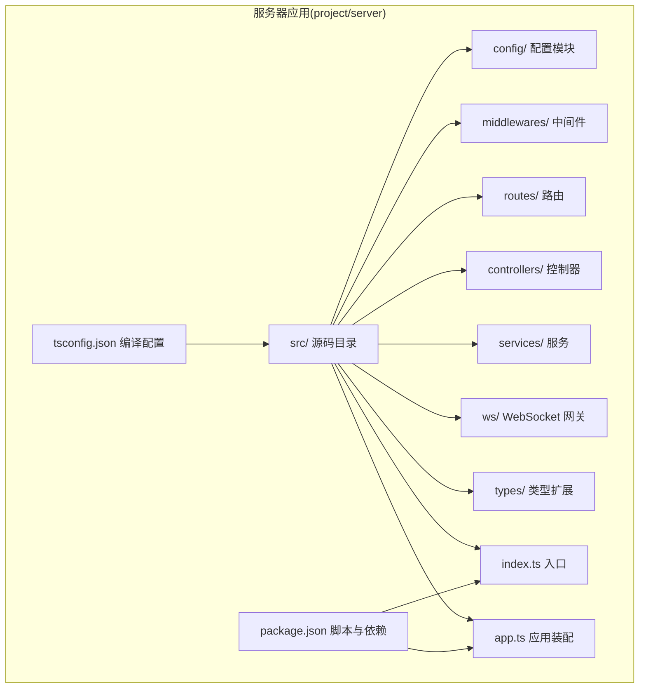
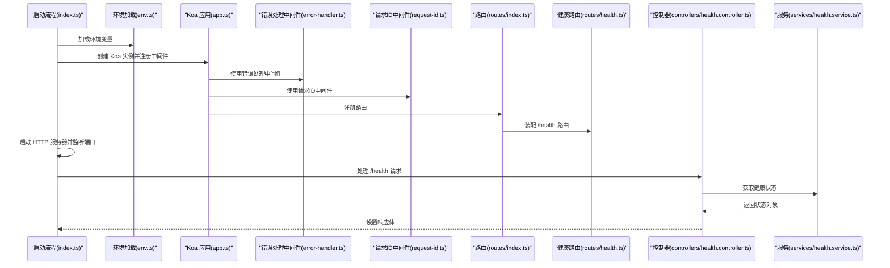
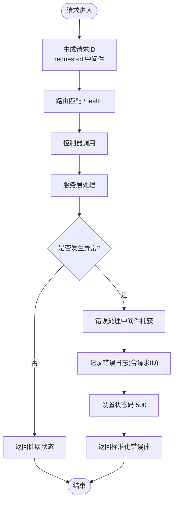
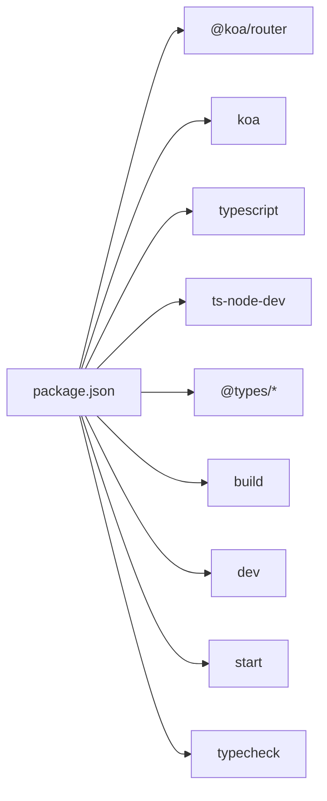

# Node.js 服务器配置

<cite>
**本文引用的文件**
- [env.ts](file://project/server/src/config/env.ts)
- [logger.ts](file://project/server/src/config/logger.ts)
- [package.json](file://project/server/package.json)
- [app.ts](file://project/server/src/app.ts)
- [index.ts](file://project/server/src/index.ts)
- [error-handler.ts](file://project/server/src/middlewares/error-handler.ts)
- [request-id.ts](file://project/server/src/middlewares/request-id.ts)
- [routes/index.ts](file://project/server/src/routes/index.ts)
- [routes/health.ts](file://project/server/src/routes/health.ts)
- [controllers/health.controller.ts](file://project/server/src/controllers/health.controller.ts)
- [services/health.service.ts](file://project/server/src/services/health.service.ts)
- [gateway.ts](file://project/server/src/ws/gateway.ts)
- [koa.d.ts](file://project/server/src/types/koa.d.ts)
- [tsconfig.json](file://project/server/tsconfig.json)
</cite>

## 目录
1. [简介](#简介)
2. [项目结构](#项目结构)
3. [核心组件](#核心组件)
4. [架构总览](#架构总览)
5. [详细组件分析](#详细组件分析)
6. [依赖分析](#依赖分析)
7. [性能考虑](#性能考虑)
8. [故障排查指南](#故障排查指南)
9. [结论](#结论)
10. [附录](#附录)

## 简介
本文件系统性梳理了基于 Koa.js 的 Node.js 服务器在本仓库中的配置管理方式，涵盖环境变量加载、日志记录、服务器启动参数、Koa 应用配置、中间件与路由组织，并给出开发与生产环境的差异建议、配置优先级与覆盖规则、部署最佳实践以及常见问题排查要点。目标是帮助开发者快速理解并安全地配置与部署该服务。

## 项目结构
服务器代码位于 project/server 目录，采用 TypeScript 编写，使用 Koa 作为 Web 框架，通过 @koa/router 组织路由，采用模块化方式组织中间件、控制器与服务层。构建产物输出到 dist 目录，运行时通过 Node.js 启动。

图表来源
- [index.ts:1-15](file://project/server/src/index.ts#L1-L15)
- [app.ts:1-14](file://project/server/src/app.ts#L1-L14)
- [package.json:1-28](file://project/server/package.json#L1-L28)
- [tsconfig.json:1-18](file://project/server/tsconfig.json#L1-L18)

章节来源
- [package.json:1-28](file://project/server/package.json#L1-L28)
- [tsconfig.json:1-18](file://project/server/tsconfig.json#L1-L18)

## 核心组件
- 环境变量加载：从进程环境读取 NODE_ENV 与 PORT，提供默认值以保证最小可用配置。
- 日志模块：统一格式化输出，支持 info/warn/error 三类级别。
- Koa 应用装配：注册错误处理、请求 ID 注入、路由等中间件。
- 路由与控制器：提供 /health 健康检查接口。
- WebSocket 网关预留：用于后续集成 WebSocket 功能。
- 请求 ID 类型扩展：为 Koa 默认状态注入 requestId 字段。

章节来源
- [env.ts:1-12](file://project/server/src/config/env.ts#L1-L12)
- [logger.ts:1-18](file://project/server/src/config/logger.ts#L1-L18)
- [app.ts:1-14](file://project/server/src/app.ts#L1-L14)
- [routes/index.ts:1-9](file://project/server/src/routes/index.ts#L1-L9)
- [routes/health.ts:1-9](file://project/server/src/routes/health.ts#L1-L9)
- [controllers/health.controller.ts:1-7](file://project/server/src/controllers/health.controller.ts#L1-L7)
- [services/health.service.ts:1-14](file://project/server/src/services/health.service.ts#L1-L14)
- [gateway.ts:1-8](file://project/server/src/ws/gateway.ts#L1-L8)
- [koa.d.ts:1-8](file://project/server/src/types/koa.d.ts#L1-L8)

## 架构总览
下图展示了从入口到路由处理的关键调用链路，以及中间件在请求生命周期中的执行顺序。

图表来源
- [index.ts:1-15](file://project/server/src/index.ts#L1-L15)
- [env.ts:1-12](file://project/server/src/config/env.ts#L1-L12)
- [app.ts:1-14](file://project/server/src/app.ts#L1-L14)
- [error-handler.ts:1-18](file://project/server/src/middlewares/error-handler.ts#L1-L18)
- [request-id.ts:1-11](file://project/server/src/middlewares/request-id.ts#L1-L11)
- [routes/index.ts:1-9](file://project/server/src/routes/index.ts#L1-L9)
- [routes/health.ts:1-9](file://project/server/src/routes/health.ts#L1-L9)
- [controllers/health.controller.ts:1-7](file://project/server/src/controllers/health.controller.ts#L1-L7)
- [services/health.service.ts:1-14](file://project/server/src/services/health.service.ts#L1-L14)

## 详细组件分析

### 环境变量配置
- 配置项
  - NODE_ENV：运行环境标识，默认 development。
  - PORT：HTTP 服务器监听端口，默认 3000。
- 加载策略
  - 通过 loadEnv 函数从进程环境读取并返回 EnvConfig 对象。
  - 当未设置时，使用上述默认值，确保最小可用配置。
- 运行参数
  - 服务器通过 http.createServer(app.callback()) 创建 HTTP 服务器，并在 index.ts 中监听指定端口。
- 开发与生产差异建议
  - 开发：NODE_ENV=development，便于启用调试信息与热重载（脚本 dev 使用 ts-node-dev）。
  - 生产：NODE_ENV=production，关闭非必要日志，使用构建产物 dist/index.js 启动。
- 配置优先级与覆盖规则
  - 环境变量优先于代码默认值；若未设置则回退到默认值。
  - 可通过容器编排或系统服务层覆盖环境变量，实现多环境隔离。

章节来源
- [env.ts:1-12](file://project/server/src/config/env.ts#L1-L12)
- [index.ts:1-15](file://project/server/src/index.ts#L1-L15)
- [package.json:1-28](file://project/server/package.json#L1-L28)

### 日志配置
- 日志级别
  - 提供 info/warn/error 三种级别，统一时间戳与级别格式化输出。
- 使用方式
  - 在中间件与网关中通过 logger 记录运行信息与异常。
- 最佳实践
  - 生产环境建议仅输出 error/warn，避免过多 info 导致磁盘压力。
  - 结合请求 ID 进行跨服务追踪，便于定位问题。

章节来源
- [logger.ts:1-18](file://project/server/src/config/logger.ts#L1-L18)
- [error-handler.ts:1-18](file://project/server/src/middlewares/error-handler.ts#L1-L18)
- [gateway.ts:1-8](file://project/server/src/ws/gateway.ts#L1-L8)

### Koa 应用配置
- 中间件注册顺序
  - 错误处理中间件：捕获下游抛出的异常，统一返回 500 与标准化错误体。
  - 请求 ID 中间件：为每个请求生成唯一标识，贯穿请求生命周期。
  - 路由中间件：注册路由并允许的方法。
- 状态扩展
  - 通过类型扩展为 Koa 默认状态注入 requestId 字段，供中间件与控制器使用。

章节来源
- [app.ts:1-14](file://project/server/src/app.ts#L1-L14)
- [error-handler.ts:1-18](file://project/server/src/middlewares/error-handler.ts#L1-L18)
- [request-id.ts:1-11](file://project/server/src/middlewares/request-id.ts#L1-L11)
- [koa.d.ts:1-8](file://project/server/src/types/koa.d.ts#L1-L8)

### 路由配置
- 路由组织
  - 主路由聚合子路由，当前包含健康检查子路由。
  - 健康路由提供 GET /health 接口，交由控制器处理。
- 扩展建议
  - 新增路由时遵循相同模式：新建子路由文件 -> 在主路由中注册 -> 在控制器中实现业务逻辑 -> 在服务层封装具体功能。

章节来源
- [routes/index.ts:1-9](file://project/server/src/routes/index.ts#L1-L9)
- [routes/health.ts:1-9](file://project/server/src/routes/health.ts#L1-L9)
- [controllers/health.controller.ts:1-7](file://project/server/src/controllers/health.controller.ts#L1-L7)
- [services/health.service.ts:1-14](file://project/server/src/services/health.service.ts#L1-L14)

### WebSocket 网关
- 当前实现
  - 留白初始化函数，记录初始化日志，便于后续接入 WebSocket 功能。
- 集成建议
  - 在初始化函数中接入 WebSocket 服务器与事件处理逻辑，并与现有日志模块协同。

章节来源
- [gateway.ts:1-8](file://project/server/src/ws/gateway.ts#L1-L8)

### 请求 ID 与错误处理流程
下图展示请求进入时如何生成请求 ID 并在出现异常时进行统一错误处理。

图表来源
- [request-id.ts:1-11](file://project/server/src/middlewares/request-id.ts#L1-L11)
- [error-handler.ts:1-18](file://project/server/src/middlewares/error-handler.ts#L1-L18)
- [controllers/health.controller.ts:1-7](file://project/server/src/controllers/health.controller.ts#L1-L7)
- [services/health.service.ts:1-14](file://project/server/src/services/health.service.ts#L1-L14)

## 依赖分析
- 运行时依赖
  - koa：Web 框架核心。
  - @koa/router：路由库。
- 开发时依赖
  - TypeScript、ts-node-dev、@types/*：开发与类型支持。
- 构建与脚本
  - build：编译 TypeScript 到 dist。
  - dev：开发模式热重载启动。
  - start：生产模式启动已构建产物。
  - typecheck：类型检查。

图表来源
- [package.json:1-28](file://project/server/package.json#L1-L28)

章节来源
- [package.json:1-28](file://project/server/package.json#L1-L28)

## 性能考虑
- 中间件顺序
  - 将错误处理置于靠前位置，避免异常穿透导致重复处理。
- 日志开销
  - 生产环境降低日志级别，避免频繁 I/O 影响吞吐。
- 路由与控制器
  - 控制器保持轻薄，复杂逻辑下沉至服务层，提升可测试性与复用性。
- 构建优化
  - 使用 TypeScript 编译输出 CommonJS，配合 Node.js 运行时获得稳定性能。

## 故障排查指南
- 常见问题
  - 端口占用：确认 PORT 是否被占用，或在启动前清理相关进程。
  - 环境变量未生效：检查容器或系统服务层的环境变量注入是否正确。
  - 500 错误：查看错误处理中间件日志，结合请求 ID 定位具体请求。
- 排查步骤
  - 开启 info 级别日志观察启动与路由访问情况。
  - 在开发模式下使用 dev 脚本进行快速迭代。
  - 生产环境使用 start 脚本启动已构建产物。

章节来源
- [logger.ts:1-18](file://project/server/src/config/logger.ts#L1-L18)
- [error-handler.ts:1-18](file://project/server/src/middlewares/error-handler.ts#L1-L18)
- [package.json:1-28](file://project/server/package.json#L1-L28)

## 结论
本项目以简洁清晰的方式实现了 Koa.js 服务器的配置管理：通过环境变量加载、统一日志模块、有序中间件注册与模块化的路由/控制器/服务分层，形成了可维护、可扩展且易于部署的基础骨架。建议在生产环境中严格控制日志级别与资源使用，并通过环境变量与容器编排实现多环境隔离与安全覆盖。

## 附录
- 部署最佳实践
  - 使用 start 脚本启动生产版本，确保 dist 目录已存在。
  - 通过环境变量覆盖 NODE_ENV 与 PORT，避免硬编码。
  - 在容器中设置只读根文件系统与最小权限，仅暴露必要端口。
  - 使用健康检查对接 /health 路由，便于编排系统进行存活/就绪探测。
- 配置示例路径
  - 环境变量加载：[env.ts:1-12](file://project/server/src/config/env.ts#L1-L12)
  - 日志模块：[logger.ts:1-18](file://project/server/src/config/logger.ts#L1-L18)
  - 应用装配与中间件：[app.ts:1-14](file://project/server/src/app.ts#L1-L14)
  - 路由与控制器：[routes/index.ts:1-9](file://project/server/src/routes/index.ts#L1-L9), [routes/health.ts:1-9](file://project/server/src/routes/health.ts#L1-L9), [controllers/health.controller.ts:1-7](file://project/server/src/controllers/health.controller.ts#L1-L7)
  - 服务层：[services/health.service.ts:1-14](file://project/server/src/services/health.service.ts#L1-L14)
  - WebSocket 网关：[gateway.ts:1-8](file://project/server/src/ws/gateway.ts#L1-L8)
  - 请求 ID 类型扩展：[koa.d.ts:1-8](file://project/server/src/types/koa.d.ts#L1-L8)
  - 构建与脚本：[package.json:1-28](file://project/server/package.json#L1-L28), [tsconfig.json:1-18](file://project/server/tsconfig.json#L1-L18)