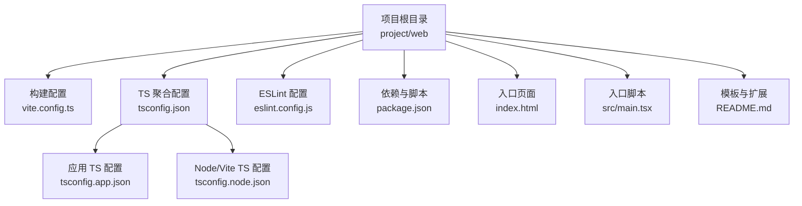
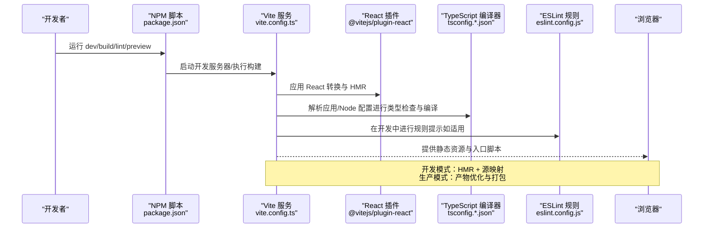
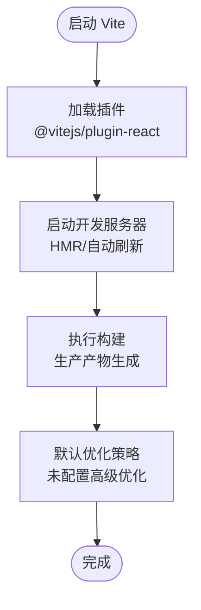
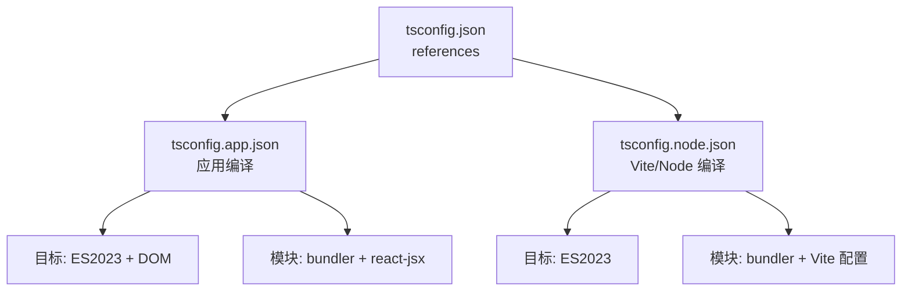
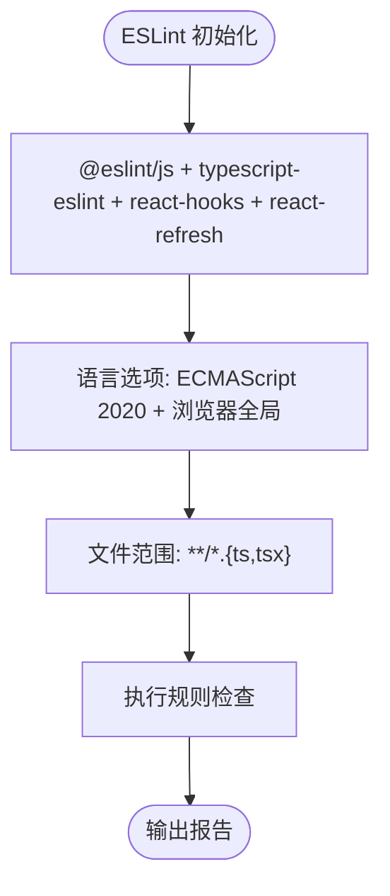
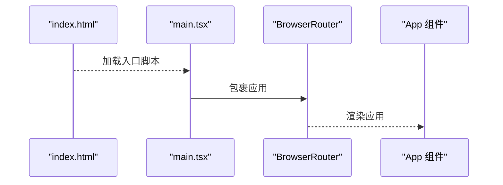
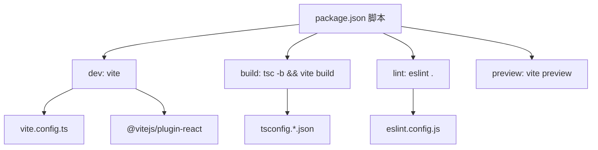

# React 前端配置

<cite>
**本文档引用的文件**
- [vite.config.ts](file://project/web/vite.config.ts)
- [tsconfig.json](file://project/web/tsconfig.json)
- [tsconfig.app.json](file://project/web/tsconfig.app.json)
- [tsconfig.node.json](file://project/web/tsconfig.node.json)
- [eslint.config.js](file://project/web/eslint.config.js)
- [package.json](file://project/web/package.json)
- [main.tsx](file://project/web/src/main.tsx)
- [index.html](file://project/web/index.html)
- [README.md](file://project/web/README.md)
</cite>

## 目录
1. [简介](#简介)
2. [项目结构](#项目结构)
3. [核心组件](#核心组件)
4. [架构总览](#架构总览)
5. [详细组件分析](#详细组件分析)
6. [依赖分析](#依赖分析)
7. [性能考虑](#性能考虑)
8. [故障排除指南](#故障排除指南)
9. [结论](#结论)
10. [附录](#附录)

## 简介
本文件系统性梳理 React 前端项目的配置管理体系，覆盖 Vite 构建工具、TypeScript 编译与 ESLint 代码规范三大部分。内容聚焦于：
- 构建选项与开发服务器配置
- 打包优化与静态资源处理
- 开发/生产环境差异与环境变量注入
- 配置示例路径与最佳实践建议

该前端项目采用 Vite 作为构建工具，TypeScript 提供类型安全，ESLint 确保代码质量与一致性。

## 项目结构
前端项目位于 project/web 目录，关键配置文件分布如下：
- 构建配置：vite.config.ts
- 类型编译配置：tsconfig.json（聚合）、tsconfig.app.json（应用）、tsconfig.node.json（Vite）
- 代码规范：eslint.config.js
- 依赖与脚本：package.json
- 入口页面与入口脚本：index.html、src/main.tsx
- 模板与扩展说明：README.md

**图表来源**
- [vite.config.ts:1-8](file://project/web/vite.config.ts#L1-L8)
- [tsconfig.json:1-8](file://project/web/tsconfig.json#L1-L8)
- [tsconfig.app.json:1-26](file://project/web/tsconfig.app.json#L1-L26)
- [tsconfig.node.json:1-25](file://project/web/tsconfig.node.json#L1-L25)
- [eslint.config.js:1-24](file://project/web/eslint.config.js#L1-L24)
- [package.json:1-34](file://project/web/package.json#L1-L34)
- [index.html:1-14](file://project/web/index.html#L1-L14)
- [main.tsx:1-15](file://project/web/src/main.tsx#L1-L15)
- [README.md:1-74](file://project/web/README.md#L1-L74)

**章节来源**
- [vite.config.ts:1-8](file://project/web/vite.config.ts#L1-L8)
- [tsconfig.json:1-8](file://project/web/tsconfig.json#L1-L8)
- [tsconfig.app.json:1-26](file://project/web/tsconfig.app.json#L1-L26)
- [tsconfig.node.json:1-25](file://project/web/tsconfig.node.json#L1-L25)
- [eslint.config.js:1-24](file://project/web/eslint.config.js#L1-L24)
- [package.json:1-34](file://project/web/package.json#L1-L34)
- [index.html:1-14](file://project/web/index.html#L1-L14)
- [main.tsx:1-15](file://project/web/src/main.tsx#L1-L15)
- [README.md:1-74](file://project/web/README.md#L1-L74)

## 核心组件
本节从配置视角拆解三大核心组件及其职责边界与协作关系。

- Vite 构建配置
  - 单一插件：@vitejs/plugin-react，启用 React 快速热更新与按需转换
  - 默认开发服务器：基于 Vite 内置能力，支持模块热替换（HMR）
  - 默认打包策略：遵循 Vite 生产构建默认行为（未显式配置额外优化项）

- TypeScript 编译配置
  - 聚合配置：通过 references 引入应用与 Node/Vite 两套 TS 配置
  - 应用配置（tsconfig.app.json）：面向浏览器运行时，启用 bundler 模式、React JSX 支持与严格本地/参数检查
  - Node/Vite 配置（tsconfig.node.json）：面向 Vite 运行时与 Node 环境，启用 bundler 模式与严格检查

- ESLint 代码规范
  - 使用 flat 配置风格，集成 @eslint/js、typescript-eslint、react-hooks、react-refresh
  - 语言选项：ECMAScript 2020，浏览器全局变量
  - 文件范围：仅对 .ts/.tsx 文件生效

**章节来源**
- [vite.config.ts:1-8](file://project/web/vite.config.ts#L1-L8)
- [tsconfig.json:1-8](file://project/web/tsconfig.json#L1-L8)
- [tsconfig.app.json:1-26](file://project/web/tsconfig.app.json#L1-L26)
- [tsconfig.node.json:1-25](file://project/web/tsconfig.node.json#L1-L25)
- [eslint.config.js:1-24](file://project/web/eslint.config.js#L1-L24)

## 架构总览
下图展示从开发到构建的关键流程与配置交互：

**图表来源**
- [package.json:6-11](file://project/web/package.json#L6-L11)
- [vite.config.ts:5-7](file://project/web/vite.config.ts#L5-L7)
- [tsconfig.app.json:10-16](file://project/web/tsconfig.app.json#L10-L16)
- [tsconfig.node.json:10-15](file://project/web/tsconfig.node.json#L10-L15)
- [eslint.config.js:8-23](file://project/web/eslint.config.js#L8-L23)

## 详细组件分析

### Vite 构建配置分析
- 插件体系
  - React 插件：负责 JSX 转换、HMR 与开发体验优化
- 开发服务器
  - 默认行为：监听端口、自动刷新、模块热替换
- 构建产物
  - 默认策略：基于 Vite 的生产构建，未配置额外压缩/分包等高级优化
- 环境变量
  - 未在配置中显式声明，通常通过 Vite 的环境变量注入机制在运行时解析

**图表来源**
- [vite.config.ts:5-7](file://project/web/vite.config.ts#L5-L7)
- [package.json:6-11](file://project/web/package.json#L6-L11)

**章节来源**
- [vite.config.ts:1-8](file://project/web/vite.config.ts#L1-L8)
- [package.json:6-11](file://project/web/package.json#L6-L11)

### TypeScript 编译配置分析
- 配置组织
  - 聚合配置通过 references 引入应用与 Node/Vite 两套配置，实现分层隔离
- 应用配置（tsconfig.app.json）
  - 目标与库：ES2023 + DOM
  - 模块解析：bundler，支持 TS 扩展导入、严格模块语法
  - JSX：使用 react-jsx
  - 严格性：启用未使用局部变量/参数检查、switch 穿透检查
- Node/Vite 配置（tsconfig.node.json）
  - 目标与库：ES2023
  - 模块解析：bundler，包含 Vite 配置文件
  - 严格性：启用未使用局部变量/参数检查、switch 穿透检查
- 与 Vite 的协作
  - 应用配置中的 types: ["vite/client"] 使 Vite 环境类型可用
  - Node/Vite 配置确保 Vite 运行时与类型检查一致

**图表来源**
- [tsconfig.json:3-6](file://project/web/tsconfig.json#L3-L6)
- [tsconfig.app.json:2-16](file://project/web/tsconfig.app.json#L2-L16)
- [tsconfig.node.json:2-15](file://project/web/tsconfig.node.json#L2-L15)

**章节来源**
- [tsconfig.json:1-8](file://project/web/tsconfig.json#L1-L8)
- [tsconfig.app.json:1-26](file://project/web/tsconfig.app.json#L1-L26)
- [tsconfig.node.json:1-25](file://project/web/tsconfig.node.json#L1-L25)

### ESLint 代码规范配置分析
- 配置风格
  - 采用 flat 配置，集中定义忽略与规则扩展
- 规则扩展
  - 推荐基础规则集、TypeScript 推荐规则集、React Hooks 推荐规则、React Refresh Vite 适配
- 语言选项
  - ECMAScript 2020，浏览器全局变量
- 文件范围
  - 仅对 .ts/.tsx 文件生效

**图表来源**
- [eslint.config.js:8-23](file://project/web/eslint.config.js#L8-L23)

**章节来源**
- [eslint.config.js:1-24](file://project/web/eslint.config.js#L1-L24)
- [README.md:14-44](file://project/web/README.md#L14-L44)

### 入口与静态资源处理
- HTML 入口
  - 提供挂载点 div#root 与入口脚本引用
- JavaScript 入口
  - 创建根节点、引入样式、路由与应用组件
- 静态资源
  - 未在配置中显式声明额外处理规则，默认由 Vite 处理常见资源类型

**图表来源**
- [index.html:9-12](file://project/web/index.html#L9-L12)
- [main.tsx:8-14](file://project/web/src/main.tsx#L8-L14)

**章节来源**
- [index.html:1-14](file://project/web/index.html#L1-L14)
- [main.tsx:1-15](file://project/web/src/main.tsx#L1-L15)

## 依赖分析
- 脚本命令
  - dev：启动 Vite 开发服务器
  - build：先执行 TypeScript 项目引用构建，再执行 Vite 生产构建
  - lint：执行 ESLint 规范检查
  - preview：预览生产构建产物
- 关键依赖
  - Vite 与 React 插件：构建与开发体验
  - TypeScript 与 typescript-eslint：类型检查与规则扩展
  - ESLint 及相关插件：代码规范与 React 特定规则
  - React 生态：React、React DOM、React Router

**图表来源**
- [package.json:6-11](file://project/web/package.json#L6-L11)
- [vite.config.ts:2-2](file://project/web/vite.config.ts#L2-L2)
- [tsconfig.json:3-6](file://project/web/tsconfig.json#L3-L6)
- [eslint.config.js:1-6](file://project/web/eslint.config.js#L1-L6)

**章节来源**
- [package.json:1-34](file://project/web/package.json#L1-L34)

## 性能考虑
- 开发性能
  - React 插件已启用快速转换与 HMR，有助于提升开发效率
  - 未启用 React Compiler，避免对开发/构建性能产生额外开销
- 构建性能
  - 当前未配置额外的打包优化（如压缩、分包、资源内联策略），可按需在生产构建阶段补充
- 类型检查
  - 建议在生产应用中启用类型感知的 ESLint 规则集，以获得更严格的类型检查与错误发现

[本节为通用指导，不直接分析具体文件]

## 故障排除指南
- 开发服务器无法启动
  - 检查端口占用与网络权限；确认 Vite 插件安装与版本兼容
- 构建失败
  - 先执行 TypeScript 项目引用构建，排查类型错误后再执行 Vite 构建
- ESLint 报错
  - 确认规则扩展与语言选项配置正确；必要时启用类型感知的 ESLint 规则集
- 环境变量问题
  - Vite 默认支持环境变量注入，若自定义配置，请确保变量命名与注入方式符合 Vite 约定

**章节来源**
- [package.json:6-11](file://project/web/package.json#L6-L11)
- [eslint.config.js:8-23](file://project/web/eslint.config.js#L8-L23)
- [README.md:10-12](file://project/web/README.md#L10-L12)

## 结论
本项目采用简洁而高效的前端配置组合：Vite 提供现代化开发体验，TypeScript 保障类型安全，ESLint 确保代码质量。当前配置未启用额外的生产构建优化，可在满足开发需求的同时保持较低的复杂度。建议根据实际业务场景逐步引入更细粒度的优化与规范策略。

[本节为总结性内容，不直接分析具体文件]

## 附录
- 开发与生产环境差异
  - 开发：Vite HMR、源映射、较宽松的规则
  - 生产：Vite 产物优化、严格类型检查与规则验证
- 环境变量注入
  - 未在配置中显式声明，通常通过 Vite 的环境变量机制在运行时解析
- 最佳实践
  - 逐步启用类型感知的 ESLint 规则集
  - 在生产构建阶段按需引入压缩与分包策略
  - 保持配置文件的模块化与清晰注释

**章节来源**
- [README.md:14-74](file://project/web/README.md#L14-L74)