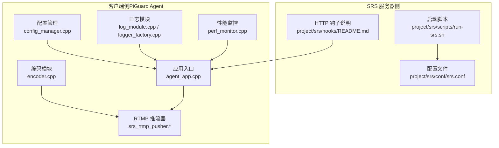
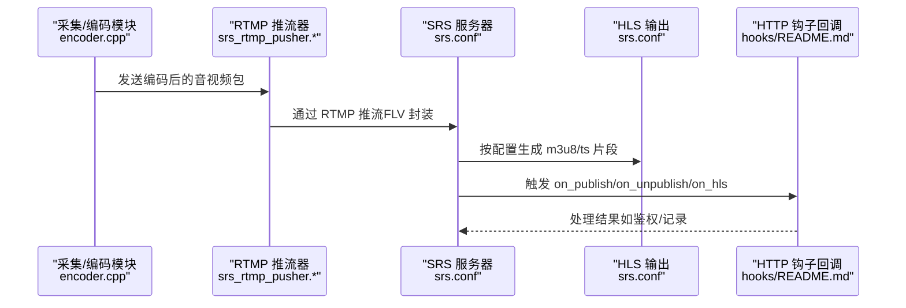
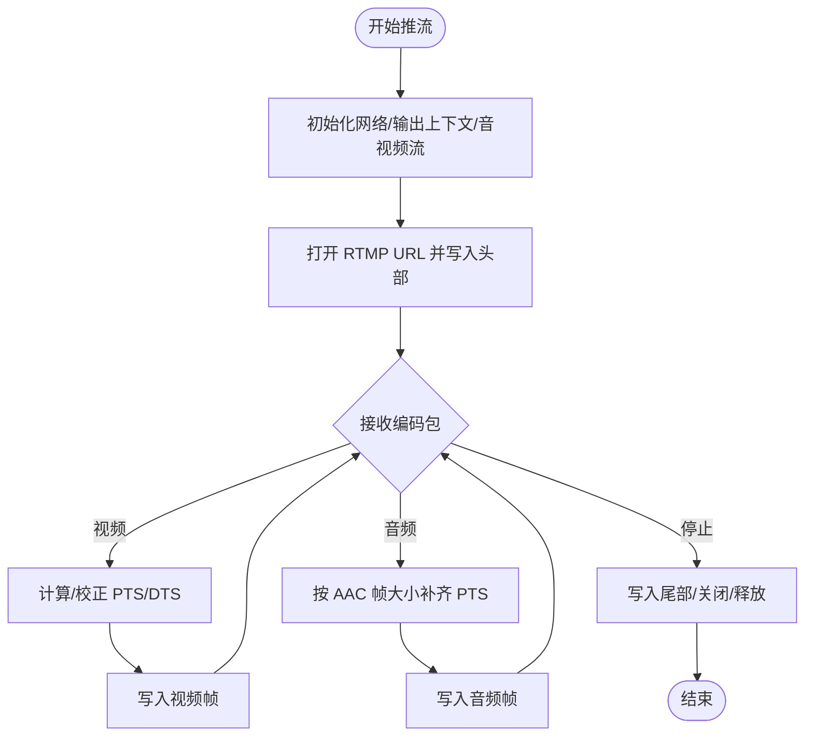
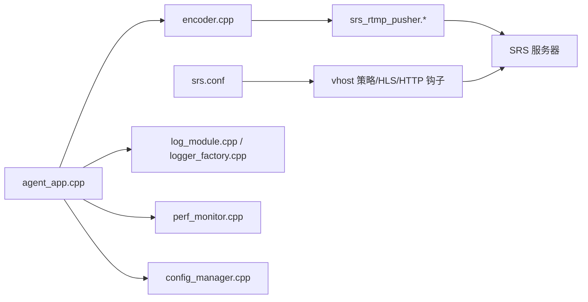

# SRS 服务器配置

<cite>
**本文引用的文件**
- [srs.conf](file://project/srs/conf/srs.conf)
- [run-srs.sh](file://project/srs/scripts/run-srs.sh)
- [README.md（hooks）](file://project/srs/hooks/README.md)
- [srs_rtmp_pusher.hpp](file://project/agent/cli/srs/srs_rtmp_pusher.hpp)
- [srs_rtmp_pusher.cpp](file://project/agent/cli/srs/srs_rtmp_pusher.cpp)
- [srs_config.hpp](file://project/agent/cli/srs/srs_config.hpp)
- [encoder.cpp](file://project/agent/src/modules/processing/encoder/encoder.cpp)
- [rtmp_publisher_module.cpp](file://project/agent/src/modules/external_access/pusher/rtmp_publisher_module.cpp)
- [agent_app.cpp](file://project/agent/src/runtime/app/agent_app.cpp)
- [config_manager.cpp](file://project/agent/src/modules/infra/config/config_manager.cpp)
- [log_module.cpp](file://project/agent/src/modules/infra/log/log_module.cpp)
- [logger_factory.cpp](file://project/agent/src/modules/infra/log/logger_factory.cpp)
- [perf_monitor.cpp](file://project/agent/src/modules/infra/perf_monitor/perf_monitor.cpp)
</cite>

## 目录
1. [简介](#简介)
2. [项目结构](#项目结构)
3. [核心组件](#核心组件)
4. [架构总览](#架构总览)
5. [详细组件分析](#详细组件分析)
6. [依赖关系分析](#依赖关系分析)
7. [性能考虑](#性能考虑)
8. [故障排查指南](#故障排查指南)
9. [结论](#结论)
10. [附录](#附录)

## 简介
本文件面向部署与运维人员，系统化梳理 SRS RTMP 服务器在本仓库中的配置与集成方式，覆盖以下主题：
- SRS 配置文件结构与关键参数说明（端口、协议、流媒体、安全）
- RTMP 推流配置与 HLS 直播配置
- 转码参数与性能调优建议
- 启动脚本使用方法与日志配置
- 常见部署场景的配置方案与最佳实践

## 项目结构
本仓库中与 SRS 相关的配置与脚本位于 project/srs 目录，包含：
- 配置文件：project/srs/conf/srs.conf
- 启动脚本：project/srs/scripts/run-srs.sh
- 回调钩子说明：project/srs/hooks/README.md

此外，客户端侧提供 RTMP 推流器实现，用于将编码后的音视频数据推送到 SRS，相关代码位于 project/agent/cli/srs。

图表来源
- [srs.conf:1-61](file://project/srs/conf/srs.conf#L1-L61)
- [run-srs.sh:1-14](file://project/srs/scripts/run-srs.sh#L1-L14)
- [README.md（hooks）:1-12](file://project/srs/hooks/README.md#L1-L12)
- [srs_rtmp_pusher.cpp:1-193](file://project/agent/cli/srs/srs_rtmp_pusher.cpp#L1-L193)
- [encoder.cpp:1-606](file://project/agent/src/modules/processing/encoder/encoder.cpp#L1-L606)
- [agent_app.cpp:1-138](file://project/agent/src/runtime/app/agent_app.cpp#L1-L138)
- [config_manager.cpp:1-40](file://project/agent/src/modules/infra/config/config_manager.cpp#L1-L40)
- [log_module.cpp:1-30](file://project/agent/src/modules/infra/log/log_module.cpp#L1-L30)
- [logger_factory.cpp:1-11](file://project/agent/src/modules/infra/log/logger_factory.cpp#L1-L11)
- [perf_monitor.cpp:1-26](file://project/agent/src/modules/infra/perf_monitor/perf_monitor.cpp#L1-L26)

章节来源
- [srs.conf:1-61](file://project/srs/conf/srs.conf#L1-L61)
- [run-srs.sh:1-14](file://project/srs/scripts/run-srs.sh#L1-L14)
- [README.md（hooks）:1-12](file://project/srs/hooks/README.md#L1-L12)

## 核心组件
- SRS 配置文件：定义监听端口、HTTP 服务、HTTP API、统计信息、虚拟主机（vhost）下的播放/发布策略、HLS 输出路径与片段参数、HTTP 钩子回调等。
- 启动脚本：负责定位配置文件并以守护进程模式启动 SRS。
- 客户端 RTMP 推流器：基于 FFmpeg 的 libavformat 将编码后的音视频写入 FLV/RTMP 输出，支持动态 PTS/DTS 补齐与错误处理。
- 编码模块：提供 H.264/AAC 编码能力，设置编码预设、延迟优化、GOP 大小、采样率与声道数等参数。
- 应用入口与基础设施：负责模块初始化顺序、日志后端、性能监控与配置管理。

章节来源
- [srs.conf:1-61](file://project/srs/conf/srs.conf#L1-L61)
- [run-srs.sh:1-14](file://project/srs/scripts/run-srs.sh#L1-L14)
- [srs_rtmp_pusher.hpp:1-48](file://project/agent/cli/srs/srs_rtmp_pusher.hpp#L1-L48)
- [srs_rtmp_pusher.cpp:1-193](file://project/agent/cli/srs/srs_rtmp_pusher.cpp#L1-L193)
- [encoder.cpp:1-606](file://project/agent/src/modules/processing/encoder/encoder.cpp#L1-L606)
- [agent_app.cpp:1-138](file://project/agent/src/runtime/app/agent_app.cpp#L1-L138)

## 架构总览
下图展示从客户端编码到 SRS 推流、再到 HLS 播放与 HTTP 钩子回调的整体流程。

图表来源
- [srs.conf:39-48](file://project/srs/conf/srs.conf#L39-L48)
- [srs.conf:54-59](file://project/srs/conf/srs.conf#L54-L59)
- [srs_rtmp_pusher.cpp:132-191](file://project/agent/cli/srs/srs_rtmp_pusher.cpp#L132-L191)
- [README.md（hooks）:5-11](file://project/srs/hooks/README.md#L5-L11)

## 详细组件分析

### SRS 配置文件结构与参数说明
- 全局参数
  - 监听端口与连接数：listen、max_connections
  - 守护进程与日志输出：daemon、srs_log_tank
- HTTP 服务器
  - 开关、监听端口、静态资源目录：http_server.enabled/listen/dir
- HTTP API
  - 开关与监听端口：http_api.enabled/listen
- 统计信息
  - 网络字节统计：stats.network
- 虚拟主机（vhost）
  - 最小延迟与 TCP NoDelay：min_latency、tcp_nodelay
  - 发布策略：publish.mr（关闭多路复用）
  - 播放策略：play.gop_cache、play.queue_length
  - HTTP 重混（FLV 拉流）：http_remux.mount
  - HLS 参数：hls.enabled、hls_path、hls_fragment、hls_window、hls_cleanup、hls_dispose、hls_m3u8_file、hls_ts_file
  - DVR：dvr.enabled（默认关闭）
  - HTTP 钩子：on_publish、on_unpublish、on_hls

章节来源
- [srs.conf:1-61](file://project/srs/conf/srs.conf#L1-L61)

### RTMP 推流配置（客户端侧）
- 推流器初始化
  - 使用 FFmpeg 的 FLV 输出格式，创建输出上下文与音视频流，设置编解码参数与 extradata
  - 初始化网络层，打开 RTMP URL，写入封装头
- 推流过程
  - 对每个输入包，根据类型设置 PTS/DTS，并进行时间基转换
  - 音频按 AAC 帧样本对齐补齐 PTS，视频按关键帧标记
  - 使用交错写入发送音视频帧，失败时记录告警
- 停止流程
  - 写入封装尾部，关闭 IO，释放上下文，反初始化网络

图表来源
- [srs_rtmp_pusher.cpp:24-104](file://project/agent/cli/srs/srs_rtmp_pusher.cpp#L24-L104)
- [srs_rtmp_pusher.cpp:132-191](file://project/agent/cli/srs/srs_rtmp_pusher.cpp#L132-L191)

章节来源
- [srs_rtmp_pusher.hpp:1-48](file://project/agent/cli/srs/srs_rtmp_pusher.hpp#L1-L48)
- [srs_rtmp_pusher.cpp:1-193](file://project/agent/cli/srs/srs_rtmp_pusher.cpp#L1-L193)

### HLS 直播配置
- HLS 开关与输出目录：hls.enabled、hls_path
- 片段参数：hls_fragment（秒）、hls_window（窗口大小，秒）、hls_cleanup（自动清理）
- 文件命名模板：hls_m3u8_file、hls_ts_file
- dispose 参数：hls_dispose 控制是否丢弃过期片段
- HTTP 重混（FLV）：http_remux.mount 支持通过 HTTP 拉取 FLV

章节来源
- [srs.conf:39-48](file://project/srs/conf/srs.conf#L39-L48)
- [srs.conf:34-37](file://project/srs/conf/srs.conf#L34-L37)

### HTTP 钩子与回调
- 钩子开关与回调地址：on_publish、on_unpublish、on_hls
- 说明文档指出回调由本项目的后端服务提供，可用于鉴权、审计与联动

章节来源
- [srs.conf:54-59](file://project/srs/conf/srs.conf#L54-L59)
- [README.md（hooks）:5-11](file://project/srs/hooks/README.md#L5-L11)

### 启动脚本与运行方式
- run-srs.sh 会检查系统中是否存在 srs 命令，定位配置文件并以守护进程方式启动
- 若未安装 SRS，请先完成安装后再执行脚本

章节来源
- [run-srs.sh:1-14](file://project/srs/scripts/run-srs.sh#L1-L14)

### 日志配置
- SRS 日志输出：srs_log_tank（控制台）
- 客户端日志后端：LogModule 初始化 spdlog 后端，LoggerFactory 提供 Logger 获取接口
- 应用入口在启动阶段初始化日志模块，便于统一收集运行日志

章节来源
- [srs.conf](file://project/srs/conf/srs.conf#L4)
- [log_module.cpp:1-30](file://project/agent/src/modules/infra/log/log_module.cpp#L1-L30)
- [logger_factory.cpp:1-11](file://project/agent/src/modules/infra/log/logger_factory.cpp#L1-L11)
- [agent_app.cpp:21-24](file://project/agent/src/runtime/app/agent_app.cpp#L21-L24)

### 性能调优参数
- SRS 端
  - min_latency、tcp_nodelay：降低播放时延
  - play.gop_cache、play.queue_length：提升首帧与缓冲稳定性
  - hls_fragment、hls_window：影响 HLS 延迟与内存占用
- 客户端编码端
  - 编码预设与延迟优化：preset=veryfast、tune=zerolatency
  - GOP 大小：与帧率匹配，减少 IDR 间隔
  - 音频采样率与声道：根据设备能力与带宽选择

章节来源
- [srs.conf:21-32](file://project/srs/conf/srs.conf#L21-L32)
- [encoder.cpp:83-84](file://project/agent/src/modules/processing/encoder/encoder.cpp#L83-L84)
- [encoder.cpp](file://project/agent/src/modules/processing/encoder/encoder.cpp#L79)
- [encoder.cpp:139-227](file://project/agent/src/modules/processing/encoder/encoder.cpp#L139-L227)

### 转码参数设置（客户端侧）
- 视频编码：H.264，像素格式 YUV420P，全局头标志，GOP 大小与帧率相关
- 音频编码：AAC，采样率与声道布局可配置，支持重采样与通道布局转换
- 时间基与 PTS/DTS：视频按纳秒时间戳换算，音频按帧样本补齐

章节来源
- [encoder.cpp:62-81](file://project/agent/src/modules/processing/encoder/encoder.cpp#L62-L81)
- [encoder.cpp:146-165](file://project/agent/src/modules/processing/encoder/encoder.cpp#L146-L165)
- [encoder.cpp:396-400](file://project/agent/src/modules/processing/encoder/encoder.cpp#L396-L400)
- [encoder.cpp:473-484](file://project/agent/src/modules/processing/encoder/encoder.cpp#L473-L484)

### 常见部署场景配置方案
- 单机轻量直播（低延迟）
  - SRS：开启 min_latency、tcp_nodelay；HLS 窗口与片段较小；关闭 DVR
  - 客户端：编码 preset=veryfast、tune=zerolatency，GOP 适配帧率
- 企业级录制与回看
  - SRS：开启 DVR；HLS 窗口适当增大；启用 http_hooks 记录事件
  - 客户端：根据带宽调整码率与分辨率
- 本地开发与调试
  - SRS：使用 console 日志；HTTP API 可用于状态查询
  - 客户端：通过日志模块输出详细运行状态

章节来源
- [srs.conf:21-32](file://project/srs/conf/srs.conf#L21-L32)
- [srs.conf:50-52](file://project/srs/conf/srs.conf#L50-L52)
- [srs.conf:39-48](file://project/srs/conf/srs.conf#L39-L48)
- [log_module.cpp:22-25](file://project/agent/src/modules/infra/log/log_module.cpp#L22-L25)

## 依赖关系分析
- SRS 服务器依赖于配置文件中的 vhost 下策略与 HLS 参数
- 客户端编码模块为 RTMP 推流器提供音视频元数据与数据包
- 应用入口负责模块生命周期与日志/配置/性能监控的初始化
- HTTP 钩子依赖后端服务提供回调接口

图表来源
- [srs.conf:21-60](file://project/srs/conf/srs.conf#L21-L60)
- [encoder.cpp:1-606](file://project/agent/src/modules/processing/encoder/encoder.cpp#L1-L606)
- [srs_rtmp_pusher.cpp:1-193](file://project/agent/cli/srs/srs_rtmp_pusher.cpp#L1-L193)
- [agent_app.cpp:1-138](file://project/agent/src/runtime/app/agent_app.cpp#L1-L138)
- [log_module.cpp:1-30](file://project/agent/src/modules/infra/log/log_module.cpp#L1-L30)
- [logger_factory.cpp:1-11](file://project/agent/src/modules/infra/log/logger_factory.cpp#L1-L11)
- [perf_monitor.cpp:1-26](file://project/agent/src/modules/infra/perf_monitor/perf_monitor.cpp#L1-L26)
- [config_manager.cpp:1-40](file://project/agent/src/modules/infra/config/config_manager.cpp#L1-L40)

## 性能考虑
- 降低延迟
  - SRS：min_latency、tcp_nodelay；HLS 片段与窗口较小
  - 客户端：编码 preset=veryfast、tune=zerolatency，GOP 与帧率匹配
- 稳定性
  - play.gop_cache、play.queue_length 提升首帧与缓冲
  - HLS 窗口过大可能增加内存占用
- 资源占用
  - 编码码率与分辨率直接影响 CPU 与内存
  - 合理设置队列容量与丢包策略，避免阻塞

## 故障排查指南
- SRS 启动失败
  - 检查 run-srs.sh 是否能找到 srs 命令；确认配置文件路径正确
- 推流异常
  - 查看客户端日志模块输出；确认 RTMP URL 与鉴权（如需）
  - 检查编码参数与推流器时间戳补全逻辑
- HLS 播放卡顿
  - 调整 hls_fragment 与 hls_window；确认 hls_cleanup 生效
- 回调未触发
  - 确认 http_hooks 地址可达；核对后端服务是否提供对应接口

章节来源
- [run-srs.sh:4-7](file://project/srs/scripts/run-srs.sh#L4-L7)
- [srs_rtmp_pusher.cpp:183-190](file://project/agent/cli/srs/srs_rtmp_pusher.cpp#L183-L190)
- [srs.conf:39-48](file://project/srs/conf/srs.conf#L39-L48)
- [README.md（hooks）:5-11](file://project/srs/hooks/README.md#L5-L11)

## 结论
本仓库提供了从客户端编码推流到 SRS 服务器的完整链路配置与实现参考。通过合理设置 SRS 的 vhost 策略、HLS 参数与 HTTP 钩子，结合客户端的低延迟编码与推流策略，可在不同场景下获得稳定且低延迟的直播体验。建议在生产环境逐步调参，优先保证稳定性与资源占用平衡。

## 附录
- 客户端默认 RTMP URL 与媒体参数可在配置头文件中查看，便于快速替换与验证
- 应用入口模块化初始化顺序清晰，便于扩展其他外部访问模块（如 WebSocket）

章节来源
- [srs_config.hpp:1-19](file://project/agent/cli/srs/srs_config.hpp#L1-L19)
- [agent_app.cpp:16-42](file://project/agent/src/runtime/app/agent_app.cpp#L16-L42)
- [rtmp_publisher_module.cpp:1-21](file://project/agent/src/modules/external_access/pusher/rtmp_publisher_module.cpp#L1-L21)