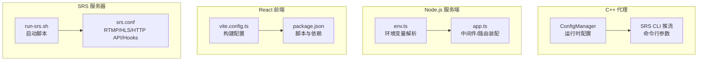
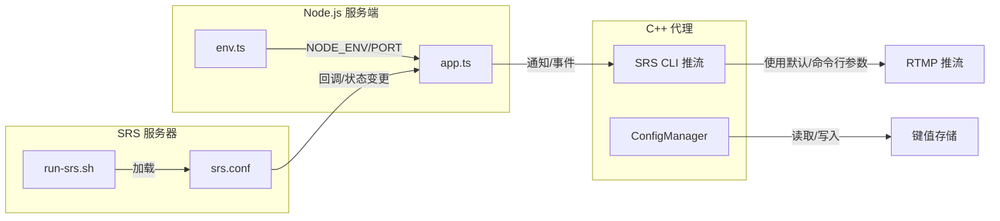
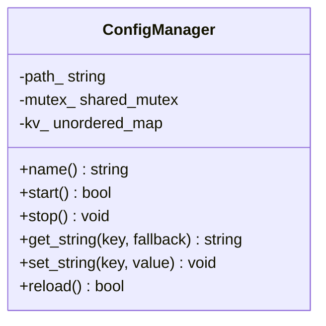
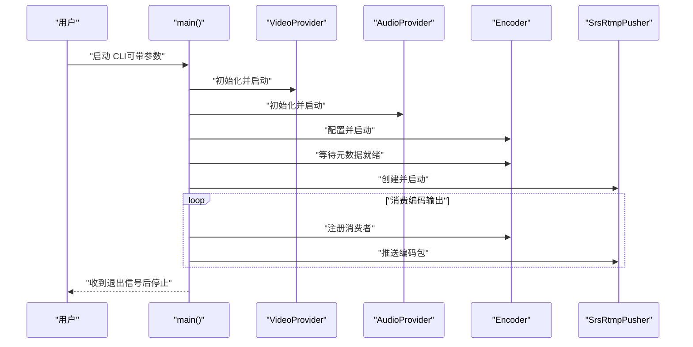
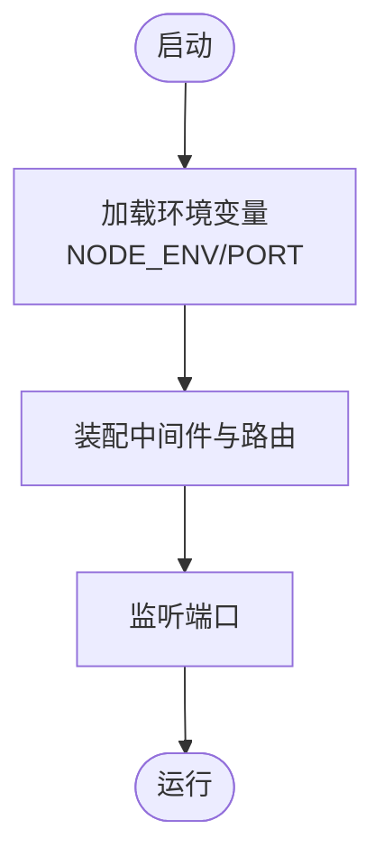
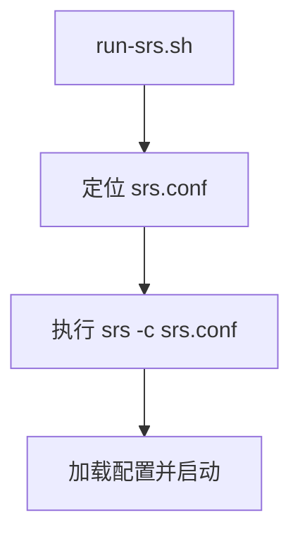
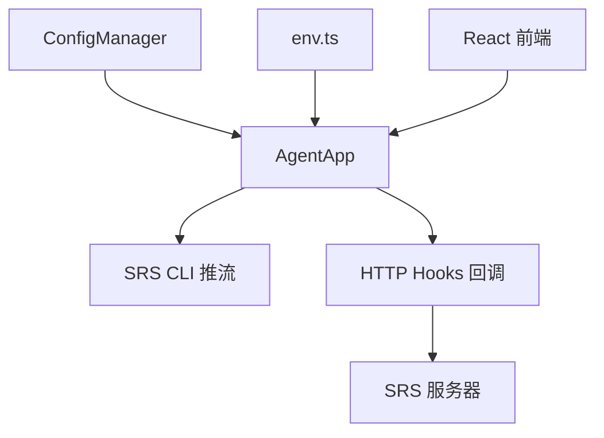

# 配置管理

<cite>
**本文引用的文件**
- [project/agent/src/modules/infra/config/include/infra_config/config_manager.hpp](file://project/agent/src/modules/infra/config/include/infra_config/config_manager.hpp)
- [project/agent/src/modules/infra/config/config_manager.cpp](file://project/agent/src/modules/infra/config/config_manager.cpp)
- [project/agent/src/runtime/app/agent_app.cpp](file://project/agent/src/runtime/app/agent_app.cpp)
- [project/agent/cli/srs/srs_config.hpp](file://project/agent/cli/srs/srs_config.hpp)
- [project/agent/cli/srs/main.cpp](file://project/agent/cli/srs/main.cpp)
- [project/server/src/config/env.ts](file://project/server/src/config/env.ts)
- [project/server/src/app.ts](file://project/server/src/app.ts)
- [project/server/package.json](file://project/server/package.json)
- [project/srs/conf/srs.conf](file://project/srs/conf/srs.conf)
- [project/srs/scripts/run-srs.sh](file://project/srs/scripts/run-srs.sh)
- [project/web/vite.config.ts](file://project/web/vite.config.ts)
- [project/web/package.json](file://project/web/package.json)
- [project/web/src/main.tsx](file://project/web/src/main.tsx)
</cite>

## 目录
1. [简介](#简介)
2. [项目结构](#项目结构)
3. [核心组件](#核心组件)
4. [架构总览](#架构总览)
5. [详细组件分析](#详细组件分析)
6. [依赖关系分析](#依赖关系分析)
7. [性能考量](#性能考量)
8. [故障排查指南](#故障排查指南)
9. [结论](#结论)
10. [附录](#附录)

## 简介
本文件系统性梳理 Pi-Guard 的配置管理，覆盖以下方面：
- C++ 代理程序配置：运行时配置加载与热更新能力、CLI 推流参数来源与默认值
- Node.js 服务器配置：环境变量解析、端口与运行模式、中间件与路由装配
- React 前端配置：构建工具与插件、开发与生产脚本
- SRS 服务器配置：RTMP/HLS/HTTP API/HTTP Hooks 等关键参数
- 环境变量管理、配置优先级与覆盖规则、配置验证与最佳实践

## 项目结构
Pi-Guard 的配置分布在四类模块中：
- C++ 代理（Agent）：运行时配置管理、CLI 推流参数
- Node.js 服务端（Server）：环境变量与应用装配
- React 前端（Web）：构建与开发脚本
- SRS 服务器（SRS）：RTMP/HLS/HTTP API/HTTP Hooks 配置

图表来源
- [project/agent/src/modules/infra/config/include/infra_config/config_manager.hpp:1-30](file://project/agent/src/modules/infra/config/include/infra_config/config_manager.hpp#L1-L30)
- [project/agent/src/modules/infra/config/config_manager.cpp:1-40](file://project/agent/src/modules/infra/config/config_manager.cpp#L1-L40)
- [project/agent/cli/srs/srs_config.hpp:1-19](file://project/agent/cli/srs/srs_config.hpp#L1-L19)
- [project/agent/cli/srs/main.cpp:1-131](file://project/agent/cli/srs/main.cpp#L1-L131)
- [project/server/src/config/env.ts:1-12](file://project/server/src/config/env.ts#L1-L12)
- [project/server/src/app.ts:1-14](file://project/server/src/app.ts#L1-L14)
- [project/web/vite.config.ts:1-8](file://project/web/vite.config.ts#L1-L8)
- [project/web/package.json:1-34](file://project/web/package.json#L1-L34)
- [project/srs/conf/srs.conf:1-61](file://project/srs/conf/srs.conf#L1-L61)
- [project/srs/scripts/run-srs.sh:1-14](file://project/srs/scripts/run-srs.sh#L1-L14)

章节来源
- [project/agent/src/modules/infra/config/include/infra_config/config_manager.hpp:1-30](file://project/agent/src/modules/infra/config/include/infra_config/config_manager.hpp#L1-L30)
- [project/agent/src/modules/infra/config/config_manager.cpp:1-40](file://project/agent/src/modules/infra/config/config_manager.cpp#L1-L40)
- [project/agent/cli/srs/srs_config.hpp:1-19](file://project/agent/cli/srs/srs_config.hpp#L1-L19)
- [project/agent/cli/srs/main.cpp:1-131](file://project/agent/cli/srs/main.cpp#L1-L131)
- [project/server/src/config/env.ts:1-12](file://project/server/src/config/env.ts#L1-L12)
- [project/server/src/app.ts:1-14](file://project/server/src/app.ts#L1-L14)
- [project/web/vite.config.ts:1-8](file://project/web/vite.config.ts#L1-L8)
- [project/web/package.json:1-34](file://project/web/package.json#L1-L34)
- [project/srs/conf/srs.conf:1-61](file://project/srs/conf/srs.conf#L1-L61)
- [project/srs/scripts/run-srs.sh:1-14](file://project/srs/scripts/run-srs.sh#L1-L14)

## 核心组件
- 运行时配置管理（C++）
  - 提供键值对配置读取与写入，支持并发安全访问；启动时加载默认配置；支持重载与动态设置
  - 默认键值包含摄像头设备、麦克风/扬声器设备等
- CLI 推流配置（C++）
  - 通过命令行参数覆盖默认推流参数；默认推流地址、视频分辨率、帧率、音频采样率与通道数等
- 服务器环境变量（Node.js）
  - 从环境变量解析运行模式与端口；提供默认值以保证最小可用配置
- 服务器装配（Node.js）
  - 中间件与路由装配顺序影响请求处理链路
- 构建配置（React）
  - Vite 插件与脚本定义开发/构建/预览流程
- SRS 服务器配置
  - RTMP 监听、HTTP 服务器、HTTP API、HLS、DVR、HTTP Hooks 等

章节来源
- [project/agent/src/modules/infra/config/include/infra_config/config_manager.hpp:11-27](file://project/agent/src/modules/infra/config/include/infra_config/config_manager.hpp#L11-L27)
- [project/agent/src/modules/infra/config/config_manager.cpp:16-37](file://project/agent/src/modules/infra/config/config_manager.cpp#L16-L37)
- [project/agent/cli/srs/srs_config.hpp:5-17](file://project/agent/cli/srs/srs_config.hpp#L5-L17)
- [project/agent/cli/srs/main.cpp:24-31](file://project/agent/cli/srs/main.cpp#L24-L31)
- [project/server/src/config/env.ts:6-11](file://project/server/src/config/env.ts#L6-L11)
- [project/server/src/app.ts:6-12](file://project/server/src/app.ts#L6-L12)
- [project/web/vite.config.ts:5-7](file://project/web/vite.config.ts#L5-L7)
- [project/srs/conf/srs.conf:1-61](file://project/srs/conf/srs.conf#L1-L61)

## 架构总览
下图展示配置在系统中的作用与交互：

图表来源
- [project/agent/src/modules/infra/config/config_manager.cpp:16-37](file://project/agent/src/modules/infra/config/config_manager.cpp#L16-L37)
- [project/agent/cli/srs/main.cpp:24-93](file://project/agent/cli/srs/main.cpp#L24-L93)
- [project/server/src/config/env.ts:6-11](file://project/server/src/config/env.ts#L6-L11)
- [project/server/src/app.ts:6-12](file://project/server/src/app.ts#L6-L12)
- [project/srs/scripts/run-srs.sh:10-13](file://project/srs/scripts/run-srs.sh#L10-L13)
- [project/srs/conf/srs.conf:54-59](file://project/srs/conf/srs.conf#L54-L59)

## 详细组件分析

### C++ 代理：运行时配置管理（ConfigManager）
- 职责
  - 提供线程安全的字符串键值存取接口
  - 启动时加载默认配置并暴露重载能力
  - 支持动态设置键值，用于运行时调整
- 关键行为
  - 启动即重载，确保首次可用配置
  - 并发读写通过共享互斥锁保护
  - 默认键值包含摄像头、麦克风、扬声器设备路径等
- 使用方式
  - 在应用启动阶段调用启动流程，随后各模块通过键名读取配置
  - 可在运行时通过设置接口更新键值，实现“热更新”效果

图表来源
- [project/agent/src/modules/infra/config/include/infra_config/config_manager.hpp:11-27](file://project/agent/src/modules/infra/config/include/infra_config/config_manager.hpp#L11-L27)
- [project/agent/src/modules/infra/config/config_manager.cpp:8-37](file://project/agent/src/modules/infra/config/config_manager.cpp#L8-L37)

章节来源
- [project/agent/src/modules/infra/config/include/infra_config/config_manager.hpp:11-27](file://project/agent/src/modules/infra/config/include/infra_config/config_manager.hpp#L11-L27)
- [project/agent/src/modules/infra/config/config_manager.cpp:16-37](file://project/agent/src/modules/infra/config/config_manager.cpp#L16-L37)

### C++ 代理：CLI 推流配置（SRS CLI）
- 默认参数
  - 视频分辨率、帧率、缓冲队列容量、音频采样率与通道数
  - 默认摄像头与音频设备、默认 RTMP 推流地址
- 参数来源
  - 命令行参数优先于默认值
  - 未提供的参数使用默认值
- 流程要点
  - 初始化音视频捕获与编码器
  - 等待编码器元数据就绪后创建 RTMP 推流器
  - 注册消费者线程持续推送编码包
  - 捕获退出信号后有序停止所有组件

图表来源
- [project/agent/cli/srs/main.cpp:24-131](file://project/agent/cli/srs/main.cpp#L24-L131)
- [project/agent/cli/srs/srs_config.hpp:5-17](file://project/agent/cli/srs/srs_config.hpp#L5-L17)

章节来源
- [project/agent/cli/srs/srs_config.hpp:5-17](file://project/agent/cli/srs/srs_config.hpp#L5-L17)
- [project/agent/cli/srs/main.cpp:24-93](file://project/agent/cli/srs/main.cpp#L24-L93)

### Node.js 服务器：环境变量与应用装配
- 环境变量
  - NODE_ENV：运行模式，默认 development
  - PORT：监听端口，默认 3000
- 应用装配
  - 错误处理中间件、请求 ID 中间件、路由装配顺序决定请求处理链
- 脚本与依赖
  - 开发、构建、启动、类型检查脚本
  - Koa 与路由等依赖

图表来源
- [project/server/src/config/env.ts:6-11](file://project/server/src/config/env.ts#L6-L11)
- [project/server/src/app.ts:6-12](file://project/server/src/app.ts#L6-L12)
- [project/server/package.json:6-11](file://project/server/package.json#L6-L11)

章节来源
- [project/server/src/config/env.ts:6-11](file://project/server/src/config/env.ts#L6-L11)
- [project/server/src/app.ts:6-12](file://project/server/src/app.ts#L6-L12)
- [project/server/package.json:6-11](file://project/server/package.json#L6-L11)

### React 前端：构建与开发脚本
- 构建配置
  - Vite 插件与开发服务器
- 脚本
  - dev、build、lint、preview
- 依赖
  - React、Ant Design Mobile、Less、ESLint 等

章节来源
- [project/web/vite.config.ts:5-7](file://project/web/vite.config.ts#L5-L7)
- [project/web/package.json:6-11](file://project/web/package.json#L6-L11)
- [project/web/src/main.tsx:1-15](file://project/web/src/main.tsx#L1-L15)

### SRS 服务器：RTMP/HLS/HTTP API/HTTP Hooks
- 关键参数
  - RTMP 监听端口、最大连接数、守护进程开关、日志输出
  - HTTP 服务器启用与目录、HTTP API 启用与监听端口
  - HLS 启用、片段时长、窗口大小、TS/M3U8 文件命名模板
  - HTTP Hooks 回调地址（与服务端对接）
- 启动流程
  - 启动脚本定位配置文件并执行 SRS

图表来源
- [project/srs/scripts/run-srs.sh:10-13](file://project/srs/scripts/run-srs.sh#L10-L13)
- [project/srs/conf/srs.conf:1-61](file://project/srs/conf/srs.conf#L1-L61)

章节来源
- [project/srs/conf/srs.conf:1-61](file://project/srs/conf/srs.conf#L1-L61)
- [project/srs/scripts/run-srs.sh:1-14](file://project/srs/scripts/run-srs.sh#L1-L14)

## 依赖关系分析
- 组件耦合
  - C++ 代理的 ConfigManager 作为统一配置源，被 AgentApp 启动流程依赖
  - CLI 推流直接依赖默认配置与命令行参数
  - 服务端通过环境变量控制运行参数，并通过 HTTP Hooks 与 SRS 协作
  - 前端与后端通过 HTTP API 交互
- 外部依赖
  - SRS 二进制与配置文件
  - Node.js 运行时与 Koa 生态
  - React/Vite 构建链

图表来源
- [project/agent/src/modules/infra/config/config_manager.cpp:16-23](file://project/agent/src/modules/infra/config/config_manager.cpp#L16-L23)
- [project/agent/src/runtime/app/agent_app.cpp:23-34](file://project/agent/src/runtime/app/agent_app.cpp#L23-L34)
- [project/agent/cli/srs/main.cpp:82-93](file://project/agent/cli/srs/main.cpp#L82-L93)
- [project/server/src/config/env.ts:6-11](file://project/server/src/config/env.ts#L6-L11)
- [project/srs/conf/srs.conf:54-59](file://project/srs/conf/srs.conf#L54-L59)

章节来源
- [project/agent/src/runtime/app/agent_app.cpp:23-34](file://project/agent/src/runtime/app/agent_app.cpp#L23-L34)
- [project/agent/cli/srs/main.cpp:82-93](file://project/agent/cli/srs/main.cpp#L82-L93)
- [project/server/src/config/env.ts:6-11](file://project/server/src/config/env.ts#L6-L11)
- [project/srs/conf/srs.conf:54-59](file://project/srs/conf/srs.conf#L54-L59)

## 性能考量
- 配置读取
  - ConfigManager 使用共享互斥锁，读多写少场景具备良好并发表现
- 推流与编码
  - CLI 推流采用独立消费者线程，避免阻塞主流程
- 服务器
  - 中间件顺序影响请求处理耗时，建议将轻量中间件前置
- 前端
  - Vite 开发服务器按需编译，生产构建开启压缩与 Tree-shaking

## 故障排查指南
- 无法启动 SRS
  - 检查 run-srs.sh 是否找到 srs 命令与正确配置文件路径
  - 确认 srs.conf 中端口未被占用
- 服务端无法监听端口
  - 检查 PORT 环境变量是否被正确解析
  - 确认防火墙与权限
- CLI 推流失败
  - 检查摄像头/麦克风设备路径与权限
  - 确认 RTMP 地址可达且格式正确
- 配置不生效
  - 对于 C++ 代理：确认已调用重载或设置接口
  - 对于 Node.js：确认环境变量拼写与类型

章节来源
- [project/srs/scripts/run-srs.sh:4-13](file://project/srs/scripts/run-srs.sh#L4-L13)
- [project/srs/conf/srs.conf:1-10](file://project/srs/conf/srs.conf#L1-L10)
- [project/server/src/config/env.ts:6-11](file://project/server/src/config/env.ts#L6-L11)
- [project/agent/cli/srs/main.cpp:82-93](file://project/agent/cli/srs/main.cpp#L82-L93)
- [project/agent/src/modules/infra/config/config_manager.cpp:16-37](file://project/agent/src/modules/infra/config/config_manager.cpp#L16-L37)

## 结论
Pi-Guard 的配置体系以“分层、解耦、可演进”为目标：
- C++ 代理提供运行时配置与 CLI 推流参数默认值
- Node.js 服务端通过环境变量与中间件装配实现灵活部署
- React 前端采用现代构建工具链，便于快速迭代
- SRS 服务器通过配置文件集中管理媒体协议与回调

建议在实际部署中结合环境变量与配置文件进行差异化管理，并建立配置变更的审计与回滚机制。

## 附录

### 配置项清单与默认值

- C++ 代理运行时配置（ConfigManager）
  - 键：config_path（只读，来自构造参数）
  - 键：camera（默认设备路径）
  - 键：mic_device（默认音频输入设备）
  - 键：speaker_device（默认音频输出设备）
  - 行为：启动时加载默认值；支持并发读取与动态设置

- CLI 推流配置（SRS CLI）
  - 视频：分辨率、帧率、缓冲队列容量
  - 音频：采样率、声道数
  - 设备：默认摄像头与音频设备
  - 推流：默认 RTMP 地址
  - 来源：命令行参数优先，否则使用默认值

- 服务器环境变量（Node.js）
  - NODE_ENV：运行模式，默认 development
  - PORT：监听端口，默认 3000

- SRS 服务器配置（srs.conf）
  - RTMP：监听端口、最大连接数、守护进程、日志输出
  - HTTP 服务器：启用、监听端口、静态目录
  - HTTP API：启用、监听端口
  - HLS：启用、片段时长、窗口大小、TS/M3U8 文件命名模板
  - HTTP Hooks：启用与回调地址（与服务端对接）

章节来源
- [project/agent/src/modules/infra/config/config_manager.cpp:16-23](file://project/agent/src/modules/infra/config/config_manager.cpp#L16-L23)
- [project/agent/cli/srs/srs_config.hpp:5-17](file://project/agent/cli/srs/srs_config.hpp#L5-L17)
- [project/server/src/config/env.ts:6-11](file://project/server/src/config/env.ts#L6-L11)
- [project/srs/conf/srs.conf:1-61](file://project/srs/conf/srs.conf#L1-L61)

### 配置优先级与覆盖规则
- CLI 参数优先于默认配置
- 运行时配置可通过设置接口覆盖默认值
- 环境变量优先于硬编码默认值
- SRS 配置文件为最终落盘配置，由启动脚本加载

章节来源
- [project/agent/cli/srs/main.cpp:28-30](file://project/agent/cli/srs/main.cpp#L28-L30)
- [project/agent/src/modules/infra/config/config_manager.cpp:34-37](file://project/agent/src/modules/infra/config/config_manager.cpp#L34-L37)
- [project/server/src/config/env.ts:6-11](file://project/server/src/config/env.ts#L6-L11)
- [project/srs/scripts/run-srs.sh:10-13](file://project/srs/scripts/run-srs.sh#L10-L13)

### 配置验证机制
- CLI 推流：等待编码器元数据就绪后再启动推流器，失败则回滚
- 服务器：中间件链路中错误处理中间件统一捕获异常
- SRS：HTTP Hooks 回调地址与服务端端点保持一致

章节来源
- [project/agent/cli/srs/main.cpp:70-83](file://project/agent/cli/srs/main.cpp#L70-L83)
- [project/server/src/app.ts:8-9](file://project/server/src/app.ts#L8-L9)
- [project/srs/conf/srs.conf:54-59](file://project/srs/conf/srs.conf#L54-L59)

### 最佳实践建议
- 环境变量管理
  - 使用 .env 文件与环境变量区分开发/测试/生产
  - 对敏感信息（如回调地址）使用密钥管理或外部配置中心
- 配置热更新
  - 仅对非关键路径配置进行热更新；涉及资源句柄的配置应设计优雅降级
  - 记录配置变更时间线，便于审计与回滚
- 配置验证
  - 在启动阶段对关键配置进行校验（端口、路径、URL 格式）
  - 对 CLI 推流增加健康检查与告警上报
- 配置文件优先级
  - 命令行 > 运行时配置 > 环境变量 > 硬编码默认值
  - SRS 配置文件作为最终权威来源，避免与运行时配置冲突