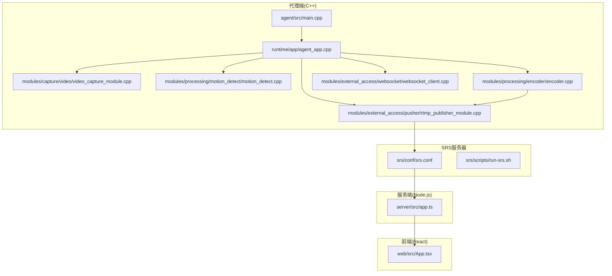
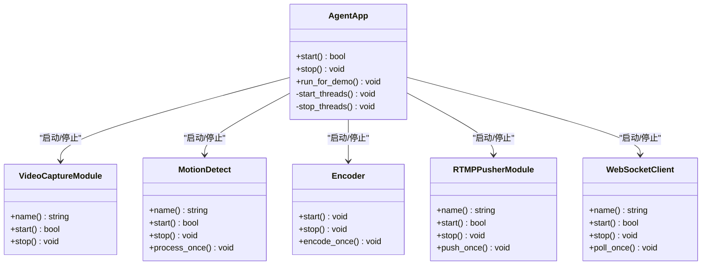
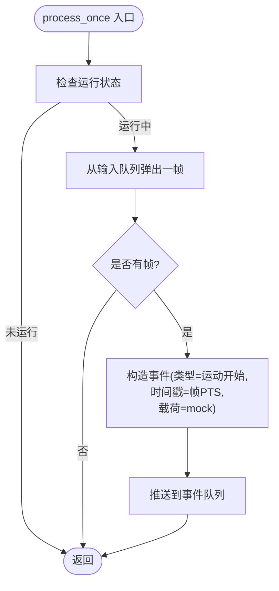
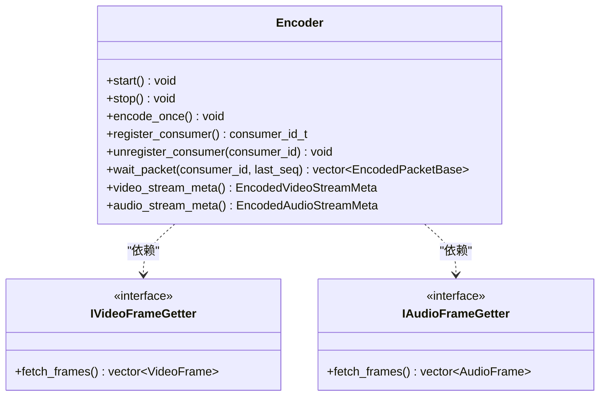
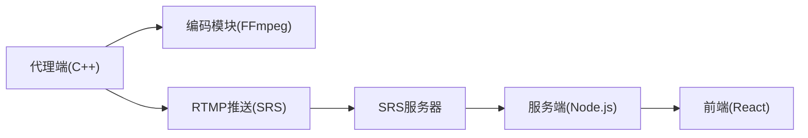

# 项目概述

<cite>
**本文引用的文件**
- [project/agent/src/main.cpp](file://project/agent/src/main.cpp)
- [project/agent/src/runtime/app/agent_app.cpp](file://project/agent/src/runtime/app/agent_app.cpp)
- [project/agent/src/modules/capture/video/video_capture_module.cpp](file://project/agent/src/modules/capture/video/video_capture_module.cpp)
- [project/agent/src/modules/processing/motion_detect/motion_detect.cpp](file://project/agent/src/modules/processing/motion_detect/motion_detect.cpp)
- [project/agent/src/modules/processing/encoder/encoder.cpp](file://project/agent/src/modules/processing/encoder/encoder.cpp)
- [project/agent/src/modules/external_access/pusher/rtmp_publisher_module.cpp](file://project/agent/src/modules/external_access/pusher/rtmp_publisher_module.cpp)
- [project/agent/src/modules/external_access/websocket/websocket_client.cpp](file://project/agent/src/modules/external_access/websocket/websocket_client.cpp)
- [project/server/src/app.ts](file://project/server/src/app.ts)
- [project/server/package.json](file://project/server/package.json)
- [project/web/src/App.tsx](file://project/web/src/App.tsx)
- [project/web/package.json](file://project/web/package.json)
- [project/srs/conf/srs.conf](file://project/srs/conf/srs.conf)
- [project/srs/scripts/run-srs.sh](file://project/srs/scripts/run-srs.sh)
- [docs/数据流.md](file://docs/数据流.md)
</cite>

## 目录
1. [简介](#简介)
2. [项目结构](#项目结构)
3. [核心组件](#核心组件)
4. [架构总览](#架构总览)
5. [详细组件分析](#详细组件分析)
6. [依赖分析](#依赖分析)
7. [性能考虑](#性能考虑)
8. [故障排查指南](#故障排查指南)
9. [结论](#结论)
10. [附录](#附录)

## 简介
Pi-Guard 是一个全栈安防监控系统，围绕“树莓派代理端 + Node.js 服务端 + React 前端 + SRS RTMP/HLS 服务器”的组合实现，提供实时视频监控、移动侦测报警、双向语音对讲（上行/下行）与远程控制能力。系统通过 C++ 代理程序采集音视频、进行编码与推送，借助 SRS 提供 RTMP 推流与 HLS 拉流，Node.js 服务端负责业务编排与 HTTP/WebSocket 通信，前端 React 应用提供用户界面与交互。

本概述面向初学者与进阶开发者：既给出概念性理解，也提供可追溯到源码的技术细节与数据流说明。

## 项目结构
项目采用多工程分层组织：
- 代理端（C++）：位于 project/agent，包含采集、处理、输出、外部接入等模块，以及运行时应用入口。
- 服务端（Node.js + TypeScript）：位于 project/server，基于 Koa 框架提供路由、中间件与 WebSocket 网关。
- 前端（React + Vite）：位于 project/web，基于 React Router 提供页面与导航。
- SRS 服务器：位于 project/srs，提供 RTMP 推流、HLS 拉流与 HTTP 回调集成。



图表来源
- [project/agent/src/main.cpp:1-19](file://project/agent/src/main.cpp#L1-L19)
- [project/agent/src/runtime/app/agent_app.cpp:1-138](file://project/agent/src/runtime/app/agent_app.cpp#L1-L138)
- [project/agent/src/modules/capture/video/video_capture_module.cpp:1-25](file://project/agent/src/modules/capture/video/video_capture_module.cpp#L1-L25)
- [project/agent/src/modules/processing/motion_detect/motion_detect.cpp:1-34](file://project/agent/src/modules/processing/motion_detect/motion_detect.cpp#L1-L34)
- [project/agent/src/modules/processing/encoder/encoder.cpp:1-606](file://project/agent/src/modules/processing/encoder/encoder.cpp#L1-L606)
- [project/agent/src/modules/external_access/pusher/rtmp_publisher_module.cpp:1-21](file://project/agent/src/modules/external_access/pusher/rtmp_publisher_module.cpp#L1-L21)
- [project/agent/src/modules/external_access/websocket/websocket_client.cpp:1-21](file://project/agent/src/modules/external_access/websocket/websocket_client.cpp#L1-L21)
- [project/server/src/app.ts:1-14](file://project/server/src/app.ts#L1-L14)
- [project/web/src/App.tsx:1-38](file://project/web/src/App.tsx#L1-L38)
- [project/srs/conf/srs.conf:1-61](file://project/srs/conf/srs.conf#L1-L61)
- [project/srs/scripts/run-srs.sh:1-14](file://project/srs/scripts/run-srs.sh#L1-L14)

章节来源
- [project/agent/src/main.cpp:1-19](file://project/agent/src/main.cpp#L1-L19)
- [project/agent/src/runtime/app/agent_app.cpp:1-138](file://project/agent/src/runtime/app/agent_app.cpp#L1-L138)
- [project/server/src/app.ts:1-14](file://project/server/src/app.ts#L1-L14)
- [project/web/src/App.tsx:1-38](file://project/web/src/App.tsx#L1-L38)
- [project/srs/conf/srs.conf:1-61](file://project/srs/conf/srs.conf#L1-L61)
- [project/srs/scripts/run-srs.sh:1-14](file://project/srs/scripts/run-srs.sh#L1-L14)

## 核心组件
- 代理端应用（AgentApp）
  - 负责启动日志、配置、性能监控、采集、处理、编码、推送、通知、WebSocket 客户端等子系统。
  - 启动顺序与线程管理在应用层集中协调，确保各模块按需初始化与退出。
- 视频采集模块（VideoCaptureModule）
  - 提供视频采集生命周期管理，作为后续编码与处理的数据来源。
- 移动侦测模块（MotionDetect）
  - 从视频帧队列取帧，触发事件并上报到事件总线，用于报警联动。
- 编码模块（Encoder）
  - 基于 FFmpeg 实现 H.264/AAC 编码，支持视频与音频双路编码，维护编码参数与消费者注册机制。
- RTMP 推送模块（RTMPPusherModule）
  - 作为外部接入模块，负责将编码后的码流推送到 SRS。
- WebSocket 客户端（WebSocketClient）
  - 作为外部接入模块，负责与服务端建立长连接，承载双向语音下行与控制指令。
- 服务端（Koa + 路由 + 中间件 + WebSocket 网关）
  - 提供健康检查、错误处理、请求 ID 追踪等通用能力；通过路由与网关与前端及代理端交互。
- 前端（React + Ant Design Mobile）
  - 提供移动端友好的导航与页面切换，承载用户操作与状态展示。
- SRS 服务器
  - 提供 RTMP 推流、HLS 拉流、HTTP 回调（如 on_publish/on_unpublish/on_hls），并与服务端打通报警与控制链路。

章节来源
- [project/agent/src/runtime/app/agent_app.cpp:16-63](file://project/agent/src/runtime/app/agent_app.cpp#L16-L63)
- [project/agent/src/modules/capture/video/video_capture_module.cpp:13-21](file://project/agent/src/modules/capture/video/video_capture_module.cpp#L13-L21)
- [project/agent/src/modules/processing/motion_detect/motion_detect.cpp:9-16](file://project/agent/src/modules/processing/motion_detect/motion_detect.cpp#L9-L16)
- [project/agent/src/modules/processing/encoder/encoder.cpp:45-54](file://project/agent/src/modules/processing/encoder/encoder.cpp#L45-L54)
- [project/agent/src/modules/external_access/pusher/rtmp_publisher_module.cpp:5-12](file://project/agent/src/modules/external_access/pusher/rtmp_publisher_module.cpp#L5-L12)
- [project/agent/src/modules/external_access/websocket/websocket_client.cpp:5-12](file://project/agent/src/modules/external_access/websocket/websocket_client.cpp#L5-L12)
- [project/server/src/app.ts:1-14](file://project/server/src/app.ts#L1-L14)
- [project/web/src/App.tsx:1-38](file://project/web/src/App.tsx#L1-L38)
- [project/srs/conf/srs.conf:21-60](file://project/srs/conf/srs.conf#L21-L60)

## 架构总览
系统以“代理端采集/编码/推送”为核心，结合“SRS 推拉流”与“服务端编排/通知”，形成完整的安防监控闭环。数据流与控制流如下：

```mermaid
graph TB
subgraph "现场侧"
CAM["USB摄像头"]
MIC["麦克风"]
SPK["扬声器"]
AG["pi-guard-agent(C++)"]
end
subgraph "网络侧"
ENC["编码器(H264/AAC)"]
RTMP["RTMP推送"]
SRS["SRS服务器"]
WS["WebSocket客户端"]
end
subgraph "云端/服务端"
SRV["Node.js服务端(Koa)"]
end
subgraph "终端侧"
WEB["React前端"]
end
CAM --> AG
MIC --> AG
AG --> ENC
ENC --> RTMP
RTMP --> SRS
SRS --> SRV
SRV --> WEB
WS <- --> SRV
WEB <- --> SRV
SPK <- --> WS
MIC --> WS
```

图表来源
- [docs/数据流.md:1-33](file://docs/数据流.md#L1-L33)
- [project/agent/src/modules/processing/encoder/encoder.cpp:1-606](file://project/agent/src/modules/processing/encoder/encoder.cpp#L1-L606)
- [project/agent/src/modules/external_access/pusher/rtmp_publisher_module.cpp:1-21](file://project/agent/src/modules/external_access/pusher/rtmp_publisher_module.cpp#L1-L21)
- [project/srs/conf/srs.conf:1-61](file://project/srs/conf/srs.conf#L1-L61)
- [project/server/src/app.ts:1-14](file://project/server/src/app.ts#L1-L14)
- [project/web/src/App.tsx:1-38](file://project/web/src/App.tsx#L1-L38)

## 详细组件分析

### 代理端应用（AgentApp）
- 职责
  - 初始化日志、配置、性能监控、采集、处理、编码、推送、通知、WebSocket 客户端等子系统。
  - 统一启动/停止流程，保证模块有序启停与资源回收。
- 关键点
  - 启动顺序：日志 → 配置 → 性能监控 → 各采集/处理/编码/推送/通知/WS 模块。
  - 线程模型：为视频/音频/运动检测/文件写入等任务分别创建工作线程，周期性调度。
  - 事件总线：将运动检测事件发布到总线，便于后续通知或记录。
- 示例场景
  - 启动后进入演示循环，周期性收集性能指标并记录日志。



图表来源
- [project/agent/src/runtime/app/agent_app.cpp:1-138](file://project/agent/src/runtime/app/agent_app.cpp#L1-L138)
- [project/agent/src/modules/capture/video/video_capture_module.cpp:1-25](file://project/agent/src/modules/capture/video/video_capture_module.cpp#L1-L25)
- [project/agent/src/modules/processing/motion_detect/motion_detect.cpp:1-34](file://project/agent/src/modules/processing/motion_detect/motion_detect.cpp#L1-L34)
- [project/agent/src/modules/processing/encoder/encoder.cpp:1-606](file://project/agent/src/modules/processing/encoder/encoder.cpp#L1-L606)
- [project/agent/src/modules/external_access/pusher/rtmp_publisher_module.cpp:1-21](file://project/agent/src/modules/external_access/pusher/rtmp_publisher_module.cpp#L1-L21)
- [project/agent/src/modules/external_access/websocket/websocket_client.cpp:1-21](file://project/agent/src/modules/external_access/websocket/websocket_client.cpp#L1-L21)

章节来源
- [project/agent/src/runtime/app/agent_app.cpp:16-63](file://project/agent/src/runtime/app/agent_app.cpp#L16-L63)
- [project/agent/src/runtime/app/agent_app.cpp:78-126](file://project/agent/src/runtime/app/agent_app.cpp#L78-L126)

### 视频采集模块（VideoCaptureModule）
- 职责
  - 提供视频采集模块的生命周期方法，作为后续编码与处理的数据输入。
- 特性
  - 名称标识、启动/停止接口，便于统一管理。

章节来源
- [project/agent/src/modules/capture/video/video_capture_module.cpp:13-21](file://project/agent/src/modules/capture/video/video_capture_module.cpp#L13-L21)

### 移动侦测模块（MotionDetect）
- 职责
  - 从视频帧队列取出帧，执行一次处理，生成“运动开始”事件并投递到事件队列。
- 特性
  - 基于线程安全队列，避免阻塞主流程。
  - 将事件回传到事件总线，供其他模块订阅。



图表来源
- [project/agent/src/modules/processing/motion_detect/motion_detect.cpp:18-31](file://project/agent/src/modules/processing/motion_detect/motion_detect.cpp#L18-L31)

章节来源
- [project/agent/src/modules/processing/motion_detect/motion_detect.cpp:9-31](file://project/agent/src/modules/processing/motion_detect/motion_detect.cpp#L9-L31)

### 编码模块（Encoder）
- 职责
  - 对视频帧与音频 PCM 进行编码，生成 H.264/H.265 与 AAC 码流，维护消费者注册与包队列。
- 关键点
  - 视频编码：设置分辨率、帧率、像素格式、预设/调优参数，使用 libswscale 转换像素格式。
  - 音频编码：设置采样率、声道布局、采样格式，必要时使用 libswresample 进行重采样/重布局。
  - 消费者模型：支持多个消费者并发消费编码结果，内部维护包队列与待消费集合。
- 性能特性
  - 视频/音频分别在独立线程中编码，避免相互阻塞。
  - 支持丢弃过期帧与溢出保护，维持系统稳定性。



图表来源
- [project/agent/src/modules/processing/encoder/encoder.cpp:45-54](file://project/agent/src/modules/processing/encoder/encoder.cpp#L45-L54)
- [project/agent/src/modules/processing/encoder/encoder.cpp:524-551](file://project/agent/src/modules/processing/encoder/encoder.cpp#L524-L551)
- [project/agent/src/modules/processing/encoder/encoder.cpp:553-583](file://project/agent/src/modules/processing/encoder/encoder.cpp#L553-L583)

章节来源
- [project/agent/src/modules/processing/encoder/encoder.cpp:56-138](file://project/agent/src/modules/processing/encoder/encoder.cpp#L56-L138)
- [project/agent/src/modules/processing/encoder/encoder.cpp:140-227](file://project/agent/src/modules/processing/encoder/encoder.cpp#L140-L227)
- [project/agent/src/modules/processing/encoder/encoder.cpp:267-297](file://project/agent/src/modules/processing/encoder/encoder.cpp#L267-L297)
- [project/agent/src/modules/processing/encoder/encoder.cpp:359-420](file://project/agent/src/modules/processing/encoder/encoder.cpp#L359-L420)
- [project/agent/src/modules/processing/encoder/encoder.cpp:422-510](file://project/agent/src/modules/processing/encoder/encoder.cpp#L422-L510)
- [project/agent/src/modules/processing/encoder/encoder.cpp:512-583](file://project/agent/src/modules/processing/encoder/encoder.cpp#L512-L583)

### RTMP 推送模块（RTMPPusherModule）
- 职责
  - 作为外部接入模块，负责将编码后的码流推送到 SRS RTMP 服务器。
- 特性
  - 提供启动/停止与单次推送接口，当前实现为空操作，便于后续扩展。

章节来源
- [project/agent/src/modules/external_access/pusher/rtmp_publisher_module.cpp:5-18](file://project/agent/src/modules/external_access/pusher/rtmp_publisher_module.cpp#L5-L18)

### WebSocket 客户端（WebSocketClient）
- 职责
  - 作为外部接入模块，负责与服务端建立长连接，承载下行语音播放与控制指令。
- 特性
  - 提供启动/停止与轮询接口，当前实现为空操作，便于后续扩展。

章节来源
- [project/agent/src/modules/external_access/websocket/websocket_client.cpp:5-18](file://project/agent/src/modules/external_access/websocket/websocket_client.cpp#L5-L18)

### 服务端（Node.js + Koa）
- 职责
  - 提供路由、中间件（错误处理、请求 ID）、WebSocket 网关，与前端和代理端交互。
- 特性
  - 使用 Koa 作为核心框架，路由与中间件按约定顺序挂载。
  - 通过 HTTP 回调与 SRS 集成，实现 on_publish/on_unpublish/on_hls 等事件联动。

章节来源
- [project/server/src/app.ts:1-14](file://project/server/src/app.ts#L1-L14)
- [project/srs/conf/srs.conf:54-59](file://project/srs/conf/srs.conf#L54-L59)

### 前端（React + Ant Design Mobile）
- 职责
  - 提供移动端页面与导航，承载用户操作与状态展示。
- 特性
  - 使用 React Router 进行页面切换，Ant Design Mobile 提供基础 UI 组件。

章节来源
- [project/web/src/App.tsx:1-38](file://project/web/src/App.tsx#L1-L38)

## 依赖分析
- 组件耦合
  - 代理端应用对各模块具有强依赖，但模块之间通过接口与队列解耦。
  - 编码模块通过接口抽象与采集模块解耦，便于替换不同采集实现。
- 外部依赖
  - 编码模块依赖 FFmpeg（libavcodec/libavutil/libswresample/libswscale）。
  - 服务端依赖 Koa 与 @koa/router。
  - 前端依赖 React、React Router 与 antd-mobile。
  - SRS 提供 RTMP/HLS 与 HTTP 回调能力，与服务端打通报警与控制链路。
- 部署拓扑
  - 代理端运行在边缘设备（如树莓派），SRS 与服务端可部署在同一主机或分离部署。
  - 前端通过浏览器访问服务端，服务端再与 SRS 协作完成推拉流。



图表来源
- [project/agent/src/modules/processing/encoder/encoder.cpp:1-606](file://project/agent/src/modules/processing/encoder/encoder.cpp#L1-L606)
- [project/srs/conf/srs.conf:1-61](file://project/srs/conf/srs.conf#L1-L61)
- [project/server/src/app.ts:1-14](file://project/server/src/app.ts#L1-L14)
- [project/web/src/App.tsx:1-38](file://project/web/src/App.tsx#L1-L38)

章节来源
- [project/agent/src/modules/processing/encoder/encoder.cpp:14-21](file://project/agent/src/modules/processing/encoder/encoder.cpp#L14-L21)
- [project/server/package.json:16-26](file://project/server/package.json#L16-L26)
- [project/web/package.json:12-17](file://project/web/package.json#L12-L17)
- [project/srs/scripts/run-srs.sh:4-13](file://project/srs/scripts/run-srs.sh#L4-L13)

## 性能考虑
- 编码线程化
  - 视频/音频分别在独立线程中编码，避免相互阻塞，提升吞吐。
- 队列与背压
  - 编码模块内部维护包队列与消费者集合，具备溢出丢弃策略，防止内存膨胀。
- 参数优化
  - 视频编码使用“超快预设 + 零延迟调优”，降低编码时延，满足实时监控需求。
- 资源回收
  - 停止时主动 flush 编码器、关闭上下文、等待线程退出，确保资源释放。

章节来源
- [project/agent/src/modules/processing/encoder/encoder.cpp:267-297](file://project/agent/src/modules/processing/encoder/encoder.cpp#L267-L297)
- [project/agent/src/modules/processing/encoder/encoder.cpp:332-349](file://project/agent/src/modules/processing/encoder/encoder.cpp#L332-L349)
- [project/agent/src/modules/processing/encoder/encoder.cpp:83-84](file://project/agent/src/modules/processing/encoder/encoder.cpp#L83-L84)

## 故障排查指南
- SRS 启动失败
  - 检查脚本是否找到 srs 命令，确认配置文件路径正确。
  - 查看 SRS 日志与监听端口（默认 1935/8080/1985）。
- 代理端无法启动
  - 检查版本打印与配置加载是否成功，确认各模块启动顺序与返回值。
  - 查看日志模块输出，定位具体模块初始化失败原因。
- 编码异常
  - 检查 FFmpeg 依赖是否完整，确认编解码器可用。
  - 关注编码线程是否正常退出与资源清理。
- 推流/拉流问题
  - 确认 RTMP 推送模块已启用并正确配置 SRS 地址。
  - 检查 SRS 的 on_publish/on_unpublish/on_hls 回调是否可达服务端。

章节来源
- [project/srs/scripts/run-srs.sh:4-13](file://project/srs/scripts/run-srs.sh#L4-L13)
- [project/agent/src/main.cpp:6-18](file://project/agent/src/main.cpp#L6-L18)
- [project/agent/src/runtime/app/agent_app.cpp:16-42](file://project/agent/src/runtime/app/agent_app.cpp#L16-L42)
- [project/agent/src/modules/processing/encoder/encoder.cpp:524-551](file://project/agent/src/modules/processing/encoder/encoder.cpp#L524-L551)
- [project/srs/conf/srs.conf:54-59](file://project/srs/conf/srs.conf#L54-L59)

## 结论
Pi-Guard 通过清晰的模块划分与稳定的外部依赖（FFmpeg/SRS/Koa/React），实现了从边缘采集到云端编排再到终端展示的完整安防监控链路。代理端负责实时采集与编码，SRS 提供低时延推拉流与回调集成，服务端承担业务编排与通知，前端提供移动端体验。该架构易于扩展与维护，适合在资源受限的边缘设备上部署。

## 附录
- 数据流概览（来自文档）
  - 实时监控：摄像头 → 视频采集 → 编码 → RTMP 推送 → SRS
  - 移动侦测报警：摄像头 → 视频采集 → 移动侦测 → HTTP 通知 → 服务端
  - 双向语音对讲（下行）：手机 → 服务端 → WebSocket 客户端 → 音频播放 → 扬声器
  - 双向语音对讲（上行）：麦克风 → 音频采集 → 回声消除 → 编码 → RTMP 推送 → SRS

章节来源
- [docs/数据流.md:6-32](file://docs/数据流.md#L6-L32)