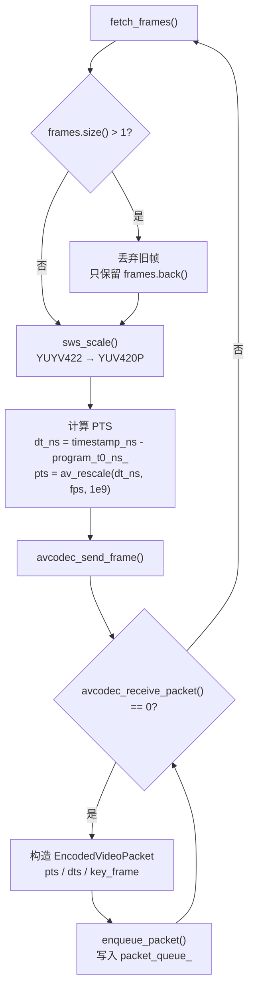
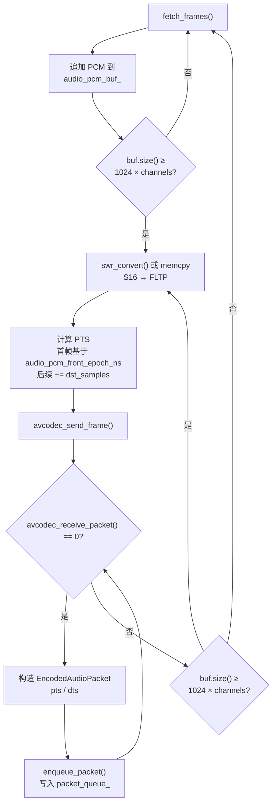
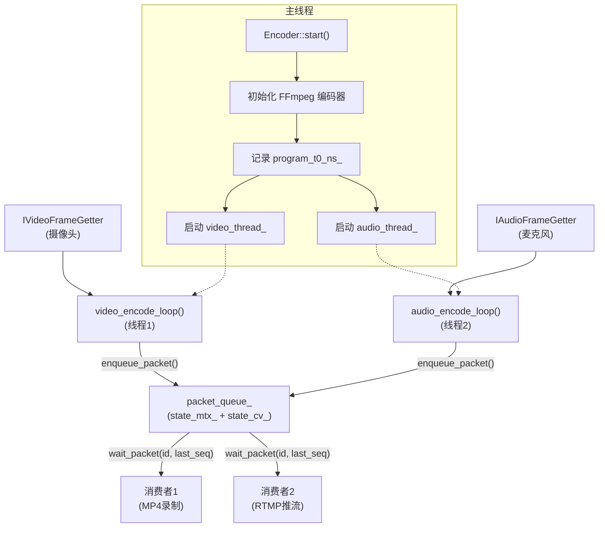

# Encoder 技术文档

## 1. 概述

Encoder 是 pi-guard 的音视频实时编码模块，核心职责：**把摄像头和麦克风采集的原始数据，压缩成标准码流，分发给下游使用**。

- **输入**：原始视频帧（YUYV422）+ 原始音频帧（PCM S16_LE）
- **输出**：H.264 视频包 + AAC 音频包
- **下游**：MP4 录制、RTMP 推流等消费者各自独立拉取

如果你只想**快速上手写代码**，直接跳到 [第 2 章 Quick Start](#2-quick-start)。如果你想**理解内部工作原理**，从 [第 7 章加工方法](#7-加工方法) 开始阅读。

---

## 2. Quick Start

### 2.1 最小可运行示例

```cpp
#include "capture_video/video_capture_provider.hpp"
#include "capture_audio/audio_capture_provider.hpp"
#include "processing_encoder/encoder.hpp"
#include "processing_encoder/video_provider_adapter.hpp"
#include "processing_encoder/audio_provider_adapter.hpp"

using namespace piguard;

int main() {
    // 1. 创建采集器（假设已在其他地方初始化并启动）
    auto& video_provider = /* 获取 VideoCaptureProvider 实例 */;
    auto& audio_provider = /* 获取 AudioCaptureProvider 实例 */;

    // 2. 创建适配器（桥接采集器与编码器）
    auto video_getter = std::make_shared<processing_encoder::VideoProviderAdapter>(video_provider);
    auto audio_getter = std::make_shared<processing_encoder::AudioProviderAdapter>(audio_provider);

    // 3. 配置编码参数
    processing_encoder::EncoderOptions opts;
    opts.video_width = 640;
    opts.video_height = 480;
    opts.video_fps = 25;
    opts.video_bitrate = 1'500'000;
    opts.audio_sample_rate = 16'000;
    opts.audio_channels = 1;
    opts.audio_bitrate = 64'000;

    // 4. 创建并启动编码器
    auto encoder = std::make_shared<processing_encoder::Encoder>(
        video_getter, audio_getter, opts);
    encoder->start();  // 失败时抛 std::runtime_error

    // 5. 注册消费者并拉取数据
    auto consumer_id = encoder->register_consumer();
    uint64_t last_seq = 0;

    while (running) {
        auto packets = encoder->wait_packet(consumer_id, last_seq);
        for (const auto& pkt : packets) {
            if (std::dynamic_pointer_cast<processing_encoder::EncodedVideoPacket>(pkt)) {
                // 处理视频包：pkt->pts, pkt->dts, pkt->key_frame, pkt->data
            } else {
                // 处理音频包：pkt->pts, pkt->dts, pkt->data
            }
            last_seq = pkt->seq;
        }
    }

    // 6. 优雅停止
    encoder->unregister_consumer(consumer_id);
    encoder->stop();
    return 0;
}
```

### 2.2 纯视频或纯音频

```cpp
// 纯视频
auto encoder = std::make_shared<processing_encoder::Encoder>(video_getter, nullptr, opts);

// 纯音频
auto encoder = std::make_shared<processing_encoder::Encoder>(nullptr, audio_getter, opts);
```

---

## 3. 输入与输出

### 3.1 输入数据

Encoder 接收来自采集层的原始音视频帧：

| 来源 | 数据结构 | 格式 | 关键字段 |
|---|---|---|---|
| V4L2 视频采集 | `VideoFrame` | YUYV422（原始像素） | `timestamp_ns`（纳秒级采集时刻）、`seq`（详见 [多消费者方案 4.3 节](./多消费者技术方案.md)）、`data`（内存映射地址） |
| ALSA 音频采集 | `AudioFrame` | PCM S16_LE（16位有符号小端） | `timestamp_ns`（纳秒级采集时刻）、`seq`、`pcm_data`（交织采样数据） |

### 3.2 输出数据

编码后输出压缩数据包，通过多消费者队列分发给下游：

| 类型 | 数据结构 | 格式 | 关键字段 |
|---|---|---|---|
| 视频编码包 | `EncodedVideoPacket` | H.264 NALU | `pts`（显示时间戳）、`dts`（解码时间戳）、`key_frame`（是否关键帧）、`data` |
| 音频编码包 | `EncodedAudioPacket` | AAC（raw） | `pts`、`dts`、`data` |

输出包同时携带编码器元数据（`EncodedVideoStreamMeta` / `EncodedAudioStreamMeta`），包含 `codec_id`、`time_base`、`extradata`（如 sps/pps）等，供消费端初始化容器格式。

---

## 4. 公共 API 速查

### 4.1 Encoder 类

| 方法 | 签名 | 说明 | 线程安全 |
|---|---|---|---|
| 构造 | `Encoder(std::shared_ptr<IVideoFrameGetter>, std::shared_ptr<IAudioFrameGetter>, EncoderOptions)` | 创建编码器实例，此时不分配 FFmpeg 资源 | ✅ 是 |
| 析构 | `~Encoder()` | 自动调用 `stop()` | ✅ 是 |
| 启动 | `void start()` | 初始化编码器并启动编码线程，失败时抛 `std::runtime_error` | ⚠️ 不应并发调用 |
| 停止 | `void stop()` | 优雅停止，join 线程并释放资源 | ⚠️ 不应并发调用 |
| 注册消费者 | `consumer_id_t register_consumer()` | 返回唯一消费者 ID | ✅ 是（内部加锁） |
| 注销消费者 | `void unregister_consumer(consumer_id_t)` | 清理该消费者未消费的数据 | ✅ 是（内部加锁） |
| 等待数据 | `std::vector<std::shared_ptr<EncodedPacketBase>> wait_packet(consumer_id_t, uint64_t last_seq)` | 阻塞等待新包，返回该消费者未消费的包列表 | ✅ 是（内部加锁） |
| 视频元数据 | `EncodedVideoStreamMeta video_stream_meta() const` | 获取视频流信息（编码器初始化后才有效） | ✅ 是（内部加锁） |
| 音频元数据 | `EncodedAudioStreamMeta audio_stream_meta() const` | 获取音频流信息（编码器初始化后才有效） | ✅ 是（内部加锁） |

### 4.2 关键类型

#### `EncodedPacketBase`

完整结构定义和三模块对比见 [`多消费者技术方案.md` 4.1 节](./多消费者技术方案.md)。关键字段：

```cpp
struct EncodedPacketBase {
    uint64_t seq{0};              // 全局递增包序列号（由 Encoder 递增分配）
    std::vector<uint8_t> data;    // 压缩数据（H.264 NALU 或 AAC raw）
    int64_t pts{0};               // 显示时间戳（基于编码器 time_base）
    int64_t dts{0};               // 解码时间戳（基于编码器 time_base）
};
```

> **注意**：`pts`/`dts` 的单位是编码器的 `time_base`，不是毫秒或纳秒。消费端必须调用 `av_packet_rescale_ts()` 映射到目标容器的时间基。

#### `EncodedVideoStreamMeta`

```cpp
struct EncodedVideoStreamMeta : public EncodedStreamMetaBase {
    int width{0};
    int height{0};
};
// 基类字段：
//   bool ready           // 编码器初始化完成且有效
//   int codec_id         // AVCodecID（如 AV_CODEC_ID_H264）
//   int time_base_num    // 时间基分子（如 1）
//   int time_base_den    // 时间基分母（如 25）
//   std::vector<uint8_t> extradata  // sps/pps 等编码器配置数据
```

#### `EncodedAudioStreamMeta`

```cpp
struct EncodedAudioStreamMeta : public EncodedStreamMetaBase {
    int sample_rate{0};   // 采样率（如 16000）
    int channels{0};      // 声道数（如 1）
};
```

---

## 5. 适配器层说明

`VideoProviderAdapter` 和 `AudioProviderAdapter` 是采集模块与编码器之间的**桥接层**。它们实现了 `IVideoFrameGetter` / `IAudioFrameGetter` 接口，把采集模块的"消费者拉取"模型转换为编码器的 `fetch_frames()` 调用。

### 5.1 为什么需要适配器

采集模块（`VideoCaptureProvider` / `AudioCaptureProvider`）和编码器之间没有直接依赖：
- 采集模块提供 `wait_frame()` / `wait_audio()` 供消费者拉取
- 编码器只依赖 `IVideoFrameGetter::fetch_frames()` / `IAudioFrameGetter::fetch_frames()`

适配器把两者连起来，同时处理序列号跟踪（`last_seq_`）。

### 5.2 使用方式

```cpp
// 视频适配器
auto video_getter = std::make_shared<processing_encoder::VideoProviderAdapter>(
    video_capture_provider);

// 音频适配器
auto audio_getter = std::make_shared<processing_encoder::AudioProviderAdapter>(
    audio_capture_provider);
```

### 5.3 生命周期管理

适配器在构造时自动向采集模块**注册消费者**，在析构时自动**注销**。因此必须确保：
- 采集模块的生命周期长于适配器
- 适配器的生命周期长于 `Encoder`（因为 `Encoder` 持有 `shared_ptr`）

```cpp
{
    VideoProviderAdapter adapter(video_provider);  // 注册消费者
    auto encoder = std::make_shared<Encoder>(&adapter, ...);  // 错误！adapter 会在块结束时销毁
}
```

正确做法：
```cpp
auto adapter = std::make_shared<VideoProviderAdapter>(video_provider);
auto encoder = std::make_shared<Encoder>(adapter, ...);
```

---

## 6. 消费者开发指南

### 6.1 最简单的消费者

下面是一个只打印包信息的 **Debug Consumer**：

```cpp
class DebugConsumer {
public:
    explicit DebugConsumer(std::shared_ptr<piguard::processing_encoder::Encoder> encoder)
        : encoder_(encoder), id_(encoder->register_consumer()) {}

    ~DebugConsumer() {
        encoder_->unregister_consumer(id_);
    }

    void run() {
        uint64_t last_seq = 0;
        while (running_) {
            auto packets = encoder_->wait_packet(id_, last_seq);
            for (const auto& pkt : packets) {
                std::string type = "unknown";
                if (std::dynamic_pointer_cast<piguard::processing_encoder::EncodedVideoPacket>(pkt)) {
                    type = "video";
                } else if (std::dynamic_pointer_cast<piguard::processing_encoder::EncodedAudioPacket>(pkt)) {
                    type = "audio";
                }
                std::cout << "[" << type << "] seq=" << pkt->seq
                          << " pts=" << pkt->pts
                          << " size=" << pkt->data.size() << " bytes\n";
                last_seq = pkt->seq;
            }
        }
    }

private:
    std::shared_ptr<piguard::processing_encoder::Encoder> encoder_;
    piguard::processing_encoder::Encoder::consumer_id_t id_;
    std::atomic<bool> running_{true};
};
```

编码包队列容量默认 300（`EncoderOptions::packet_queue_capacity`），超限时丢弃最老包。消费者核心机制（`last_seq` 增量拉取、`wait_packet` 阻塞等待、多消费者并行）详见 [`多消费者技术方案.md`](./多消费者技术方案.md)。

---

## 7. 加工方法

### 7.1 视频编码流程



**编码参数**：
- `preset=veryfast`：降低编码计算量
- `tune=zerolatency`：关闭内部帧缓冲
- `max_b_frames=0`：不使用 B 帧
- `gop_size=fps`：每秒一个关键帧

### 7.2 音频编码流程



**PCM 缓冲机制**：ALSA 每次采集约 320 样本（16000Hz × 20ms），但 AAC 编码器标准帧为 1024 样本。`audio_pcm_buf_` 负责累积多次采集的小片 PCM，够一帧才送入编码器。

### 7.3 多消费者队列分发

编码包通过 `packet_queue_` 以多消费者模式分发，机制详见 [`多消费者技术方案.md`](./多消费者技术方案.md)。编码器的差异化配置：队列容器为 `deque<QueuedPacket>`，容量由 `EncoderOptions::packet_queue_capacity` 控制（默认 300）。

---

## 8. 音画同步实现

### 8.1 核心问题

若视频 PTS 用编码计数器（`pts++`），音频 PTS 用采样点累加，一旦视频丢帧就会产生固定时差：

```
录制 4 秒，25fps 采集 100 帧，编码器只处理 60 帧（丢 40 帧）：
  视频 PTS = 0, 1, 2, ..., 59   → 代表 59/25 = 2.36 秒
  音频 PTS = 0, 1024, ..., 64000 → 代表 64000/16000 = 4.0 秒
  视频比音频慢 1.64 秒！
```

### 8.2 解决方案：统一 wall-clock 基准

**第一步：统一物理时间戳**

视频和音频采集时都使用 `steady_clock` 纳秒时间戳：
- `VideoFrame::timestamp_ns`
- `AudioFrame::timestamp_ns`

**第二步：建立公共零点**

`Encoder::start()` 在启动编码线程前记录：

```cpp
program_t0_ns_ = steady_clock::now().time_since_epoch().count();
```

**第三步：视频 PTS 基于采集时刻**

```cpp
dt_ns = video_frame->timestamp_ns - program_t0_ns_;
video_ctx_->frame->pts = av_rescale(dt_ns, fps, 1'000'000'000LL);
```

即使编码线程积压、丢弃旧帧，保留帧的 PTS 仍精确反映其采集时刻，不会因丢帧而"压缩"时间轴。

**第四步：音频 PTS 基于样本累进**

- 首帧：PCM 缓冲队首样本的物理时间相对 `program_t0_ns_` 换算到采样率时间基
- 后续：每帧固定累加 `dst_samples`（如 1024）
- 同时 `audio_pcm_front_epoch_ns_` 在纳秒尺度同步推进

```cpp
if (!audio_pts_base_initialized_) {
    audio_ctx_->pts = av_rescale(audio_pcm_front_epoch_ns_ - program_t0_ns_,
                                  sample_rate, 1'000'000'000LL);
    audio_pts_base_initialized_ = true;
}
audio_ctx_->frame->pts = audio_ctx_->pts;
audio_ctx_->pts += dst_samples;
```

**第五步：容器交错写入**

输出端使用 `av_interleaved_write_frame()` 按 PTS 自动交错音视频包，确保 MP4/FLV 文件播放时声画对齐。

---

## 9. 线程架构

### 9.1 整体架构



### 9.2 主线程

`start()` 流程：
```
running_ = true
init_video_encoder()      ──▶ H.264 编码器初始化
init_audio_encoder()      ──▶ AAC 编码器初始化
program_t0_ns_ = now()    ──▶ 记录公共基准
启动 video_thread_        ──▶ 若 video_getter_ 非空
启动 audio_thread_        ──▶ 若 audio_getter_ 非空
```

`stop()` 流程：
```
mark_stopped()            ──▶ running_ = false，唤醒所有等待者
video_thread_.join()      ──▶ 等待视频线程结束
audio_thread_.join()      ──▶ 等待音频线程结束
flush_video_encoder()     ──▶ avcodec_send_frame(nullptr) 刷出残留帧
flush_audio_encoder()     ──▶ 同理刷出音频残留
close_video_encoder()     ──▶ 释放 FFmpeg 资源
close_audio_encoder()
```

### 9.3 视频编码线程

```cpp
void video_encode_loop() {
    while (running_) {
        auto frames = video_getter_->fetch_frames();
        if (frames.empty()) continue;
        
        // 实时丢帧：只保留最新帧
        const auto& video_frame = frames.back();
        
        // 格式转换
        sws_scale(video_ctx_->sws_ctx, ...);
        
        // 计算并设置 PTS
        video_ctx_->frame->pts = av_rescale(...);
        
        // 编码
        avcodec_send_frame(video_ctx_->codec_ctx, video_ctx_->frame);
        while (avcodec_receive_packet(video_ctx_->codec_ctx, video_ctx_->packet) == 0) {
            enqueue_packet(encoded_packet);
        }
    }
}
```

### 9.4 音频编码线程

```cpp
void audio_encode_loop() {
    while (running_) {
        auto frames = audio_getter_->fetch_frames();
        
        // 累积所有 PCM 到缓冲
        for (const auto& frame : frames) {
            if (audio_pcm_buf_.empty()) {
                audio_pcm_front_epoch_ns_ = frame->timestamp;  // 记录队首时间
            }
            audio_pcm_buf_.insert(frame->pcm_data);
        }
        
        // 够一帧才编码
        while (audio_pcm_buf_.size() >= dst_total) {
            swr_convert(...);  // 或 memcpy
            
            // 设置 PTS
            audio_ctx_->frame->pts = audio_ctx_->pts;
            audio_ctx_->pts += dst_samples;
            
            avcodec_send_frame(audio_ctx_->codec_ctx, audio_ctx_->frame);
            while (avcodec_receive_packet(...) == 0) {
                enqueue_packet(encoded_packet);
            }
            
            audio_pcm_buf_.erase(已编码部分);  // 保留余数到下次
        }
    }
}
```

### 9.5 同步机制

编码器采用 `state_mtx_` + `state_cv_` 的同步模式，与多消费者方案 7.4/7.6 节一致。编码器的差异：

| 维度 | 编码器 | 音视频采集模块 |
|---|---|---|
| 锁的数量 | 1 把（`state_mtx_`） | 2 把（`state_mtx_` + `start_mtx_`） |
| 启动握手 | 无（不操作硬件，`start()` 同步初始化即可） | 有（需等待硬件初始化结果） |
| 生产者线程 | 2 个（`video_thread_` + `audio_thread_`） | 1 个 |
| 额外受保护状态 | `video_meta_`、`audio_meta_` | 无 |

两个编码线程通过同一个 `enqueue_packet()` 入队，都在 `state_mtx_` 保护下操作 `packet_queue_`，不存在额外的线程安全问题。

### 9.6 关键设计决策

1. **视频/音频独立线程**：避免一方阻塞另一方。视频编码计算量大，音频数据量小但频率高，分离后互不干扰。

2. **视频实时丢帧，音频全量累积**：视频积压时旧帧已无意义，丢弃后只编码最新帧；音频是时间连续信号，不能丢采样，必须全部累积编码。

3. **send/receive 异步模型**：FFmpeg 编码是异步的，一次 `send_frame` 可能产生 0~N 个包，因此始终使用 `while (receive_packet() == 0)` 而非 `if`。

4. **Flush 机制**：停止时发送 `nullptr` 帧告知编码器无更多输入，循环接收残留包，确保 GOP 尾部不丢帧。

---

## 10. 依赖与构建

### 10.1 外部依赖

| 库 | 用途 | 最低版本建议 |
|---|---|---|
| `libavcodec` | H.264 / AAC 编解码 | 4.x |
| `libavutil` | 内存管理、时间换算 | 4.x |
| `libswscale` | 视频像素格式转换（YUYV422 → YUV420P） | 4.x |
| `libswresample` | 音频重采样（S16 → FLTP） | 4.x |

系统依赖安装（Ubuntu/Debian）：
```bash
sudo apt-get install libavcodec-dev libavutil-dev libswscale-dev libswresample-dev
```

### 10.2 CMake 引入

本模块通过 [`CMakeLists.txt`](file:///home/tsxuehu/workspace-daoqi/pi-guard/project/agent/src/modules/processing/encoder/CMakeLists.txt) 构建为静态库 `pi_guard_encoder`：

```cmake
add_library(pi_guard_encoder STATIC
    encoder.cpp
    encoder_module.cpp
    video_provider_adapter.cpp
    audio_provider_adapter.cpp
)

target_link_libraries(pi_guard_encoder
    PUBLIC
        pi_guard_foundation
        pi_guard_video_capture
        pi_guard_audio_capture
        pi_guard_infra_log
        PkgConfig::AVCODEC
        PkgConfig::AVUTIL
        PkgConfig::SWSCALE
        PkgConfig::SWRESAMPLE
)
```

在你的目标中链接：
```cmake
target_link_libraries(your_target PRIVATE pi_guard_encoder)
```

头文件搜索路径已通过 `target_include_directories` 自动设置：
```
${CMAKE_CURRENT_SOURCE_DIR}/include
```

---

## 11. 配置项详解

### 11.1 `EncoderOptions`

```cpp
struct EncoderOptions {
    int video_width{640};              // 视频宽度（像素）
    int video_height{480};             // 视频高度（像素）
    int video_fps{25};                 // 视频帧率（fps），影响 time_base 和 PTS 计算
    int video_bitrate{1'500'000};      // 视频码率（bps），H.264 平均码率
    int audio_sample_rate{16'000};     // 音频采样率（Hz），必须与采集一致
    int audio_channels{1};             // 音频声道数（1=单声道，2=立体声）
    int audio_bitrate{64'000};         // 音频码率（bps），AAC 目标码率
    size_t packet_queue_capacity{300}; // 编码包队列最大长度，超限时丢弃最老包
};
```

### 11.2 调参建议

| 场景 | 参数调整 |
|---|---|
| 低带宽网络推流 | `video_bitrate` 降至 800000~1000000，`video_width/height` 降至 480p |
| 高画质本地录制 | `video_bitrate` 提升至 4000000，`video_fps` 提升至 30 |
| 降低 CPU 占用 | `video_fps` 降至 15，`video_width/height` 降至 320p |
| 降低延迟 | 保持 `tune=zerolatency`、`gop_size=fps`、`max_b_frames=0`（代码中已固定） |
| 音频质量优先 | `audio_bitrate` 提升至 128000，`audio_sample_rate` 提升至 44100 |

> **注意**：`audio_sample_rate` 必须与 ALSA 采集配置严格一致，否则会出现采样率不匹配导致的杂音或漂移。

---

## 12. 错误处理与边界情况

### 12.1 `start()` 失败

`start()` 内部调用 `init_video_encoder()` 和 `init_audio_encoder()`，任一环节失败会：
1. 记录 error 日志定位具体原因
2. 调用 `mark_stopped()` 和 `close_*_encoder()` 清理已分配资源
3. 抛出 `std::runtime_error("Encoder: failed to initialize encoders")`

**常见失败原因**：
- FFmpeg 编码器未找到（缺少 codec）
- 分辨率/采样率不被编码器支持
- `avcodec_open2()` 失败（参数不合法）
- 内存分配失败

### 12.2 `wait_packet()` 行为

| 场景 | 行为 |
|---|---|
| 队列有新包 | 返回所有该消费者未消费的包 |
| 队列为空且运行中 | 阻塞等待，直到新包入队或 `stop()` |
| `stop()` 后队列为空 | 返回空向量 `[]` |
| 消费者已注销 | 返回空向量 `[]` |

### 12.3 队列溢出

当 `packet_queue_.size() > packet_queue_capacity`（默认 300）时，最老的包会被丢弃，并记录 warn 日志：
```
packet queue overflow, dropped oldest packet
```

如果消费者处理速度跟不上编码速度（比如磁盘 IO 慢），会观察到这条日志。

### 12.4 线程安全注意事项

- `start()` 和 `stop()` **不应并发调用**，也不可在编码线程内部调用。
- `register_consumer()` / `unregister_consumer()` / `wait_packet()` 可安全地在多个线程并发调用。
- `Encoder` 实例应在所有消费者线程 join 后再销毁，避免 `wait_packet` 中的引用失效。
