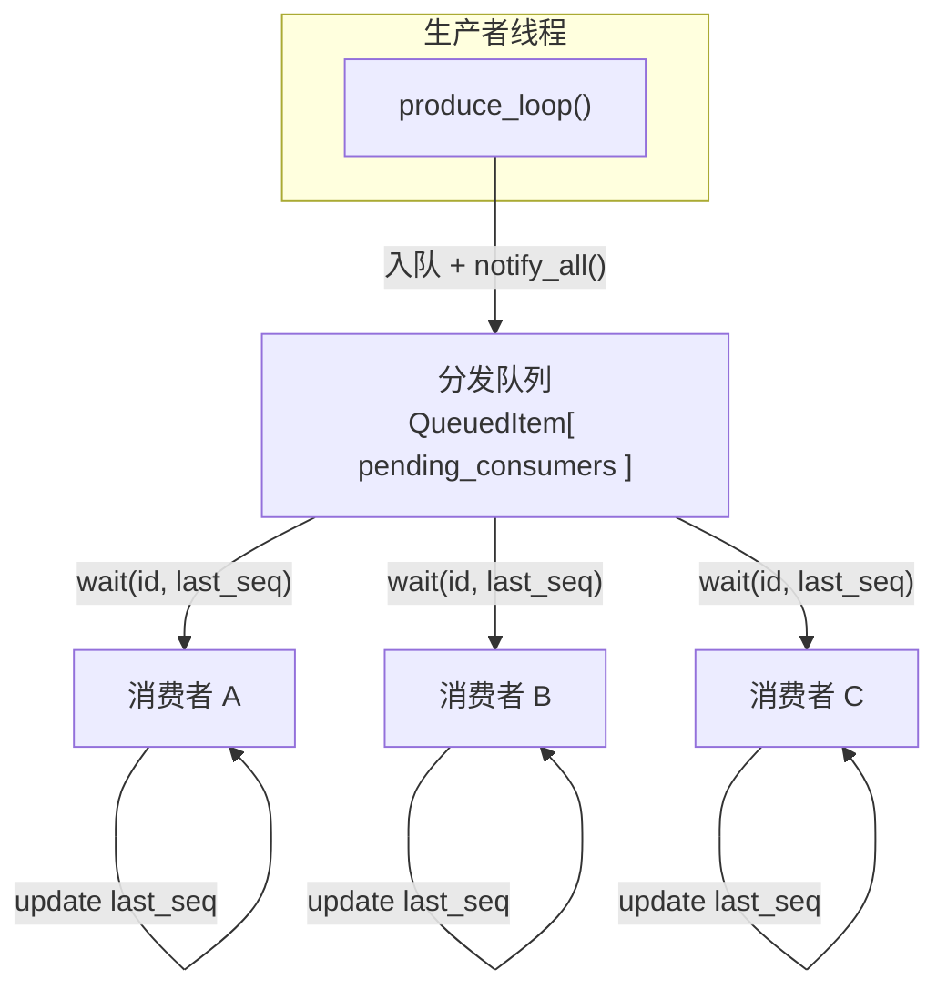

# 多消费者技术方案

## 1. 概述

pi-guard 的音视频链路中，三个核心模块采用了**统一的多消费者设计模式**：

| 模块 | 生产者 | 消费者典型场景 |
|---|---|---|
| `capture_video`（视频采集） | V4L2 采集线程 | 移动侦测、编码器、预览 |
| `capture_audio`（音频采集） | ALSA 采集线程 | 编码器、音频录制 |
| `processing_encoder`（编码器） | 视频/音频编码线程 | MP4 录制、RTMP 推流 |

这三个模块共享同一套设计思想：**单生产者线程产出数据，多个消费者独立、按需、以各自速率拉取**。本文档讲解这套方案的通用设计、关键机制，以及三个模块的具体实现差异。

---

## 2. 设计目标

### 2.1 为什么需要多消费者

以视频采集为例，一帧摄像头数据需要同时服务多个下游：
- **移动侦测**：每帧都要分析，但计算量大、处理慢
- **编码器**：25fps 实时编码，可能丢帧保新
- **预览**：按需取帧，可能 5fps 就够了

如果采用"生产者直接推送到消费者"的模型， fastest consumer 会拖慢整体；如果采用广播，慢消费者会丢数据。多消费者队列让**每个消费者按自己的节奏独立消费**，互不干扰。

### 2.2 核心诉求

| 诉求 | 说明 |
|---|---|
| 独立消费进度 | 消费者 A 处理到第 100 帧，消费者 B 可以刚从第 50 帧开始 |
| 自动资源回收 | 数据在所有消费者取走后才释放，避免悬空引用 |
| 队列容量可控 | 防止慢消费者拖垮内存，超限时丢弃最老数据 |
| 消费者动态增减 | 运行时可以注册/注销消费者，不影响其他消费者 |

---

## 3. 核心架构

### 3.1 单生产者-多消费者模型



### 3.2 数据流动时序

```
T0（初始）: consumers = {A, B}

时刻 T1: 生产者产出 Frame#1，pending = {A, B}，入队，notify_all
         消费者 A wait 返回，取走 Frame#1
         Frame#1 pending = {B}

时刻 T2: 生产者产出 Frame#2，pending = {A, B}，入队，notify_all
         消费者 B wait 返回，取走 Frame#1~#2
         Frame#1 pending = {} → 从队列移除，资源释放
         Frame#2 pending = {A}

时刻 T3: 消费者 C 注册，consumers = {A, B, C}
         C 调用 wait，但 Frame#2 的 pending = {A}，不包含 C
         C 阻塞等待（已有队列节点不会追加新消费者）

时刻 T4: 生产者产出 Frame#3，pending = {A, B, C}，入队，notify_all
         唤醒 C，C 取走 Frame#3（新消费者从注册后的数据开始消费）
```

---

## 4. 核心数据结构

### 4.1 队列节点：QueuedItem

三个模块的数据结构本质相同，只是类型名和 pending 容器略有差异：

**视频采集**（[`video_capture_provider.hpp`](file:///home/tsxuehu/workspace-daoqi/pi-guard/project/agent/src/modules/capture/video/include/capture_video/video_capture_provider.hpp)）
```cpp
struct QueuedFrame {
    std::shared_ptr<VideoFrame> frame;
    std::unordered_set<consumer_id_t> pending_consumers;
};
std::deque<QueuedFrame> queue_;
```

**音频采集**（[`audio_capture_provider.hpp`](file:///home/tsxuehu/workspace-daoqi/pi-guard/project/agent/src/modules/capture/audio/include/capture_audio/audio_capture_provider.hpp)）
```cpp
struct queued_audio {
    std::shared_ptr<AudioFrame> frame;
    std::set<consumer_id_t> pending_consumers;
};
std::list<queued_audio> queue_;
```

**编码器**（[`encoder.hpp`](file:///home/tsxuehu/workspace-daoqi/pi-guard/project/agent/src/modules/processing/encoder/include/processing_encoder/encoder.hpp)）
```cpp
struct QueuedPacket {
    std::shared_ptr<EncodedPacketBase> packet;
    std::unordered_set<consumer_id_t> pending_consumers;
};
std::deque<QueuedPacket> packet_queue_;
```

### 4.2 设计要点

- **`pending_consumers`**：记录还有哪些消费者没取走这帧/包。为空时，该节点可从队列中移除。
- **`shared_ptr`**：实际数据通过 `shared_ptr` 持有，节点移除时引用计数减 1。当最后一个引用（队列 + 所有消费者）释放时，数据才真正销毁。
- **队列容器选择**：视频和编码器用 `deque`（频繁头部弹出）；音频用 `list`（迭代器稳定性更好，但实际差异不大）。

---

## 5. 消费者生命周期

### 5.1 注册：register_consumer()

```cpp
consumer_id_t register_consumer() {
    std::lock_guard lock(state_mtx_);
    const consumer_id_t id = next_consumer_id_++;
    consumers_.insert(id);          // 加入活跃消费者集合
    return id;
}
```

- 在 `state_mtx_` 保护下分配递增的唯一 ID
- 新消费者不会自动获得历史数据；它需要在下次 `wait_*()` 时从队列中筛选未消费的节点

### 5.2 拉取：wait_*(consumer_id, last_seq)

```cpp
std::vector<std::shared_ptr<Frame>> wait_frame(consumer_id_t id, uint64_t last_seq) {
    std::unique_lock lock(state_mtx_);

    // 阻塞等待：有新帧且该消费者未消费
    state_cv_.wait(lock, [this, id, last_seq] {
        if (!running_) return true;
        for (const auto& item : queue_) {
            if (item.frame->seq > last_seq && item.pending_consumers.count(id) > 0)
                return true;
        }
        return false;
    });

    // 收集所有该消费者未消费的帧
    std::vector<std::shared_ptr<Frame>> result;
    for (const auto& item : queue_) {
        if (item.frame->seq > last_seq && item.pending_consumers.count(id) > 0) {
            result.push_back(item.frame);
        }
    }

    // 标记为已消费
    cleanup_consumer_pending_locked(id, last_seq, false);
    return result;
}
```

**关键设计**：
- 使用**谓词等待**（predicate wait），避免虚假唤醒问题
- 返回的是**批量数据**（`vector`），不是单帧，减少锁竞争
- `last_seq` 由消费者自己维护，每次取到数据后更新为最后一帧的 `seq`

### 5.3 注销：unregister_consumer()

```cpp
void unregister_consumer(consumer_id_t id) {
    std::lock_guard lock(state_mtx_);
    consumers_.erase(id);
    cleanup_consumer_pending_locked(id, 0, true);  // clear_all = true
    state_cv_.notify_all();
}
```

- 从活跃消费者集合移除
- `clear_all = true`：将该消费者从所有历史节点的 `pending_consumers` 中移除
- 通知所有等待中的消费者（它们可能正在等这帧）

---

## 6. 三模块实现对比

| 维度 | VideoCaptureProvider | AudioCaptureProvider | Encoder |
|---|---|---|---|
| 生产者线程 | `cap_thread_` (V4L2 DQBUF) | `produce_thread_` (ALSA readi) | `video_thread_` + `audio_thread_` |
| 队列容器 | `deque<QueuedFrame>` | `list<queued_audio>` | `deque<QueuedPacket>` |
| pending 容器 | `unordered_set<uint64_t>` | `set<uint32_t>` | `unordered_set<uint64_t>` |
| 消费者 ID 类型 | `uint64_t` | `uint32_t` | `uint64_t` |
| 队列容量 | 构造函数传入（`max_capacity`） | 固定 50（约 1 秒缓冲） | `EncoderOptions::packet_queue_capacity`（默认 300） |
| 容量溢出策略 | `pop_front()` 丢最老帧 | `pop_front()` 丢最老帧 | `pop_front()` 丢最老包 |
| 消费者基类 | `ConsumerBase` | `AudioConsumerBase` | 无（直接操作 Encoder API） |
| 特殊机制 | **V4L2 QBUF 引用计数回收** | 无 | 无 |

---

## 7. 关键机制详解

### 7.1 引用计数与资源回收（视频采集的特殊性）

视频采集模块面临一个独特问题：V4L2 的帧数据是 `mmap` 映射的内核缓冲区，**必须在使用完毕后通过 `VIDIOC_QBUF` 还回驱动**，否则驱动会很快耗尽缓冲区而停止采集。

解决方案：**`shared_ptr` 自定义删除器 + `pending_consumers` 双重引用计数**。

```cpp
// 1. 出队时创建帧，绑定 QBUF 删除器
frame->v4l2_ref = std::shared_ptr<void>(nullptr, [fd, idx](void*) {
    v4l2_buffer b{};
    b.type = V4L2_BUF_TYPE_VIDEO_CAPTURE;
    b.memory = V4L2_MEMORY_MMAP;
    b.index = idx;
    ioctl(fd, VIDIOC_QBUF, &b);  // 还回驱动
});

// 2. 入队时，frame 被 shared_ptr 持有（引用计数 +1）
queue_.push_back({frame, consumers_});

// 3. 消费者 wait_frame 返回时，result 中又持有 shared_ptr（引用计数 +N）

// 4. 所有消费者取走后，队列节点被 erase，shared_ptr 销毁
//    当最后一个引用（队列 + 所有消费者）释放时，删除器执行 QBUF
```

**时序**：
```
DQBUF → 创建 frame(v4l2_ref) → 入队(queue 持有 shared_ptr)
                                              ↓
消费者 A wait → 返回 frame(A 持有 shared_ptr)
消费者 B wait → 返回 frame(B 持有 shared_ptr)
                                              ↓
A 处理完释放 → shared_ptr 引用计数 -1
B 处理完释放 → shared_ptr 引用计数 -1，变为 0
                                              ↓
                                      删除器执行 QBUF
                                      缓冲区还回驱动
```

这个设计巧妙之处在于：**不需要知道消费者什么时候用完**，只要 `shared_ptr` 的引用计数归零，QBUF 自动发生。队列节点移除和消费者释放是两个独立事件，最终由引用计数保证正确性。

### 7.2 队列溢出处理

三个模块在队列满时的策略一致：**丢弃最老的数据**。

```cpp
while (queue_.size() > max_capacity) {
    queue_.pop_front();  // 最老帧被移除
}
```

这意味着**慢消费者会丢失数据**，这是预期行为：
- 视频：旧帧是"过去"的画面，丢了不影响实时性
- 音频：虽然原则上不该丢采样，但 1 秒缓冲对大多数场景够用
- 编码包：消费者处理跟不上时（磁盘 IO 慢、网络卡），丢包保内存

> 如果业务不能容忍丢数据，应该增大容量或优化消费者处理速度，而不是改变丢弃策略。

### 7.3 条件变量等待策略

消费者使用**谓词等待**来避免虚假唤醒：

```cpp
state_cv_.wait(lock, [this, id, last_seq] {
    if (!running_) return true;  // 停止时立即返回
    for (const auto& item : queue_) {
        if (item.frame->seq > last_seq && item.pending_consumers.count(id) > 0)
            return true;  // 有新帧可取
    }
    return false;  // 继续等待
});
```

这种设计保证了：
- **不丢通知**：生产者 `notify_all()` 后，至少有一个消费者会醒来检查条件
- **安全退出**：`stop()` 设置 `running_ = false` 后 `notify_all()`，所有阻塞的消费者都会醒来并返回空结果
- **批量消费**：消费者一次取走所有未消费数据，而不是每帧唤醒一次

### 7.4 同步机制详解

#### 锁的粒度

三个模块都使用**一把大锁** `state_mtx_` 保护所有共享状态：

| 受保护的数据 | 说明 |
|---|---|
| `running_` | 生产者线程运行标志 |
| `consumers_` / `active_consumers_` | 活跃消费者集合 |
| `queue_` | 分发队列 |
| `next_consumer_id_` / `next_seq_` | ID 生成器 |

> **为什么不拆细锁？** 因为生产者的入队操作（"读 consumers_ + 写 queue_"）和消费者的出队操作（"读 queue_ + 写 pending_consumers"）高度耦合，拆锁反而增加死锁风险。当前场景下，锁竞争不激烈（生产者批量入队、消费者批量取出），一把锁更简单可靠。

#### 生产者-消费者协作时序

```
┌─────────────┐                      ┌─────────────┐
│  生产者线程  │                      │  消费者线程  │
├─────────────┤                      ├─────────────┤
│ 1. 产出数据  │                      │             │
│ 2. lock()   │◄──── state_mtx_ ────►│ 5. lock()   │
│ 3. 入队     │                      │ 6. 收集数据  │
│ 4. unlock() │                      │ 7. unlock() │
│    │        │                      │    │        │
│    ▼        │                      │    ▼        │
│ notify_all()│─────────────────────►│ 处理数据... │
│             │   state_cv_ 唤醒      │ (无锁)      │
└─────────────┘                      └─────────────┘
```

**关键点**：
- 消费者**持有锁等待**（`wait` 会自动释放锁并阻塞），所以生产者入队时不会阻塞
- 消费者拿到数据后**立即解锁**，数据处理在锁外进行，避免长时间持有锁

#### start/stop 握手同步

视频和音频采集模块还有一个额外的同步机制：**启动握手**。

```cpp
// 主线程（start）
void start() {
    running_ = true;
    cap_thread_ = std::thread(&produce_loop, this);

    // 等待采集线程回报启动结果
    std::unique_lock lock(start_mtx_);
    start_cv_.wait(lock, [this] { return start_reported_; });
    if (!start_ok_) {
        throw std::runtime_error("start failed");
    }
}

// 采集线程（produce_loop）
void produce_loop() {
    if (!init_hardware()) {
        report_start_result(false);  // 唤醒 start()，告知失败
        return;
    }
    report_start_result(true);       // 唤醒 start()，告知成功
    // ... 进入主循环
}
```

为什么需要这个握手？
- `start()` 需要知道硬件初始化是否成功（V4L2/ALSA 打开失败）
- 如果没有这个同步，`start()` 立即返回后，调用方以为已经启动，实际硬件初始化失败，后续 `wait_*()` 永远等不到数据

#### 谓词等待 vs 裸 wait

**错误的写法（虚假唤醒问题）**：
```cpp
// 不要这样写！
while (queue_empty_for_me()) {
    state_cv_.wait(lock);  // 可能被虚假唤醒，条件根本没满足
}
```

**正确的写法（谓词等待）**：
```cpp
state_cv_.wait(lock, [this, id, last_seq] {
    if (!running_) return true;
    for (const auto& item : queue_) {
        if (item.frame->seq > last_seq && item.pending_consumers.count(id))
            return true;
    }
    return false;
});
```

C++ 标准库的 `wait(predicate)` 内部等价于：
```cpp
while (!predicate()) {
    wait(lock);
}
```

这意味着即使因为**虚假唤醒**（spurious wakeup）或**其他消费者的 notify** 导致线程醒来，只要条件不满足，就会继续等待。

#### 批量消费减少锁竞争

消费者不是每帧唤醒一次，而是**一次取走所有未消费数据**：

```cpp
// 消费者线程
while (running_) {
    auto frames = provider->wait_frame(id, last_seq);  // 可能一次返回 10 帧
    process(frames);                                    // 批量处理，无锁
    last_seq = frames.back()->seq;
}
```

相比之下，如果每次只取一帧：
```cpp
// 低效的写法
while (running_) {
    auto frame = provider->wait_one_frame(id);  // 每帧都要加锁、wait、notify
    process(frame);
}
```

批量设计让**条件变量的唤醒次数**和**锁的获取次数**都大幅降低。

#### 三模块同步代码对比

| 模块 | 入队代码 | 唤醒方式 | 消费者等待条件 |
|---|---|---|---|
| Video | `lock` → `push_back` → `unlock` → `notify_all()` | `state_cv_.notify_all()` | `seq > last_seq && pending.count(id)` |
| Audio | `lock` → `push_back` → `unlock` → `notify_all()` | `state_cv_.notify_all()` | `seq > last_seq && pending.count(id)` |
| Encoder | `lock` → `push_back` → `unlock` → `notify_all()` | `state_cv_.notify_all()` | `seq > last_seq && pending.count(id)` |

三个模块的同步逻辑**完全一致**，区别仅在于数据类型和队列容量。

---

## 8. 使用示例

### 8.1 视频采集消费者（继承 ConsumerBase）

```cpp
#include "capture_video/consumer_base.hpp"

class MotionDetectConsumer : public piguard::capture_video::ConsumerBase {
public:
    MotionDetectConsumer(std::shared_ptr<piguard::capture_video::VideoCaptureProvider> provider)
        : ConsumerBase(provider, "MotionDetect") {}

    void process(const std::vector<std::shared_ptr<piguard::capture_video::VideoFrame>>& frames) override {
        for (const auto& frame : frames) {
            // 移动侦测处理...
        }
    }
};

// 使用
auto provider = std::make_shared<piguard::capture_video::VideoCaptureProvider>(...);
provider->start();

auto consumer = std::make_shared<MotionDetectConsumer>(provider);
std::thread t([consumer]() { consumer->run(); });

// 停止时
consumer->stop();
t.join();
// consumer 析构时自动 unregister
```

### 8.2 音频采集消费者（继承 AudioConsumerBase）

```cpp
#include "capture_audio/consumer_base.hpp"

class AudioEncoderAdapter : public piguard::capture_audio::AudioConsumerBase {
public:
    AudioEncoderAdapter(std::shared_ptr<piguard::capture_audio::AudioCaptureProvider> provider)
        : AudioConsumerBase(provider, "EncoderAdapter") {}

    void process(const std::vector<std::shared_ptr<piguard::capture_audio::AudioFrame>>& frames) override {
        for (const auto& frame : frames) {
            // 送入编码器...
        }
    }
};
```

### 8.3 编码器消费者（直接操作 API）

```cpp
auto encoder = std::make_shared<piguard::processing_encoder::Encoder>(...);
encoder->start();

auto id = encoder->register_consumer();
uint64_t last_seq = 0;

while (running) {
    auto packets = encoder->wait_packet(id, last_seq);
    for (const auto& pkt : packets) {
        // MP4 写入或 RTMP 推流
        last_seq = pkt->seq;
    }
}

encoder->unregister_consumer(id);
```

---

## 9. 设计决策与权衡

### 9.1 为什么选择"拉取"而非"推送"

| 模式 | 优点 | 缺点 |
|---|---|---|
| **拉取**（当前设计） | 消费者自己控制节奏，不会忙等；批量取减少锁竞争 | 消费者需要维护 `last_seq` |
| 推送（回调） | 实时性更高，代码更直观 | 慢消费者会阻塞生产者；需要背压机制 |

实时音视频场景下，**消费者处理速度差异大**（编码 25fps vs 移动侦测可能 5fps），拉取模式更适合。

### 9.2 为什么 pending_consumers 用集合而非计数器

用整数计数器似乎更简单（"还有 N 个消费者没取"），但用集合有两个优势：
1. **消费者注销时精准清理**：可以只移除特定消费者，不需要知道总数
2. **调试友好**：可以遍历看具体哪些消费者 pending，便于排查"谁没消费"

### 9.3 为什么音频和视频分开两套而不是共用一套模板

虽然设计模式高度相似，但三个模块保持独立实现的原因是：
1. **资源回收机制不同**：视频需要 V4L2 QBUF，音频和编码包不需要
2. **生命周期耦合不同**：视频帧和 V4L2 fd 强绑定，音频和 ALSA handle 绑定
3. **避免过度抽象**：C++ 模板元编程会增加编译时间和理解成本，当前代码量不大，显式重复更可维护

---

## 10. 常见问题

**Q：新注册的消费者能拿到历史数据吗？**

能。`wait_*()` 返回的是队列中所有 `seq > last_seq` 且该消费者 pending 的节点。新消费者的 `last_seq = 0`，所以会拿到队列中所有当前数据。但如果队列已满、旧数据已被丢弃，那新消费者只能拿到剩余数据。

**Q：消费者处理太慢会怎样？**

队列满时最老数据被丢弃。该消费者会看到 seq 跳跃（比如上次拿到 100，下次直接跳到 150），这是预期行为。

**Q：消费者崩溃/没调用 unregister 会怎样？**

如果消费者线程崩溃但没有释放 `ConsumerBase` / `AudioConsumerBase` 对象，析构函数里的 `unregister_consumer` 不会执行。该消费者的 ID 会一直留在 `pending_consumers` 中，导致队列节点永远无法释放，最终内存泄漏。生产环境中应确保消费者对象的生命周期受 RAII 管理。

**Q：为什么 `wait_*()` 返回 vector 而不是单帧？**

减少锁竞争。生产者批量入队、消费者批量取出，条件变量的唤醒次数降到最低。
