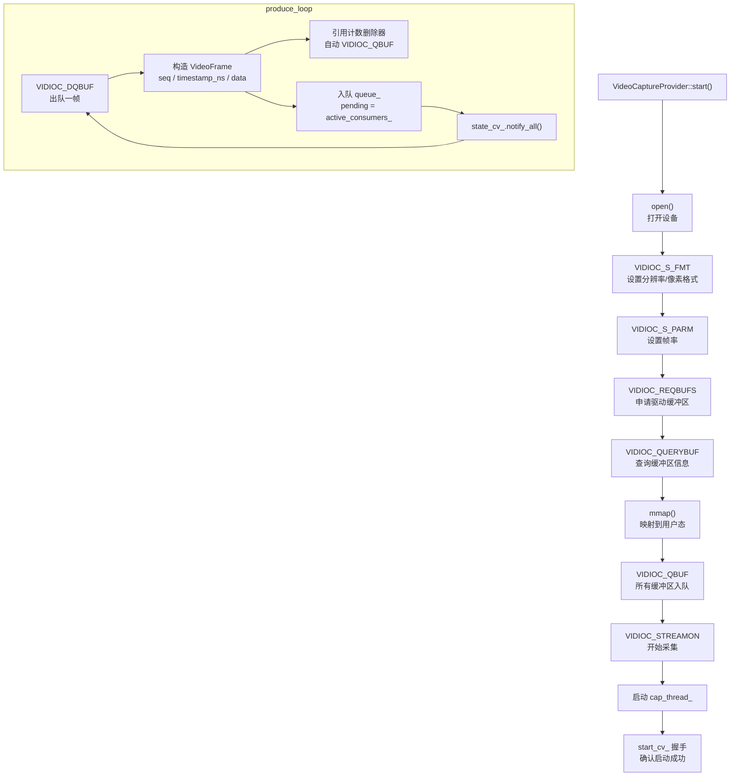
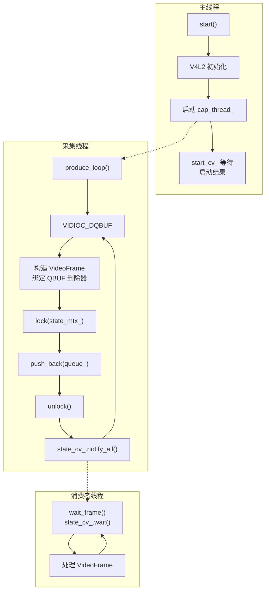

# 视频采集技术文档

## 1. 概述

`capture_video` 是 pi-guard 的视频采集模块，通过 V4L2 接口从摄像头捕获原始视频帧，以**多消费者队列**模式分发给下游（编码器、移动侦测、预览等）。

- **输入**：V4L2 视频设备（如 `/dev/video0`）
- **输出**：`VideoFrame`（YUYV422 原始像素）
- **下游**：编码器、移动侦测、预览等消费者独立拉取

如果你只想**快速接入使用**，跳到 [第 2 章 Quick Start](#2-quick-start)。如果你想**理解内部工作原理**，从 [第 6 章 V4L2 采集流程](#6-v4l2-采集流程) 开始阅读。

---

## 2. Quick Start

### 2.1 最小可运行示例

```cpp
#include "capture_video/video_capture_provider.hpp"
#include "capture_video/video_frame.hpp"

using namespace piguard;

int main() {
    // 1. 创建采集器
    auto provider = std::make_shared<capture_video::VideoCaptureProvider>(
        "/dev/video0",   // V4L2 设备路径
        25,              // 采集帧率 fps
        640,             // 宽度
        480,             // 高度
        4,               // mmap 缓冲区个数
        30               // 队列最大容量
    );

    // 2. 启动采集
    provider->start();

    // 3. 注册消费者并拉取数据
    auto consumer_id = provider->register_consumer();
    uint64_t last_seq = 0;

    while (running) {
        auto frames = provider->wait_frame(consumer_id, last_seq);
        for (const auto& frame : frames) {
            // frame->seq, frame->timestamp_ns, frame->data, frame->length
            // data 是 mmap 映射地址，格式为 YUYV422
        }
        if (!frames.empty()) {
            last_seq = frames.back()->seq;
        }
    }

    // 4. 注销并停止
    provider->unregister_consumer(consumer_id);
    provider->stop();
    return 0;
}
```

### 2.2 使用消费者基类（推荐）

```cpp
#include "capture_video/consumer_base.hpp"

class MotionDetectConsumer : public piguard::capture_video::ConsumerBase {
public:
    MotionDetectConsumer(std::shared_ptr<piguard::capture_video::VideoCaptureProvider> provider)
        : ConsumerBase(provider, "MotionDetect") {}

    void process(const std::vector<std::shared_ptr<piguard::capture_video::VideoFrame>>& frames) override {
        for (const auto& frame : frames) {
            // 移动侦测处理...
        }
    }
};

// 使用
auto consumer = std::make_shared<MotionDetectConsumer>(provider);
std::thread t([consumer]() { consumer->run(); });

// 停止
consumer->stop();
t.join();
// 析构时自动 unregister
```

---

## 3. 输入与输出

### 3.1 输入

| 参数 | 类型 | 说明 | 示例 |
|---|---|---|---|
| `device` | `std::string` | V4L2 设备路径 | `"/dev/video0"` |
| `capture_fps` | `int` | 期望采集帧率 | `25`、`30` |
| `capture_width` | `int` | 期望分辨率宽度 | `640`、`1280` |
| `capture_height` | `int` | 期望分辨率高度 | `480`、`720` |
| `buffer_count` | `uint32_t` | mmap 缓冲区个数（建议 >= 2） | `4` |
| `max_capacity` | `size_t` | 分发队列最大帧数 | `30` |

### 3.2 输出

| 数据结构 | 字段 | 说明 |
|---|---|---|
| `VideoFrame` | `seq: uint64_t` | 全局递增帧序号（详见 [多消费者方案 4.3 节](./多消费者技术方案.md)） |
| | `timestamp_ns: uint64_t` | 采集时刻（`steady_clock` 纳秒） |
| | `data: void*` | mmap 映射地址（YUYV422 像素数据） |
| | `length: size_t` | 帧数据大小（字节） |
| | `v4l2_ref: std::shared_ptr<void>` | **引用计数回收核心**，详见 [第 7 章](#7-引用计数与-qbuf-回收) |

**像素格式**：YUYV422（YUV 4:2:2），每像素 2 字节。

**数据量估算**（640×480）：
```
每帧字节数 = 640 × 480 × 2 = 614,400 bytes ≈ 600 KB
25fps 下每秒 = 600 KB × 25 = 15 MB/s
```

---

## 4. 公共 API 速查

### 4.1 VideoCaptureProvider

| 方法 | 签名 | 说明 | 线程安全 |
|---|---|---|---|
| 构造 | `VideoCaptureProvider(std::string device, int capture_fps, int capture_width, int capture_height, uint32_t buffer_count, size_t max_capacity)` | 创建设备路径、帧率、分辨率、缓冲数、队列容量 | ✅ 是 |
| 析构 | `~VideoCaptureProvider()` | 自动调用 `stop()` | ✅ 是 |
| 启动 | `void start()` | 初始化 V4L2 并启动采集线程，失败抛 `runtime_error` | ⚠️ 不应并发调用 |
| 停止 | `void stop()` | 停止采集并释放 V4L2 资源 | ⚠️ 不应并发调用 |
| 注册消费者 | `consumer_id_t register_consumer()` | 返回唯一消费者 ID（`uint64_t`） | ✅ 是（内部加锁） |
| 注销消费者 | `void unregister_consumer(consumer_id_t consumer_id)` | 清理该消费者在队列中的状态 | ✅ 是（内部加锁） |
| 等待数据 | `std::vector<std::shared_ptr<VideoFrame>> wait_frame(consumer_id_t consumer_id, uint64_t last_seq)` | 阻塞等待新帧，返回未消费的帧列表 | ✅ 是（内部加锁） |
| 帧率 | `int capture_fps() const` | 返回配置的采集帧率 | ✅ 是（只读） |

### 4.2 ConsumerBase

| 方法 | 说明 |
|---|---|
| `ConsumerBase(provider, name)` | 构造时自动注册消费者 |
| `~ConsumerBase()` | 析构时自动注销消费者 |
| `run()` | 循环拉取数据并调用 `process()`，空结果时退出 |
| `stop()` | 设置 `running_ = false`，使 `run()` 退出 |
| `process(frames)` | 纯虚函数，子类实现业务逻辑 |

---

## 5. 多消费者设计

视频采集和音频采集、编码器采用**同一套多消费者设计模式**，核心机制（`seq` / `last_seq` 增量拉取、`pending_consumers` 追踪、队列溢出丢弃最老帧等）详见 [`多消费者技术方案.md`](./多消费者技术方案.md)。

本节仅列出视频模块的差异化配置和特有要点：

| 配置项 | 值 | 说明 |
|---|---|---|
| `max_capacity_` | 构造函数传入 | 分发队列最大帧数，超限时丢弃最旧帧 |
| 队列容器 | `std::deque` | 频繁头部弹出 |
| pending 容器 | `std::unordered_set<consumer_id_t>` | 记录未消费的消费者 |

**视频特有的消费者要点**：不要长时间持有帧。帧数据是 mmap 映射的 V4L2 缓冲区，长时间持有会耗尽驱动缓冲区，导致采集线程无法 DQBUF。这是视频模块和其他模块最大的区别——音频帧和编码包的数据由 `vector` 自有，持有不影响生产者。

---

## 6. V4L2 采集流程

### 6.1 整体流程



### 6.2 关键步骤详解

#### 步骤 1：打开设备

```cpp
fd_ = open(device_.c_str(), O_RDWR);
```

以读写模式打开 V4L2 设备，后续所有 ioctl 都通过该 fd 进行。

#### 步骤 2：设置格式

```cpp
v4l2_format fmt{};
fmt.type = V4L2_BUF_TYPE_VIDEO_CAPTURE;
fmt.fmt.pix.width = capture_width_;
fmt.fmt.pix.height = capture_height_;
fmt.fmt.pix.pixelformat = V4L2_PIX_FMT_YUYV;
fmt.fmt.pix.field = V4L2_FIELD_ANY;
ioctl(fd_, VIDIOC_S_FMT, &fmt);
```

- `V4L2_PIX_FMT_YUYV`：固定使用 YUYV422 格式
- 驱动可能返回与请求不同的分辨率（如请求 640×480，实际 640×360），但代码中没有二次校验，使用时需注意

#### 步骤 3：设置帧率

```cpp
v4l2_streamparm parm{};
parm.type = V4L2_BUF_TYPE_VIDEO_CAPTURE;
parm.parm.capture.timeperframe.numerator = 1;
parm.parm.capture.timeperframe.denominator = capture_fps_;
ioctl(fd_, VIDIOC_S_PARM, &parm);
```

#### 步骤 4：申请并映射缓冲区

```cpp
// 申请驱动缓冲区
v4l2_requestbuffers req{};
req.count = buffer_count_;
req.type = V4L2_BUF_TYPE_VIDEO_CAPTURE;
req.memory = V4L2_MEMORY_MMAP;
ioctl(fd_, VIDIOC_REQBUFS, &req);

// 映射到用户态
for (uint32_t i = 0; i < req.count; ++i) {
    v4l2_buffer buf{};
    buf.type = V4L2_BUF_TYPE_VIDEO_CAPTURE;
    buf.memory = V4L2_MEMORY_MMAP;
    buf.index = i;
    ioctl(fd_, VIDIOC_QUERYBUF, &buf);

    void* start = mmap(nullptr, buf.length, PROT_READ | PROT_WRITE, MAP_SHARED, fd_, buf.m.offset);
    mmap_buffers_[i] = {start, buf.length};
}
```

#### 步骤 5：入队并启动

```cpp
// 所有缓冲区先入队
for (uint32_t i = 0; i < mmap_buffers_.size(); ++i) {
    v4l2_buffer buf{};
    buf.type = V4L2_BUF_TYPE_VIDEO_CAPTURE;
    buf.memory = V4L2_MEMORY_MMAP;
    buf.index = i;
    ioctl(fd_, VIDIOC_QBUF, &buf);
}

// 启动采集
v4l2_buf_type type = V4L2_BUF_TYPE_VIDEO_CAPTURE;
ioctl(fd_, VIDIOC_STREAMON, &type);
```

#### 步骤 6：采集循环（DQBUF → 构造帧 → QBUF 回收）

```cpp
while (running_) {
    v4l2_buffer buf{};
    buf.type = V4L2_BUF_TYPE_VIDEO_CAPTURE;
    buf.memory = V4L2_MEMORY_MMAP;

    if (ioctl(fd_, VIDIOC_DQBUF, &buf) < 0) {
        // 错误处理（见 9.2 节）
        continue;
    }

    auto frame = std::make_shared<VideoFrame>();
    frame->seq = ++global_seq_;
    frame->timestamp_ns = steady_clock::now();
    frame->data = mmap_buffers_[buf.index].start;
    frame->length = buf.bytesused;

    // 【核心】引用计数回收
    frame->v4l2_ref = std::shared_ptr<void>(nullptr, [fd, idx](void*) {
        v4l2_buffer b{};
        b.type = V4L2_BUF_TYPE_VIDEO_CAPTURE;
        b.memory = V4L2_MEMORY_MMAP;
        b.index = idx;
        ioctl(fd, VIDIOC_QBUF, &b);
    });

    // 入队分发
    {
        std::lock_guard lock(state_mtx_);
        queue_.push_back({frame, active_consumers_});
        while (queue_.size() > max_capacity_) {
            queue_.pop_front();  // 丢弃最旧帧
        }
    }
    state_cv_.notify_all();
}
```

---

## 7. 引用计数与 QBUF 回收

这是视频采集模块**最核心的设计**，也是和音频采集最大的区别。

### 7.1 问题：V4L2 缓冲区必须还回驱动

V4L2 使用 mmap 缓冲区循环：
```
QBUF（入队） → 驱动填充数据 → DQBUF（出队） → 用户处理 → QBUF（还回）
```

如果用户处理完后没有调用 `QBUF`，驱动可用的缓冲区会越来越少，最终停止产出新帧。

### 7.2 解决方案：`shared_ptr` 自定义删除器 + `pending_consumers`

`shared_ptr` 自定义删除器绑定 `VIDIOC_QBUF`，配合 `pending_consumers` 实现双重引用计数——当最后一个引用（队列 + 所有消费者）释放时，删除器自动执行 QBUF。完整机制和时序图详见 [`多消费者技术方案.md` 7.1 节](./多消费者技术方案.md)。

视频特有的细节：删除器的 `fd` 和 `buf.index` 必须在 DQBUF 时捕获，因为后续 QBUF 需要这两个参数来定位正确的缓冲区。如果 `fd` 在 `stop()` 后被 close，删除器中的 `ioctl` 会失败——但此时 `stop()` 已调用 `VIDIOC_STREAMOFF`，不再需要还回缓冲区，所以不影响正确性。

---

## 8. 线程架构



### 8.1 启动握手

视频采集使用 `start_mtx_ + start_cv_` 进行启动握手，机制与音频采集一致，详见 [`多消费者技术方案.md` 7.5 节](./多消费者技术方案.md)。

视频特有的启动细节：硬件初始化步骤为 `open` → `S_FMT` → `S_PARM` → `REQBUFS` → `QUERYBUF` → `mmap` → `QBUF` → `STREAMON`（详见 6.2 节），任一步骤失败都会通过 `report_start_result(false)` 通知主线程，`start()` 抛出 `std::runtime_error`。失败时自动回滚资源（stream_off → unmap → close）。

### 8.2 停止流程

停止机制与多消费者方案 7.7 节一致：`mark_stopped()` 设置 `running_ = false` + `notify_all()`，消费者被唤醒后返回空结果退出，主线程 `join()` 等待所有线程结束。

视频特有的停止步骤——`VIDIOC_STREAMOFF` 唤醒阻塞的 DQBUF：

```cpp
void stop() {
    mark_stopped();        // running_ = false, notify_all
    stream_off();          // VIDIOC_STREAMOFF，唤醒阻塞的 DQBUF
    cap_thread_.join();    // 等待采集线程结束
    unmap_all();           // munmap 所有缓冲区
    close_fd();            // close 设备
}
```

`VIDIOC_DQBUF` 在没有数据时会阻塞。调用 `VIDIOC_STREAMOFF` 后，阻塞的 `DQBUF` 会以 `EINVAL` 或 `EPIPE` 错误返回，采集线程检查 `running_` 后优雅退出。这是视频模块和音频模块的关键差异——音频的 `snd_pcm_readi` 最多阻塞一个 ALSA 周期（~20ms）就会返回，而 V4L2 的 `DQBUF` 可能无限期阻塞，必须用 `STREAMOFF` 显式唤醒。

---

## 9. 依赖与构建

### 9.1 外部依赖

视频采集依赖 Linux V4L2 子系统，无需额外库（头文件 `<linux/videodev2.h>` 由内核提供）。

### 9.2 CMake 引入

[`CMakeLists.txt`](file:///home/tsxuehu/workspace-daoqi/pi-guard/project/agent/src/modules/capture/video/CMakeLists.txt)：

```cmake
add_library(pi_guard_video_capture STATIC
    video_capture_module.cpp
    video_capture_provider.cpp
)

target_link_libraries(pi_guard_video_capture
    PUBLIC
        pi_guard_foundation
        pi_guard_infra_log
)
```

在你的目标中链接：
```cmake
target_link_libraries(your_target PRIVATE pi_guard_video_capture)
```

---

## 10. 错误处理与边界情况

### 10.1 `start()` 失败

`start()` 在以下情况抛出 `std::runtime_error`：
- 设备打开失败（权限不足或设备不存在）
- 格式/帧率设置不被设备支持
- 缓冲区申请失败（内存不足）
- mmap 失败

失败时会自动 join 采集线程并回滚资源（stream_off → unmap → close）。

### 10.2 DQBUF 错误处理

```cpp
if (ioctl(fd_, VIDIOC_DQBUF, &buf) < 0) {
    if (!running_) break;  // stop() 导致的预期错误

    // 指数退避日志：只在 1, 2, 4, 8, 16... 次时打印
    if ((dqbuf_error_count & (dqbuf_error_count - 1)) == 0) {
        logger->warn("VIDIOC_DQBUF failed...");
    }
    ++dqbuf_error_count;
    std::this_thread::yield();
}
```

| 错误场景 |  errno | 处理 |
|---|---|---|
| `stop()` 后 `STREAMOFF` | `EINVAL` / `EPIPE` | 预期行为，检查 `running_` 后退出 |
| 驱动临时故障 | 其他 | 指数退避日志，yield 后重试 |

### 10.3 队列溢出

```cpp
while (queue_.size() > max_capacity_) {
    queue_.pop_front();
    ++dropped_frames;
    if (dropped_frames == 1 || (dropped_frames % 100) == 0) {
        logger->warn("queue full, dropped oldest frame...");
    }
}
```

- 溢出时丢弃最旧帧
- 日志按指数节奏上报（首次 + 每 100 帧），避免持续拥塞时刷屏

### 10.4 消费者未注销导致泄漏

如果消费者线程崩溃且没有释放 `ConsumerBase` 对象，析构函数里的 `unregister_consumer` 不会执行。该消费者的 ID 会一直留在各帧的 `pending_consumers` 中，导致这些帧永远无法从队列移除，最终内存泄漏且驱动缓冲区耗尽。

> 生产环境应确保消费者对象的生命周期受 RAII 管理（如 `std::shared_ptr`）。

---

## 11. 配置与调参

### 11.1 分辨率选择

| 分辨率 | 场景 | 每帧大小（YUYV422） |
|---|---|---|
| 640×480 | 低带宽、实时预览 | ~600 KB |
| 1280×720 | 标准安防 | ~1.8 MB |
| 1920×1080 | 高清录制 | ~4 MB |

### 11.2 帧率选择

| 帧率 | 场景 |
|---|---|
| 15 fps | 降低 CPU/带宽占用 |
| 25 fps | **推荐默认值**，PAL 标准 |
| 30 fps | NTSC 标准 |

### 11.3 缓冲区个数

| buffer_count | 适用场景 |
|---|---|
| 2 | 最小配置，延迟最低 |
| 4 | **推荐默认值**，平衡延迟和抖动 |
| 8+ | 高抖动环境，但增加延迟 |

更多缓冲区可以平滑帧率波动，但会增加端到端延迟（驱动需要填充更多缓冲才会出帧）。

### 11.4 队列容量

| max_capacity | 缓冲时间（25fps） | 适用场景 |
|---|---|---|
| 10 | 400ms | 低延迟实时场景 |
| 30 | 1.2s | **推荐默认值** |
| 100 | 4s | 消费者处理慢，容忍高延迟 |

队列容量应大于消费者的处理周期 × 帧率，否则频繁丢帧。
