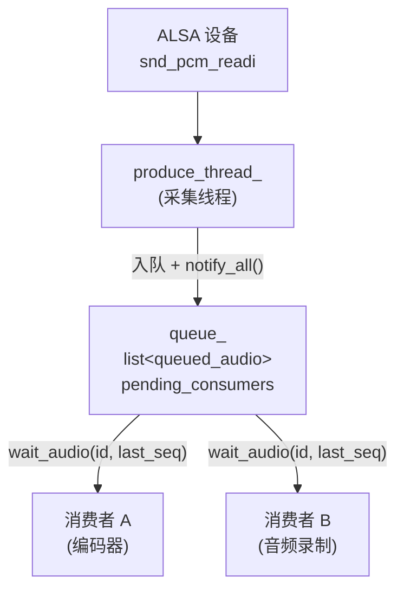
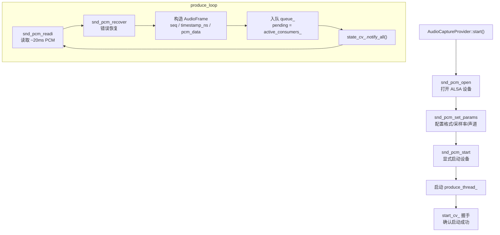
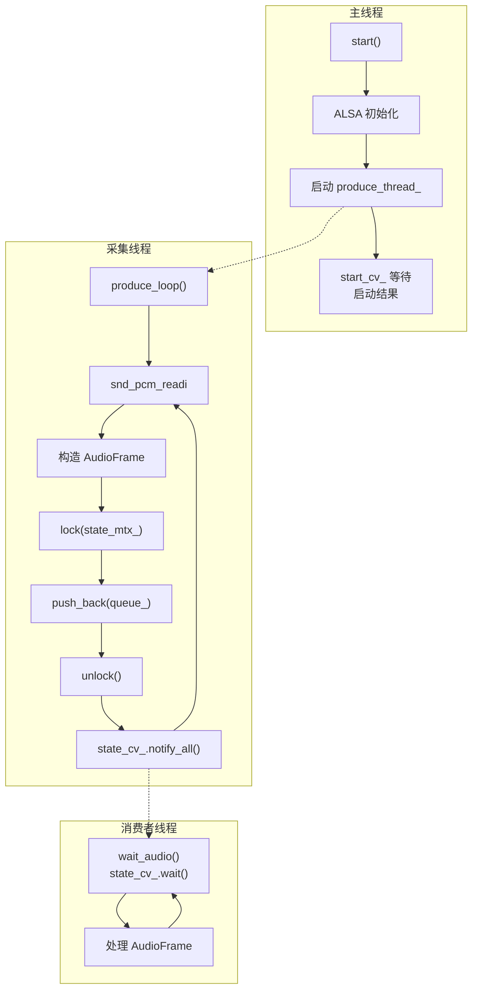

# 音频采集技术文档

## 1. 概述

`capture_audio` 是 pi-guard 的音频采集模块，通过 ALSA 接口从麦克风捕获 PCM 音频数据，以**多消费者队列**模式分发给下游（编码器、音频录制等）。

- **输入**：ALSA 音频设备（如 `default`、`plughw:0,7`）
- **输出**：`AudioFrame`（PCM S16_LE，交织格式）
- **下游**：编码器、音频录制等消费者独立拉取

如果你只想**快速接入使用**，跳到 [第 2 章 Quick Start](#2-quick-start)。如果你想**理解内部工作原理**，从 [第 6 章 ALSA 采集流程](#6-alsa-采集流程) 开始阅读。

---

## 2. Quick Start

### 2.1 最小可运行示例

```cpp
#include "capture_audio/audio_capture_provider.hpp"
#include "capture_audio/audio_frame.hpp"
#include "capture_audio/consumer_base.hpp"

using namespace piguard;

int main() {
    // 1. 创建采集器
    auto provider = std::make_shared<capture_audio::AudioCaptureProvider>(
        "default",      // ALSA 设备名
        16000,          // 采样率 Hz
        1               // 声道数
    );

    // 2. 启动采集
    provider->start();

    // 3. 注册消费者并拉取数据
    auto consumer_id = provider->register_consumer();
    uint64_t last_seq = 0;

    while (running) {
        auto frames = provider->wait_audio(consumer_id, last_seq);
        for (const auto& frame : frames) {
            // frame->seq, frame->timestamp_ns, frame->pcm_data
            // pcm_data 是 vector<int16_t>，交织格式
        }
        if (!frames.empty()) {
            last_seq = frames.back()->seq;
        }
    }

    // 4. 注销并停止
    provider->unregister_consumer(consumer_id);
    provider->stop();
    return 0;
}
```

### 2.2 使用消费者基类（推荐）

```cpp
#include "capture_audio/consumer_base.hpp"

class MyAudioConsumer : public piguard::capture_audio::AudioConsumerBase {
public:
    MyAudioConsumer(std::shared_ptr<piguard::capture_audio::AudioCaptureProvider> provider)
        : AudioConsumerBase(provider, "MyConsumer") {}

    void process(const std::vector<std::shared_ptr<piguard::capture_audio::AudioFrame>>& frames) override {
        for (const auto& frame : frames) {
            // 处理音频帧
        }
    }
};

// 使用
auto consumer = std::make_shared<MyAudioConsumer>(provider);
std::thread t([consumer]() { consumer->run(); });

// 停止
consumer->stop();
t.join();
// 析构时自动 unregister
```

---

## 3. 输入与输出

### 3.1 输入

| 参数 | 类型 | 说明 | 示例 |
|---|---|---|---|
| `device` | `std::string` | ALSA PCM 设备名 | `"default"`、`"plughw:0,7"` |
| `sample_rate_hz` | `unsigned int` | 采样率，必须 > 0 | `16000`、`44100` |
| `channels` | `unsigned int` | 声道数，必须 >= 1 | `1`（单声道）、`2`（立体声） |

构造函数会对非法参数抛出 `std::invalid_argument`。

### 3.2 输出

| 数据结构 | 字段 | 说明 |
|---|---|---|
| `AudioFrame` | `seq: uint64_t` | 全局递增帧序号 |
| | `pcm_data: vector<int16_t>` | PCM S16_LE 交织采样数据 |
| | `timestamp_ns: uint64_t` | 采集时刻（`steady_clock` 纳秒） |

**PCM 格式**：S16_LE（16 位有符号小端），交织（interleaved）格式。单声道时每个采样 2 字节；立体声时左右声道交替排列。

**数据量估算**（16000Hz / 单声道 / 20ms 周期）：
```
每帧样本数 = 16000 × 20 / 1000 = 320 个 sample
字节数 = 320 × 2 = 640 bytes
```

---

## 4. 公共 API 速查

### 4.1 AudioCaptureProvider

| 方法 | 签名 | 说明 | 线程安全 |
|---|---|---|---|
| 构造 | `AudioCaptureProvider(std::string device, unsigned int sample_rate_hz, unsigned int channels)` | 创建采集器，非法参数抛 `invalid_argument` | ✅ 是 |
| 析构 | `~AudioCaptureProvider()` | 自动调用 `stop()` | ✅ 是 |
| 启动 | `void start()` | 初始化 ALSA 并启动采集线程，失败抛 `runtime_error` | ❌ 不可并发 |
| 停止 | `void stop()` | 停止采集并清理资源 | ❌ 不可并发 |
| 注册消费者 | `consumer_id_t register_consumer()` | 返回唯一消费者 ID（`uint32_t`） | ✅ 是（内部加锁） |
| 注销消费者 | `void unregister_consumer(consumer_id_t id)` | 清理该消费者在队列中的状态 | ✅ 是（内部加锁） |
| 等待数据 | `std::vector<std::shared_ptr<AudioFrame>> wait_audio(consumer_id_t id, uint64_t last_seq)` | 阻塞等待新帧，返回未消费的帧列表 | ✅ 是（内部加锁） |

### 4.2 AudioConsumerBase

| 方法 | 说明 |
|---|---|
| `AudioConsumerBase(provider, name)` | 构造时自动注册消费者 |
| `~AudioConsumerBase()` | 析构时自动注销消费者 |
| `run()` | 循环拉取数据并调用 `process()`，空结果时退出 |
| `stop()` | 设置 `running_ = false`，使 `run()` 退出 |
| `process(frames)` | 纯虚函数，子类实现业务逻辑 |

---

## 5. 多消费者设计

音频采集和视频采集、编码器采用**同一套多消费者设计模式**。详见 [`多消费者技术方案.md`](./多消费者技术方案.md)，本节只摘录音频相关的关键信息。

### 5.1 核心机制



### 5.2 队列配置

| 配置项 | 值 | 说明 |
|---|---|---|
| `max_queue_capacity_` | `50` | 固定值，约 1 秒缓冲（320 样本 × 50 帧 ≈ 16000 样本 = 1 秒） |
| 队列容器 | `std::list` | 迭代器稳定，便于删除 |
| pending 容器 | `std::set<consumer_id_t>` | 记录未消费的消费者 |

### 5.3 消费者要点

1. **维护 `last_seq`**：每次取到帧后更新为最后一帧的 `seq`
2. **`wait_audio` 是阻塞的**：没有新帧时阻塞，直到有新数据或 `stop()`
3. **队列满时丢弃最老帧**：慢消费者会丢失数据，这是预期行为
4. **新消费者从注册后的数据开始消费**：已有队列节点不会追加新消费者

---

## 6. ALSA 采集流程

### 6.1 整体流程



### 6.2 关键步骤详解

#### 步骤 1：打开设备

```cpp
snd_pcm_open(&handle, device_.c_str(), SND_PCM_STREAM_CAPTURE, 0);
```

- `SND_PCM_STREAM_CAPTURE` 表示捕获模式
- 第三个参数 `0` 表示阻塞模式（`snd_pcm_readi` 会阻塞直到数据就绪）

#### 步骤 2：配置参数

```cpp
snd_pcm_set_params(handle,
                   SND_PCM_FORMAT_S16_LE,        // 16位有符号小端
                   SND_PCM_ACCESS_RW_INTERLEAVED, // 交织访问
                   channels_,                     // 声道数
                   sample_rate_,                  // 采样率
                   1,                             // 软重采样允许
                   50000);                        // 延迟 50ms
```

#### 步骤 3：显式启动（关键 workaround）

```cpp
snd_pcm_start(handle);
```

**为什么需要显式 `start`？**

`snd_pcm_set_params` 在 capture 路径上会把 `start_threshold` 设为 `buffer_size`。这意味着首次 `snd_pcm_readi` 想隐式启动时（`avail=0 < buffer_size`），设备不会真的进入 `RUNNING` 状态。部分 USB Audio 驱动在「未 RUNNING 就读取」时会直接返回 `-EIO` 并循环刷屏。

显式调用 `snd_pcm_start` 让设备立刻进入 `RUNNING`，避免这个陷阱。

#### 步骤 4：读取循环

```cpp
const unsigned frame_size = (sample_rate_ > 0) ? (sample_rate_ * 20u / 1000u) : 320u;
std::vector<int16_t> buffer(frame_size * channels_);

while (running_) {
    int ret = snd_pcm_readi(handle, buffer.data(), frame_size);
    if (ret < 0) {
        // 错误恢复
        snd_pcm_recover(handle, ret, 1);
        continue;
    }
    // 构造 AudioFrame 并入队
}
```

**每次读取约 20ms 数据**：
- 16000Hz 下 = 320 个样本
- 每样本 2 字节 × 声道数
- 这是 ALSA 驱动常见的周期大小

#### 步骤 5：错误恢复

```cpp
if (ret < 0) {
    int recover_ret = snd_pcm_recover(handle, ret, 1);
    if (recover_ret < 0) {
        // 不可恢复错误，日志记录后退避重试
        sleep(100ms);
    }
}
```

`snd_pcm_recover` 统一处理：
- `-EPIPE`（underrun/overrun）
- `-ESTRPIPE`（挂起）
- `-EINTR`（中断）

必要时自动执行 `prepare` / `resume`。

---

## 7. 线程架构



### 7.1 start/stop 握手

和 [`VideoCaptureProvider`](./多消费者技术方案.md) 一样，音频采集也使用 `start_mtx_ + start_cv_` 进行启动握手：

```cpp
// 主线程
start_cv_.wait(lock, [this] { return start_reported_; });
if (!start_ok_) throw std::runtime_error("start failed");

// 采集线程
report_start_result(true);  // 或 false（初始化失败时）
```

### 7.2 停止流程

```cpp
void stop() {
    mark_stopped();          // running_ = false, notify_all
    produce_thread_.join();  // 等待采集线程结束
}
```

采集线程在 `snd_pcm_readi` 阻塞时，`mark_stopped()` 只是设置了标志。由于 ALSA 读取是阻塞的，线程可能在 `readi` 上等待下一个周期（~20ms）后才能检查 `running_` 标志并退出。这是可接受的延迟。

---

## 8. 依赖与构建

### 8.1 外部依赖

| 库 | 用途 |
|---|---|
| `libasound2` (ALSA) | 音频采集 API |

Ubuntu/Debian 安装：
```bash
sudo apt-get install libasound2-dev
```

### 8.2 CMake 引入

[`CMakeLists.txt`](file:///home/tsxuehu/workspace-daoqi/pi-guard/project/agent/src/modules/capture/audio/CMakeLists.txt)：

```cmake
find_package(ALSA REQUIRED)

add_library(pi_guard_audio_capture STATIC
    audio_capture_module.cpp
    audio_capture_provider.cpp
)

target_link_libraries(pi_guard_audio_capture
    PUBLIC
        pi_guard_foundation
        pi_guard_infra_log
        ${ALSA_LIBRARIES}
)
```

在你的目标中链接：
```cmake
target_link_libraries(your_target PRIVATE pi_guard_audio_capture)
```

---

## 9. 错误处理与边界情况

### 9.1 构造函数非法参数

| 非法条件 | 异常 |
|---|---|
| `device.empty()` | `std::invalid_argument` |
| `sample_rate_hz == 0` | `std::invalid_argument` |
| `channels == 0` | `std::invalid_argument` |

### 9.2 `start()` 失败

`start()` 在以下情况抛出 `std::runtime_error`：
- `snd_pcm_open` 失败（设备不存在或占用）
- `snd_pcm_set_params` 失败（格式/采样率不支持）
- `snd_pcm_start` 失败（驱动问题）

失败时会自动 join 采集线程，不会泄漏。

### 9.3 运行时错误恢复

采集过程中可能遇到的错误：

| 错误码 | 原因 | 处理 |
|---|---|---|
| `-EPIPE` | ALSA buffer overrun | `snd_pcm_recover` 自动 prepare |
| `-ESTRPIPE` | 设备挂起（电源管理） | `snd_pcm_recover` 自动 resume |
| `-EINTR` | 系统中断 | `snd_pcm_recover` 忽略并继续 |
| `-EIO` | 硬件 I/O 错误 | recover 失败，日志 + 100ms 退避 |

### 9.4 停止后入队的帧

```cpp
{
    std::lock_guard lock(state_mtx_);
    if (!running_) {
        dropped_after_stop = true;
    } else {
        queue_.push_back({af, active_consumers_});
        // ...
    }
}
if (dropped_after_stop) {
    logger->info("dropping captured audio frame after running_ set to false");
    break;
}
```

`running_` 检查和入队操作在同一把锁下原子执行，避免竞争：停止命令到达后，已读取但尚未入队的帧会被丢弃，不会进入队列。

---

## 10. 配置与调参

### 10.1 采样率选择

| 采样率 | 场景 | 注意 |
|---|---|---|
| 8000 Hz | 低带宽语音 | 音质差，仅适合对讲 |
| 16000 Hz | 语音识别、安防 | **推荐默认值**，平衡质量和带宽 |
| 44100 Hz | 音乐录制 | 更高质量，数据量更大 |
| 48000 Hz | 专业音频 | 需确保 ALSA 设备和编码器都支持 |

> **关键**：`sample_rate_` 必须与下游编码器的 `audio_sample_rate` 严格一致，否则会出现采样率不匹配导致的杂音或时间轴漂移。

### 10.2 声道数选择

| 声道数 | 场景 |
|---|---|
| 1（单声道） | 语音采集、安防场景 |
| 2（立体声） | 音乐、需要方位感的场景 |

### 10.3 ALSA 设备名

常见设备名：
```
default              # 默认设备，通常带软混音
plughw:0,0           # 第一个声卡的第一个设备（带插件）
hw:0,0               # 第一个声卡的第一个设备（直连，无插件）
```

`plughw:` 前缀带 ALSA 插件层，可以自动重采样和格式转换；`hw:` 直连硬件，性能更好但要求参数严格匹配。

### 10.4 缓冲区大小

队列容量固定为 `50` 帧，约 1 秒缓冲：
```
50 帧 × 20ms = 1000ms = 1 秒
```

如果需要更大的缓冲（比如消费者处理很慢），目前需要通过修改源码调整 `max_queue_capacity_`。
